## 목차

1.  강사소개 및 미트업 안내

2.  챗GPT 체험 삶의 현장

    -   실습: 자료조사

3.  챗GPT 시대 오피스 전쟁 (사무 자동화 → 사무 지능화)

    -   실습: 글쓰기

4.  프롬프트 엔지니어링 (Text-to-X)

    -   실습: 그리기

5.  AutoGPT, 엑셀과 추론

    -   실습: 수능문제풀이

6.  질의응답


## 강사소개 & 강의 개요 {.smaller}

::: panel-tabset
### 강사소개

::: {layout-ncol="2"}
### AI 아바타

{.absolute top="0" right="0" width="300"}

### 주요경력 및 학력

-   (현) 비영리법인 한국 R 사용자회: 기술 이사

-   (현) 국가교육위원회 전문위원: 과학/기술 분과

-   (현) 건국대학교 챗GPT 데이터 사이언스 과정: 외래교수

-   (전) TCS: GS 칼텍스 디지털 아카데미 강사

-   (전) 연세대학교 데이터 사이언스: 겸임교수

-   (전) 삼정 KPMG: Lighthouse AI 기술총괄

-   (전) 웹젠: 데이터 과학자 TD

-   (전) 현대모비스: 차량용 반도체 개발구매 <br>

-   (전) 현대자동차: VAATZ / FTA <br>

    <br> <hr> <br>

-   KAIST, CMU, 연세대 응용통계 및 컴퓨터 과학 전공

-   [RStudio Instructor](https://education.rstudio.com/trainers/people/lee+kwangchun/) - Tidyverse

-   [Seoul R Meetup Organizer](https://r2bit.com/seoul-r/)
:::


### 강의개요

::: {layout-ncol="2"}


### 강의상세

- 날짜 : 2023. 6. 19.(월) 13:00~15:00
- 장소 : 비대면
- 대상 : 경기도 신규임용 공무원
- 내용
  - 4차 산업혁명
  - 챗GPT
  - Text-to-X
  - 사무 자동화 &rarr; 사무 지능화
  - 프롬프트 엔지니어링
:::
:::

#  {background-image="img/meetup_logo.jpg"}

::: r-fit-text
:::

## 서울 R 미트업 {.smaller}

::: columns
::: column
::: r-stack

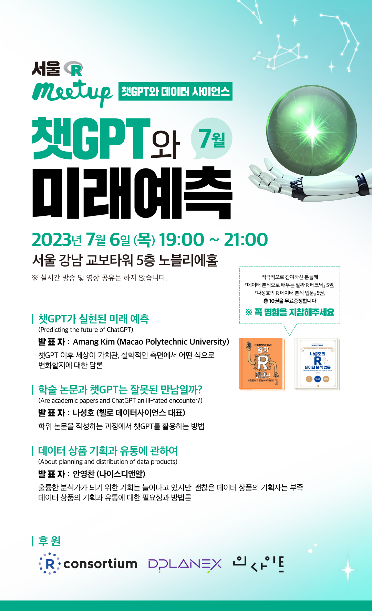{.fragment width="320"}

::: fragment
{.fragment width="320"}
:::

::: fragment
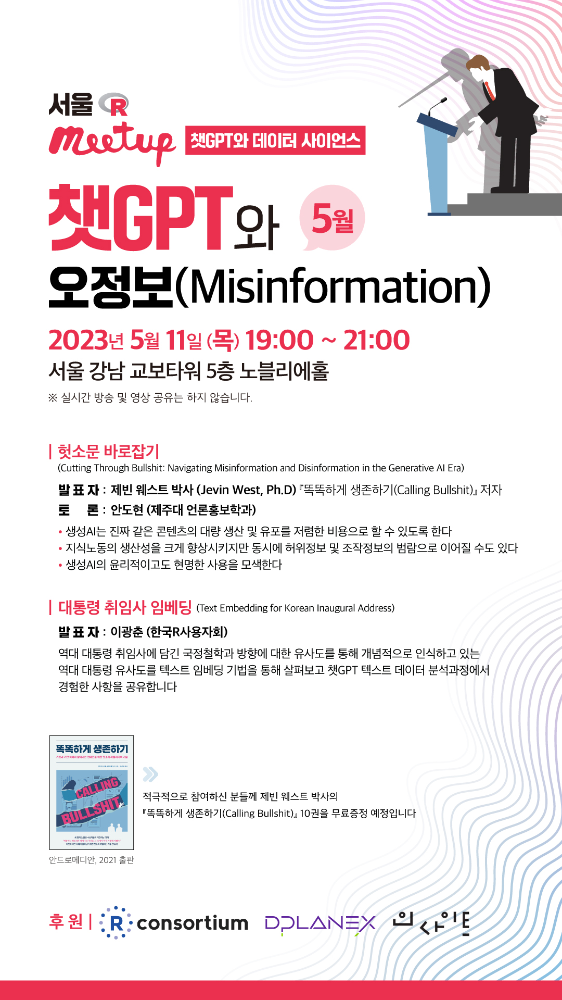{.fragment width="320"}
:::

::: fragment
{.fragment width="320"}
:::

::: fragment
{.fragment width="320"}
:::


:::
:::

::: column
## 참여와 연대

-   **서울R미트업 meetup.com**: [link](https://www.meetup.com/seoul-r-meetup)
    -   **23년 4월 서울 R 미트업**: [link](https://www.meetup.com/seoul-r-meetup/events/292232899/)
    -   **23년 5월 서울 R 미트업**: [link](https://www.meetup.com/seoul-r-meetup/events/292966674/)
    -   **23년 6월 서울 R 미트업**: [link](https://www.meetup.com/seoul-r-meetup/events/293485362/)
    -   **23년 7월 서울 R 미트업**: [link](https://www.meetup.com/seoul-r-meetup/events/293929603/)
-   세계 R 미트업 현황 (Global R Meetup Dashboard): [link](https://r-community.org/usergroups/)
-   한국 R 사용자회 (Korea R User Group): [link](https://r2bit.com/)
-   한국 R 컨퍼런스 (Korea R Conference): [link](https://use-r.kr/)
-   유튜브 채널 (Youtube Channel): [link](https://www.youtube.com/channel/UCW-epmIvjBEhhVXw_F0Nqbw)
-   페이스북 그룹 (Facebook Group): [link](https://www.facebook.com/groups/tidyverse)
:::
:::


# 삶의 현장 <br> 사용자 / 개발자

## 백만\~1억 사용자 

백만, 5천만, 1억 가입자를 가질 때까지 걸린 소요시간

::: panel-tabset
## 전화기

![[@song2019digital]](img/time-to-reach-springer.png){width="600"}

## 기술 진화

](img/hbr_trends.png)

## chatGPT 백만

{width="600"}

## 빅3 서비스


## 1억명 (소요 달수)

{width="600"}
:::

## AI를 바라보는 관점

::: panel-tabset
### 트위터 Santiago I {.unnumbered}


### 트위터 Santiago II {.unnumbered}


### 버스탄 두 남자 {.unnumbered}

{width="600"}
:::

## 3 대장 + $\alpha$


## 체험 삶의 현장

::: panel-tabset
### 현대백화점 (글쓰기)

::: columns
::: column
<br> 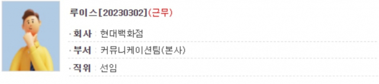
:::

::: column
<br> 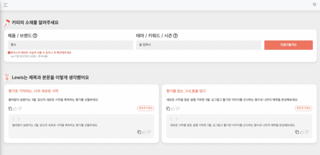
:::
:::

### 마이크로소프트 (코딩)

::: columns
::: {.column width="60%"}

:::

::: {.column width="40%"}
<br>

-   신규 코드의 **40%**가 Copilot으로 작성
-   **75%의 개발자**가 업무에 더 큰 성취감을 느꼈습니다.
-   **87%의 개발자**가 정신적 노력을 절약하는 데 도움이 되었다고 답했습니다.
:::
:::

### 네이버 (그리기)

<br> <br> 

### 로스쿨 (추론)

{width="636"}
:::

::: aside
-   웹툰 출처: [@webtoon2021]
-   로스쿨 출처: <https://r2bit.com/chatGPT/gpt4_performance.html> [@openai2023gpt4]
:::

## 시장 와해 사례: 서점 

공상과학 및 판타지 잡지 클라크스월드(Clarkesworld)는 AI가 생성한 소설라는 비난을 받은 후 신규 공상과학소설이 급증한 것이 AI 기계로 작성된 원인을 큰 것으로 파악하고 2월 20일부터 공식적으로 투고를 중단했다.

::: {#sci-fiction layout-ncol="2"}
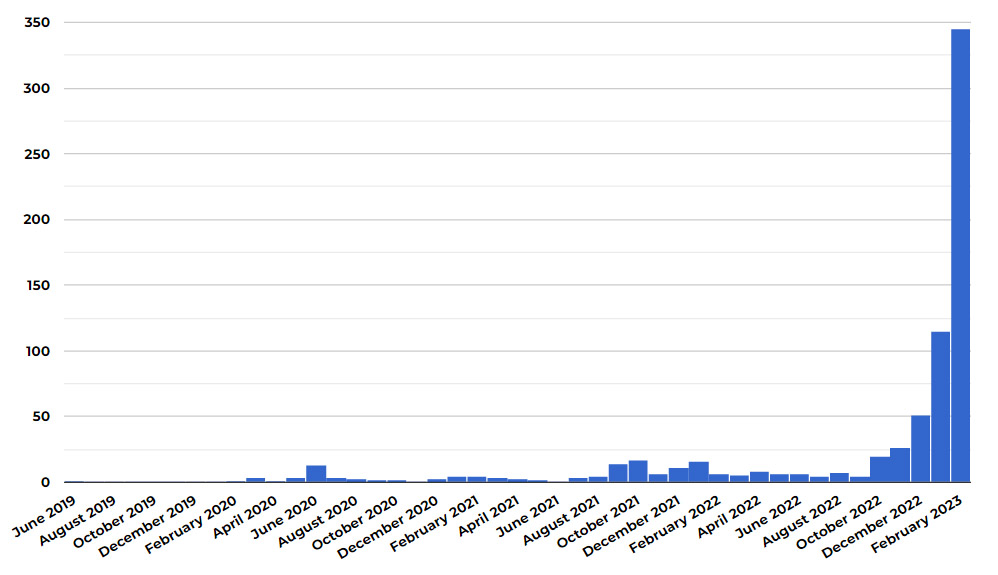


:::

[[Neil Clark (2023-02-15), "A Concerning Trend", CLARKESWORLD MAGAZINE](http://neil-clarke.com/a-concerning-trend/)]{.aside}

## 시장 와해 사례: 병원  {.smaller}

<br>

::: columns
::: column
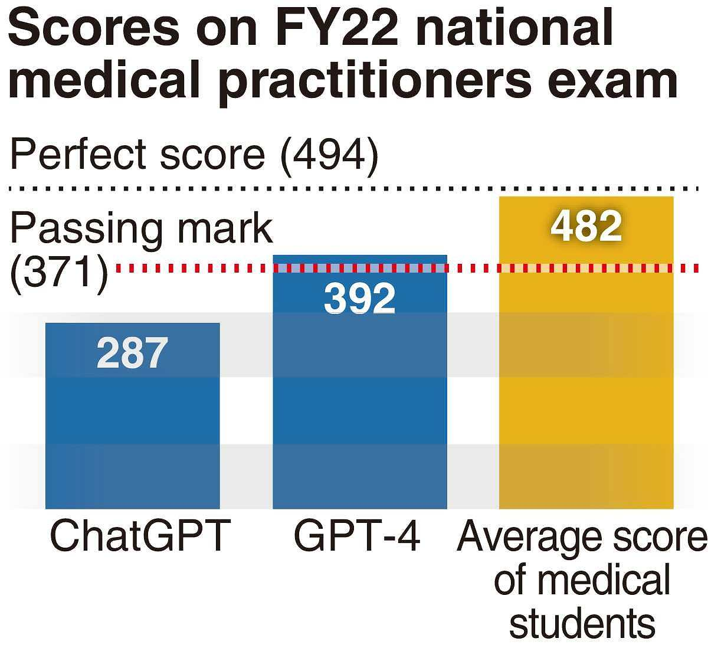
:::

::: column
일본과 미국의 국제 연구팀에 따르면 미국에 본사를 둔 OpenAI가 개발한 인공지능 모델의 최신 버전이 일본의 의사 국가시험에 합격할 수 있는 능력을 입증했다고 합니다.

그러나 AI는 인간 수험생의 평균 점수보다 낮은 점수를 받았고 환자의 안락사를 유도하는 옵션을 선택하는 등 일부 부적절한 답변을 제공했습니다.

워싱턴 대학의 자연어 처리 전문 연구원 정고 카사이(Jungo Kasai)를 포함한 연구팀은 2018년부터 2022년까지 5년간 OpenAI의 대화형 AI 시스템인 ChatGPT와 GPT-4를 사용하여 국가 의사 자격시험을 치렀습니다.

ChatGPT는 모든 시험에서 불합격했습니다. 하지만 최신 시스템인 GPT-4는 모든 시험에서 합격점을 넘겼습니다.
:::
:::

::: aside
-   자료출처: [The Yomiuri Shimbun, "AI Demonstrates Passing Score on Medical Practitioner Exam in Japan", May 10, 2023](https://japannews.yomiuri.co.jp/society/general-news/20230510-108846/)
:::

## 시장 와해 사례: 사교육  {.smaller}

::: columns
::: column

:::

::: column
##### ChatGPT가 비즈니스를 죽이고 있다고 회사가 말한 후 Chegg 주가는 40 % 이상 하락했다.

[Chegg](https://www.chegg.com/)의 주가는 온라인 교육 회사가 ChatGPT가 성장을 저해하고 있다고 밝힌 후 폭락했습니다.

> "올해 상반기에는 ChatGPT가 신규 계정 성장에 눈에 띄는 영향을 미치지 않았고 신규 가입에 대한 기대치를 충족하고 있었습니다."라고 월요일 저녁 실적 발표에서 댄 로젠스웨이그 CEO는 말했습니다. "하지만 3월부터 ChatGPT에 대한 학생들의 관심이 크게 급증했습니다. 이제 신규 고객 성장률에 영향을 미치고 있다고 생각합니다."

Chegg, Inc.는 캘리포니아주 산타클라라에 본사를 둔 미국 교육 기술 회사로 숙제 도움, 디지털 및 실제 교과서 대여, 교과서, 온라인 튜터링 및 기타 학생 서비스를 제공.
:::
:::

::: aside
-   자료출처: [CNBC, "Chegg shares drop more than 40% after company says ChatGPT is killing its business", May 2, 2023](https://www.cnbc.com/2023/05/02/chegg-drops-more-than-40percent-after-saying-chatgpt-is-killing-its-business.html)
:::

## 시장 와해 사례: 미디어 광고 그룹  {.smaller}

::: columns
::: {.column width="50%"}
### OpenAI와 펜실베이나 대학교

인공 지능이 개방되고 제너레이티브 AI를 제공하는 플랫폼을 통해 대중화됨에 따라 전체 직업의 최소 80%에서 업무가 변화할 것으로 예측된다. 대학 교육이 필요한 직업이 가장 큰 영향을 받을 것이며, 많은 경우 사람들이 수행하는 업무의 절반 이상이 AI의 영향을 받을 수 있다. 중요한 점은 영향을 받는 직업은 대체되는 것이 아니라 생성형 AI에 의해 크게 영향을 받거나 증강될 것이라는 점이다. [@eloundou2023gpts]

-   통역사 및 번역가
-   설문 조사 연구원
-   시인, 작사가 및 창작 작가
-   동물 과학자
-   **홍보 전문가**
-   수학자 / 세무사 / 금융 정량 분석가
-   웹 및 디지털 인터페이스 디자이너
:::

::: {.column width="50%"}
### 설문조사와 광고기업

![[@kpf2023survey]](img/kpf_survey.jpg)

> 중국 최대 미디어 광고 그룹이 카피라이터와 디자이너 등에 대한 아웃소싱(외주)을 무기한 중단하고 챗GPT 같은 생성형 인공지능(AI) 기구로 대체를 선언했다. 14일 홍콩 사우스차이나모닝포스트(SCMP)에 따르면, 광고회사 블루포커스는 내부 이메일을 통해 "생성형 AI를 전적으로 수용하기 위해 카피라이터, 디자이너, 단기 계약직 등 특정 분야의 아웃소싱 비용을 즉시 절감할 것"이라고 밝혔다.
:::
:::

::: aside
-   [챗GPT로 사라질 직업 1위는 세무사 아니었네..."번역가·통역사 더 위험"](https://v.daum.net/v/Kcnup4UNU7)
-   [中최대 광고 기업 "단기 계약직, AI로 대체한다"](https://n.news.naver.com/mnews/article/215/0001095495)
:::

## 시장 와해 사례: 에너지 기업  {.smaller}

<br>

::: columns
::: column

:::

::: column
##### AI가 에너지 회사에서 250명의 업무를 수행하고 숙련된 직원보다 고객을 더 잘 만족시키고 있다.

영국에 본사를 둔 가정용 에너지 공급업체인 옥토퍼스 에너지의 CEO는 인공지능이 회사 직원 250명의 업무를 대신하고 있다고 말했다.

런던 타임즈에 기고한 글에서 Greg Jackson은 회사가 몇 달 동안 AI를 실험해 왔다고 말했다. 그는 이 기술이 회사 시스템에 통합되어 2월부터 직원들이 일부 고객 이메일에 답장을 보내도록 허용하기 시작했다고 말했다.

현재 AI는 고객 이메일의 3분의 1 이상에 답장하고 있으며, 이는 약 250명의 직원이 처리하는 업무라고 CEO는 말했다.

> "AI가 작성한 이메일의 고객 만족도는 80%로, 숙련되고 훈련된 사람이 작성한 65%보다 훨씬 높았다."
:::
:::

::: aside
-   자료출처: [CNBC, "Chegg shares drop more than 40% after company says ChatGPT is killing its business", May 2, 2023](https://www.cnbc.com/2023/05/02/chegg-drops-more-than-40percent-after-saying-chatgpt-is-killing-its-business.html)
:::

## 시장 와해 사례: Stackoverflow  {.smaller}

<br>

::: columns
::: column
::: r-stack
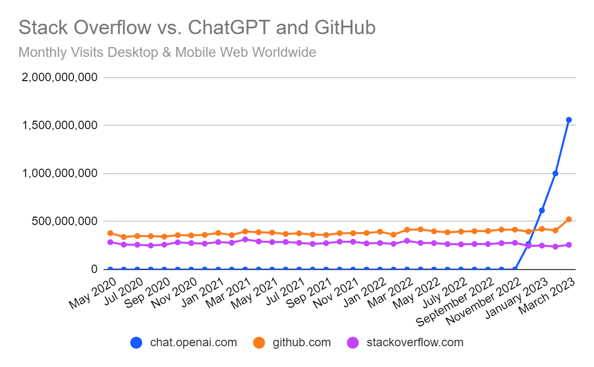

::: fragment
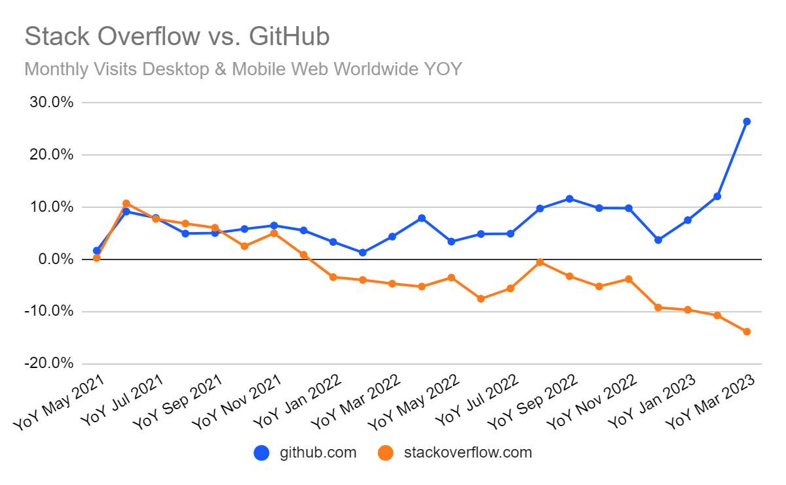
:::

::: fragment
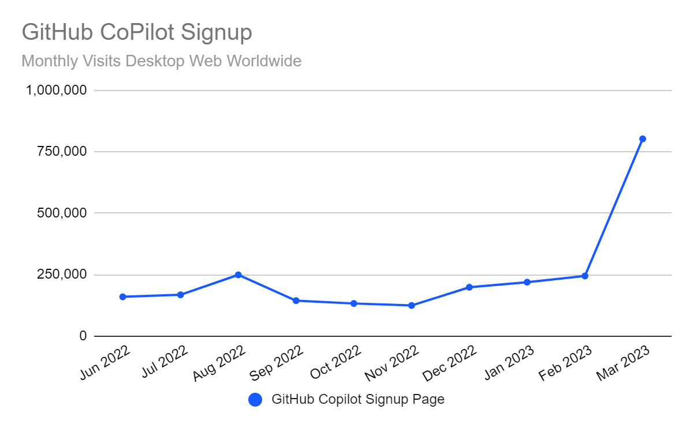
:::
:::
:::

::: column
##### 개발자들은 점점 더 많은 조언을 Stackoverflow 게시판이 아닌 AI 챗봇과 GitHub CoPilot에서 얻고 있다.

-   [스택 오버플로](https://stackoverflow.com/)의 트래픽은 2022년 1월 이후 매월 평균 6%씩 감소하고 있으며, 3월에는 13.9% 감소했다.
-   ChatGPT는 11월 말에 출시되어 전년 대비 실적은 없지만, [웹사이트](https://chat.openai.com/)는 그 짧은 시간 동안 전 세계 트래픽에서 Microsoft의 Bing 검색 엔진보다 더 많은 트래픽을 기록하며 세계에서 가장 인기 있는 디지털 자산 중 하나로 자리 잡았다. 3월에는 16억 건, 4월 상반기에는 9억 2,070만 건이 방문했다.
-   GitHub 웹사이트도 3월에 전년 대비 26.4% 증가한 5억 2,400만 건의 트래픽을 기록하는 등 강력한 성장세를 보이고 있는데, 일반적으로 Visual Studio Code와 같은 코드 편집기 내에서 이루어지는 CoPilot의 모든 사용량이 반영되어 있지는 않지만, 서비스 구독을 위해 웹사이트를 방문하는 사람들도 포함된다.
-   2월부터 3월까지 GitHub CoPilot 무료 평가판 가입 페이지 방문 수는 3배 이상 증가하여 80만 건을 돌파했다.
:::
:::

::: aside
-   자료출처: [David F. Carr (April 27, 2023), "Developers increasingly get advice from AI chatbots and GitHub CoPilot rather than Stack Overflow message boards", Similarweb Blog](https://www.similarweb.com/blog/insights/ai-news/stack-overflow-chatgpt/)
:::

## 실습: 자료조사 {.smaller}

::: panel-tabset
### 실제자료

::: {.cell output-location='default'}
::: {.cell-output-display}
```{=html}
<div id="qkipnjrkcf" style="padding-left:0px;padding-right:0px;padding-top:10px;padding-bottom:10px;overflow-x:auto;overflow-y:auto;width:auto;height:auto;">
<style>@import url("https://fonts.googleapis.com/css2?family=Source+Sans+Pro:ital,wght@0,100;0,200;0,300;0,400;0,500;0,600;0,700;0,800;0,900;1,100;1,200;1,300;1,400;1,500;1,600;1,700;1,800;1,900&display=swap");
@import url("https://fonts.googleapis.com/css2?family=Libre+Franklin:ital,wght@0,100;0,200;0,300;0,400;0,500;0,600;0,700;0,800;0,900;1,100;1,200;1,300;1,400;1,500;1,600;1,700;1,800;1,900&display=swap");
@import url("https://fonts.googleapis.com/css2?family=Source+Sans+Pro:ital,wght@0,100;0,200;0,300;0,400;0,500;0,600;0,700;0,800;0,900;1,100;1,200;1,300;1,400;1,500;1,600;1,700;1,800;1,900&display=swap");
@import url("https://fonts.googleapis.com/css2?family=IBM+Plex+Sans+KR:ital,wght@0,100;0,200;0,300;0,400;0,500;0,600;0,700;0,800;0,900;1,100;1,200;1,300;1,400;1,500;1,600;1,700;1,800;1,900&display=swap");
#qkipnjrkcf table {
  font-family: 'IBM Plex Sans KR', sans-serif, system-ui, 'Segoe UI', Roboto, Helvetica, Arial, 'Apple Color Emoji', 'Segoe UI Emoji', 'Segoe UI Symbol', 'Noto Color Emoji';
  -webkit-font-smoothing: antialiased;
  -moz-osx-font-smoothing: grayscale;
}

#qkipnjrkcf thead, #qkipnjrkcf tbody, #qkipnjrkcf tfoot, #qkipnjrkcf tr, #qkipnjrkcf td, #qkipnjrkcf th {
  border-style: none;
}

#qkipnjrkcf p {
  margin: 0;
  padding: 0;
}

#qkipnjrkcf .gt_table {
  display: table;
  border-collapse: collapse;
  line-height: normal;
  margin-left: auto;
  margin-right: auto;
  color: #333333;
  font-size: 16px;
  font-weight: normal;
  font-style: normal;
  background-color: #FFFFFF;
  width: auto;
  border-top-style: none;
  border-top-width: 2px;
  border-top-color: #A8A8A8;
  border-right-style: none;
  border-right-width: 2px;
  border-right-color: #D3D3D3;
  border-bottom-style: solid;
  border-bottom-width: 2px;
  border-bottom-color: #A8A8A8;
  border-left-style: none;
  border-left-width: 2px;
  border-left-color: #D3D3D3;
}

#qkipnjrkcf .gt_caption {
  padding-top: 4px;
  padding-bottom: 4px;
}

#qkipnjrkcf .gt_title {
  color: #333333;
  font-size: 125%;
  font-weight: initial;
  padding-top: 4px;
  padding-bottom: 4px;
  padding-left: 5px;
  padding-right: 5px;
  border-bottom-color: #FFFFFF;
  border-bottom-width: 0;
}

#qkipnjrkcf .gt_subtitle {
  color: #333333;
  font-size: 85%;
  font-weight: initial;
  padding-top: 3px;
  padding-bottom: 5px;
  padding-left: 5px;
  padding-right: 5px;
  border-top-color: #FFFFFF;
  border-top-width: 0;
}

#qkipnjrkcf .gt_heading {
  background-color: #FFFFFF;
  text-align: left;
  border-bottom-color: #FFFFFF;
  border-left-style: none;
  border-left-width: 1px;
  border-left-color: #D3D3D3;
  border-right-style: none;
  border-right-width: 1px;
  border-right-color: #D3D3D3;
}

#qkipnjrkcf .gt_bottom_border {
  border-bottom-style: none;
  border-bottom-width: 2px;
  border-bottom-color: #D3D3D3;
}

#qkipnjrkcf .gt_col_headings {
  border-top-style: none;
  border-top-width: 2px;
  border-top-color: #D3D3D3;
  border-bottom-style: none;
  border-bottom-width: 1px;
  border-bottom-color: #334422;
  border-left-style: none;
  border-left-width: 1px;
  border-left-color: #D3D3D3;
  border-right-style: none;
  border-right-width: 1px;
  border-right-color: #D3D3D3;
}

#qkipnjrkcf .gt_col_heading {
  color: #333333;
  background-color: #FFFFFF;
  font-size: 12px;
  font-weight: normal;
  text-transform: inherit;
  border-left-style: none;
  border-left-width: 1px;
  border-left-color: #D3D3D3;
  border-right-style: none;
  border-right-width: 1px;
  border-right-color: #D3D3D3;
  vertical-align: bottom;
  padding-top: 5px;
  padding-bottom: 6px;
  padding-left: 5px;
  padding-right: 5px;
  overflow-x: hidden;
}

#qkipnjrkcf .gt_column_spanner_outer {
  color: #333333;
  background-color: #FFFFFF;
  font-size: 12px;
  font-weight: normal;
  text-transform: inherit;
  padding-top: 0;
  padding-bottom: 0;
  padding-left: 4px;
  padding-right: 4px;
}

#qkipnjrkcf .gt_column_spanner_outer:first-child {
  padding-left: 0;
}

#qkipnjrkcf .gt_column_spanner_outer:last-child {
  padding-right: 0;
}

#qkipnjrkcf .gt_column_spanner {
  border-bottom-style: none;
  border-bottom-width: 1px;
  border-bottom-color: #334422;
  vertical-align: bottom;
  padding-top: 5px;
  padding-bottom: 5px;
  overflow-x: hidden;
  display: inline-block;
  width: 100%;
}

#qkipnjrkcf .gt_spanner_row {
  border-bottom-style: hidden;
}

#qkipnjrkcf .gt_group_heading {
  padding-top: 8px;
  padding-bottom: 8px;
  padding-left: 5px;
  padding-right: 5px;
  color: #333333;
  background-color: #FFFFFF;
  font-size: 100%;
  font-weight: initial;
  text-transform: inherit;
  border-top-style: solid;
  border-top-width: 2px;
  border-top-color: #D3D3D3;
  border-bottom-style: solid;
  border-bottom-width: 2px;
  border-bottom-color: #D3D3D3;
  border-left-style: none;
  border-left-width: 1px;
  border-left-color: #D3D3D3;
  border-right-style: none;
  border-right-width: 1px;
  border-right-color: #D3D3D3;
  vertical-align: middle;
  text-align: left;
}

#qkipnjrkcf .gt_empty_group_heading {
  padding: 0.5px;
  color: #333333;
  background-color: #FFFFFF;
  font-size: 100%;
  font-weight: initial;
  border-top-style: solid;
  border-top-width: 2px;
  border-top-color: #D3D3D3;
  border-bottom-style: solid;
  border-bottom-width: 2px;
  border-bottom-color: #D3D3D3;
  vertical-align: middle;
}

#qkipnjrkcf .gt_from_md > :first-child {
  margin-top: 0;
}

#qkipnjrkcf .gt_from_md > :last-child {
  margin-bottom: 0;
}

#qkipnjrkcf .gt_row {
  padding-top: 7px;
  padding-bottom: 7px;
  padding-left: 5px;
  padding-right: 5px;
  margin: 10px;
  border-top-style: solid;
  border-top-width: 1px;
  border-top-color: #D3D3D3;
  border-left-style: none;
  border-left-width: 1px;
  border-left-color: #D3D3D3;
  border-right-style: none;
  border-right-width: 1px;
  border-right-color: #D3D3D3;
  vertical-align: middle;
  overflow-x: hidden;
}

#qkipnjrkcf .gt_stub {
  color: #333333;
  background-color: #FFFFFF;
  font-size: 100%;
  font-weight: initial;
  text-transform: inherit;
  border-right-style: solid;
  border-right-width: 2px;
  border-right-color: #D3D3D3;
  padding-left: 5px;
  padding-right: 5px;
}

#qkipnjrkcf .gt_stub_row_group {
  color: #333333;
  background-color: #FFFFFF;
  font-size: 100%;
  font-weight: initial;
  text-transform: inherit;
  border-right-style: solid;
  border-right-width: 2px;
  border-right-color: #D3D3D3;
  padding-left: 5px;
  padding-right: 5px;
  vertical-align: top;
}

#qkipnjrkcf .gt_row_group_first td {
  border-top-width: 2px;
}

#qkipnjrkcf .gt_row_group_first th {
  border-top-width: 2px;
}

#qkipnjrkcf .gt_summary_row {
  color: #333333;
  background-color: #FFFFFF;
  text-transform: inherit;
  padding-top: 8px;
  padding-bottom: 8px;
  padding-left: 5px;
  padding-right: 5px;
}

#qkipnjrkcf .gt_first_summary_row {
  border-top-style: solid;
  border-top-color: #D3D3D3;
}

#qkipnjrkcf .gt_first_summary_row.thick {
  border-top-width: 2px;
}

#qkipnjrkcf .gt_last_summary_row {
  padding-top: 8px;
  padding-bottom: 8px;
  padding-left: 5px;
  padding-right: 5px;
  border-bottom-style: solid;
  border-bottom-width: 2px;
  border-bottom-color: #D3D3D3;
}

#qkipnjrkcf .gt_grand_summary_row {
  color: #333333;
  background-color: #FFFFFF;
  text-transform: inherit;
  padding-top: 8px;
  padding-bottom: 8px;
  padding-left: 5px;
  padding-right: 5px;
}

#qkipnjrkcf .gt_first_grand_summary_row {
  padding-top: 8px;
  padding-bottom: 8px;
  padding-left: 5px;
  padding-right: 5px;
  border-top-style: double;
  border-top-width: 6px;
  border-top-color: #D3D3D3;
}

#qkipnjrkcf .gt_last_grand_summary_row_top {
  padding-top: 8px;
  padding-bottom: 8px;
  padding-left: 5px;
  padding-right: 5px;
  border-bottom-style: double;
  border-bottom-width: 6px;
  border-bottom-color: #D3D3D3;
}

#qkipnjrkcf .gt_striped {
  background-color: rgba(128, 128, 128, 0.05);
}

#qkipnjrkcf .gt_table_body {
  border-top-style: none;
  border-top-width: 2px;
  border-top-color: #D3D3D3;
  border-bottom-style: solid;
  border-bottom-width: 2px;
  border-bottom-color: #FFFFFF;
}

#qkipnjrkcf .gt_footnotes {
  color: #333333;
  background-color: #FFFFFF;
  border-bottom-style: none;
  border-bottom-width: 2px;
  border-bottom-color: #D3D3D3;
  border-left-style: none;
  border-left-width: 2px;
  border-left-color: #D3D3D3;
  border-right-style: none;
  border-right-width: 2px;
  border-right-color: #D3D3D3;
}

#qkipnjrkcf .gt_footnote {
  margin: 0px;
  font-size: 90%;
  padding-top: 4px;
  padding-bottom: 4px;
  padding-left: 5px;
  padding-right: 5px;
}

#qkipnjrkcf .gt_sourcenotes {
  color: #333333;
  background-color: #FFFFFF;
  border-bottom-style: none;
  border-bottom-width: 2px;
  border-bottom-color: #D3D3D3;
  border-left-style: none;
  border-left-width: 2px;
  border-left-color: #D3D3D3;
  border-right-style: none;
  border-right-width: 2px;
  border-right-color: #D3D3D3;
}

#qkipnjrkcf .gt_sourcenote {
  font-size: 90%;
  padding-top: 4px;
  padding-bottom: 4px;
  padding-left: 5px;
  padding-right: 5px;
}

#qkipnjrkcf .gt_left {
  text-align: left;
}

#qkipnjrkcf .gt_center {
  text-align: center;
}

#qkipnjrkcf .gt_right {
  text-align: right;
  font-variant-numeric: tabular-nums;
}

#qkipnjrkcf .gt_font_normal {
  font-weight: normal;
}

#qkipnjrkcf .gt_font_bold {
  font-weight: bold;
}

#qkipnjrkcf .gt_font_italic {
  font-style: italic;
}

#qkipnjrkcf .gt_super {
  font-size: 65%;
}

#qkipnjrkcf .gt_footnote_marks {
  font-size: 75%;
  vertical-align: 0.4em;
  position: initial;
}

#qkipnjrkcf .gt_asterisk {
  font-size: 100%;
  vertical-align: 0;
}

#qkipnjrkcf .gt_indent_1 {
  text-indent: 5px;
}

#qkipnjrkcf .gt_indent_2 {
  text-indent: 10px;
}

#qkipnjrkcf .gt_indent_3 {
  text-indent: 15px;
}

#qkipnjrkcf .gt_indent_4 {
  text-indent: 20px;
}

#qkipnjrkcf .gt_indent_5 {
  text-indent: 25px;
}
</style>
<table class="gt_table" data-quarto-disable-processing="false" data-quarto-bootstrap="false">
  <thead>
    
    <tr class="gt_col_headings">
      <th class="gt_col_heading gt_columns_bottom_border gt_center" rowspan="1" colspan="1" style="color: #A9A9A9; font-family: 'Source Sans Pro'; text-transform: uppercase;" scope="col" id="순위">순위</th>
      <th class="gt_col_heading gt_columns_bottom_border gt_center" rowspan="1" colspan="1" style="color: #A9A9A9; font-family: 'Source Sans Pro'; text-transform: uppercase;" scope="col" id="영화명">영화명</th>
      <th class="gt_col_heading gt_columns_bottom_border gt_center" rowspan="1" colspan="1" style="color: #A9A9A9; font-family: 'Source Sans Pro'; text-transform: uppercase;" scope="col" id="개봉일">개봉일</th>
      <th class="gt_col_heading gt_columns_bottom_border gt_center" rowspan="1" colspan="1" style="color: #A9A9A9; font-family: 'Source Sans Pro'; text-transform: uppercase;" scope="col" id="매출액">매출액</th>
      <th class="gt_col_heading gt_columns_bottom_border gt_center" rowspan="1" colspan="1" style="color: #A9A9A9; font-family: 'Source Sans Pro'; text-transform: uppercase;" scope="col" id="관객수">관객수</th>
      <th class="gt_col_heading gt_columns_bottom_border gt_center" rowspan="1" colspan="1" style="color: #A9A9A9; font-family: 'Source Sans Pro'; text-transform: uppercase;" scope="col" id="스크린수">스크린수</th>
      <th class="gt_col_heading gt_columns_bottom_border gt_center" rowspan="1" colspan="1" style="color: #A9A9A9; font-family: 'Source Sans Pro'; text-transform: uppercase;" scope="col" id="국적">국적</th>
      <th class="gt_col_heading gt_columns_bottom_border gt_center" rowspan="1" colspan="1" style="color: #A9A9A9; font-family: 'Source Sans Pro'; text-transform: uppercase;" scope="col" id="배급사">배급사</th>
    </tr>
  </thead>
  <tbody class="gt_table_body">
    <tr><td headers="순위" class="gt_row gt_center" style="font-family: 'Source Sans Pro'; font-weight: 400;">1</td>
<td headers="영화명" class="gt_row gt_center" style="font-family: 'Source Sans Pro'; font-weight: 400;">명량</td>
<td headers="개봉일" class="gt_row gt_center" style="font-family: 'Source Sans Pro'; font-weight: 400;">2014-07-30</td>
<td headers="매출액" class="gt_row gt_center" style="font-family: 'Source Sans Pro'; font-weight: 400;">1,357</td>
<td headers="관객수" class="gt_row gt_center" style="font-family: 'Source Sans Pro'; font-weight: 400;">1,761</td>
<td headers="스크린수" class="gt_row gt_center" style="font-family: 'Source Sans Pro'; font-weight: 400;">1587</td>
<td headers="국적" class="gt_row gt_center" style="font-family: 'Source Sans Pro'; font-weight: 400;">한국</td>
<td headers="배급사" class="gt_row gt_center" style="font-family: 'Source Sans Pro'; font-weight: 400;">(주)씨제이이엔엠</td></tr>
    <tr><td headers="순위" class="gt_row gt_center" style="font-family: 'Source Sans Pro'; font-weight: 400;">2</td>
<td headers="영화명" class="gt_row gt_center" style="font-family: 'Source Sans Pro'; font-weight: 400;">극한직업</td>
<td headers="개봉일" class="gt_row gt_center" style="font-family: 'Source Sans Pro'; font-weight: 400;">2019-01-23</td>
<td headers="매출액" class="gt_row gt_center" style="font-family: 'Source Sans Pro'; font-weight: 400;">1,396</td>
<td headers="관객수" class="gt_row gt_center" style="font-family: 'Source Sans Pro'; font-weight: 400;">1,626</td>
<td headers="스크린수" class="gt_row gt_center" style="font-family: 'Source Sans Pro'; font-weight: 400;">1978</td>
<td headers="국적" class="gt_row gt_center" style="font-family: 'Source Sans Pro'; font-weight: 400;">한국</td>
<td headers="배급사" class="gt_row gt_center" style="font-family: 'Source Sans Pro'; font-weight: 400;">(주)씨제이이엔엠</td></tr>
    <tr><td headers="순위" class="gt_row gt_center" style="font-family: 'Source Sans Pro'; font-weight: 400;">3</td>
<td headers="영화명" class="gt_row gt_center" style="font-family: 'Source Sans Pro'; font-weight: 400;">신과함께-죄와 벌</td>
<td headers="개봉일" class="gt_row gt_center" style="font-family: 'Source Sans Pro'; font-weight: 400;">2017-12-20</td>
<td headers="매출액" class="gt_row gt_center" style="font-family: 'Source Sans Pro'; font-weight: 400;">1,157</td>
<td headers="관객수" class="gt_row gt_center" style="font-family: 'Source Sans Pro'; font-weight: 400;">1,441</td>
<td headers="스크린수" class="gt_row gt_center" style="font-family: 'Source Sans Pro'; font-weight: 400;">1912</td>
<td headers="국적" class="gt_row gt_center" style="font-family: 'Source Sans Pro'; font-weight: 400;">한국</td>
<td headers="배급사" class="gt_row gt_center" style="font-family: 'Source Sans Pro'; font-weight: 400;">롯데쇼핑㈜롯데엔터테인먼트</td></tr>
    <tr><td headers="순위" class="gt_row gt_center" style="font-family: 'Source Sans Pro'; font-weight: 400;">4</td>
<td headers="영화명" class="gt_row gt_center" style="font-family: 'Source Sans Pro'; font-weight: 400;">국제시장</td>
<td headers="개봉일" class="gt_row gt_center" style="font-family: 'Source Sans Pro'; font-weight: 400;">2014-12-17</td>
<td headers="매출액" class="gt_row gt_center" style="font-family: 'Source Sans Pro'; font-weight: 400;">1,109</td>
<td headers="관객수" class="gt_row gt_center" style="font-family: 'Source Sans Pro'; font-weight: 400;">1,426</td>
<td headers="스크린수" class="gt_row gt_center" style="font-family: 'Source Sans Pro'; font-weight: 400;">966</td>
<td headers="국적" class="gt_row gt_center" style="font-family: 'Source Sans Pro'; font-weight: 400;">한국</td>
<td headers="배급사" class="gt_row gt_center" style="font-family: 'Source Sans Pro'; font-weight: 400;">(주)씨제이이엔엠</td></tr>
    <tr><td headers="순위" class="gt_row gt_center" style="font-family: 'Source Sans Pro'; font-weight: 400;">5</td>
<td headers="영화명" class="gt_row gt_center" style="font-family: 'Source Sans Pro'; font-weight: 400;">어벤져스: 엔드게임</td>
<td headers="개봉일" class="gt_row gt_center" style="font-family: 'Source Sans Pro'; font-weight: 400;">2019-04-24</td>
<td headers="매출액" class="gt_row gt_center" style="font-family: 'Source Sans Pro'; font-weight: 400;">1,222</td>
<td headers="관객수" class="gt_row gt_center" style="font-family: 'Source Sans Pro'; font-weight: 400;">1,393</td>
<td headers="스크린수" class="gt_row gt_center" style="font-family: 'Source Sans Pro'; font-weight: 400;">2835</td>
<td headers="국적" class="gt_row gt_center" style="font-family: 'Source Sans Pro'; font-weight: 400;">미국</td>
<td headers="배급사" class="gt_row gt_center" style="font-family: 'Source Sans Pro'; font-weight: 400;">월트디즈니컴퍼니코리아 유한책임회사</td></tr>
    <tr><td headers="순위" class="gt_row gt_center" style="font-family: 'Source Sans Pro'; font-weight: 400;">6</td>
<td headers="영화명" class="gt_row gt_center" style="font-family: 'Source Sans Pro'; font-weight: 400;">겨울왕국 2</td>
<td headers="개봉일" class="gt_row gt_center" style="font-family: 'Source Sans Pro'; font-weight: 400;">2019-11-21</td>
<td headers="매출액" class="gt_row gt_center" style="font-family: 'Source Sans Pro'; font-weight: 400;">1,148</td>
<td headers="관객수" class="gt_row gt_center" style="font-family: 'Source Sans Pro'; font-weight: 400;">1,375</td>
<td headers="스크린수" class="gt_row gt_center" style="font-family: 'Source Sans Pro'; font-weight: 400;">2648</td>
<td headers="국적" class="gt_row gt_center" style="font-family: 'Source Sans Pro'; font-weight: 400;">미국</td>
<td headers="배급사" class="gt_row gt_center" style="font-family: 'Source Sans Pro'; font-weight: 400;">월트디즈니컴퍼니코리아 유한책임회사</td></tr>
    <tr><td headers="순위" class="gt_row gt_center" style="font-family: 'Source Sans Pro'; font-weight: 400;">7</td>
<td headers="영화명" class="gt_row gt_center" style="font-family: 'Source Sans Pro'; font-weight: 400;">아바타</td>
<td headers="개봉일" class="gt_row gt_center" style="font-family: 'Source Sans Pro'; font-weight: 400;">2009-12-17</td>
<td headers="매출액" class="gt_row gt_center" style="font-family: 'Source Sans Pro'; font-weight: 400;">1,284</td>
<td headers="관객수" class="gt_row gt_center" style="font-family: 'Source Sans Pro'; font-weight: 400;">1,362</td>
<td headers="스크린수" class="gt_row gt_center" style="font-family: 'Source Sans Pro'; font-weight: 400;">912</td>
<td headers="국적" class="gt_row gt_center" style="font-family: 'Source Sans Pro'; font-weight: 400;">미국</td>
<td headers="배급사" class="gt_row gt_center" style="font-family: 'Source Sans Pro'; font-weight: 400;">주식회사 해리슨앤컴퍼니,이십세기폭스코리아(주)</td></tr>
    <tr><td headers="순위" class="gt_row gt_center" style="font-family: 'Source Sans Pro'; font-weight: 400;">8</td>
<td headers="영화명" class="gt_row gt_center" style="font-family: 'Source Sans Pro'; font-weight: 400;">베테랑</td>
<td headers="개봉일" class="gt_row gt_center" style="font-family: 'Source Sans Pro'; font-weight: 400;">2015-08-05</td>
<td headers="매출액" class="gt_row gt_center" style="font-family: 'Source Sans Pro'; font-weight: 400;">1,052</td>
<td headers="관객수" class="gt_row gt_center" style="font-family: 'Source Sans Pro'; font-weight: 400;">1,341</td>
<td headers="스크린수" class="gt_row gt_center" style="font-family: 'Source Sans Pro'; font-weight: 400;">1064</td>
<td headers="국적" class="gt_row gt_center" style="font-family: 'Source Sans Pro'; font-weight: 400;">한국</td>
<td headers="배급사" class="gt_row gt_center" style="font-family: 'Source Sans Pro'; font-weight: 400;">(주)씨제이이엔엠</td></tr>
    <tr><td headers="순위" class="gt_row gt_center" style="font-family: 'Source Sans Pro'; font-weight: 400;">9</td>
<td headers="영화명" class="gt_row gt_center" style="font-family: 'Source Sans Pro'; font-weight: 400;">괴물</td>
<td headers="개봉일" class="gt_row gt_center" style="font-family: 'Source Sans Pro'; font-weight: 400;">2006-07-27</td>
<td headers="매출액" class="gt_row gt_center" style="font-family: 'Source Sans Pro'; font-weight: 400;">0</td>
<td headers="관객수" class="gt_row gt_center" style="font-family: 'Source Sans Pro'; font-weight: 400;">1,302</td>
<td headers="스크린수" class="gt_row gt_center" style="font-family: 'Source Sans Pro'; font-weight: 400;">167</td>
<td headers="국적" class="gt_row gt_center" style="font-family: 'Source Sans Pro'; font-weight: 400;">한국</td>
<td headers="배급사" class="gt_row gt_center" style="font-family: 'Source Sans Pro'; font-weight: 400;">(주)쇼박스</td></tr>
    <tr><td headers="순위" class="gt_row gt_center" style="font-family: 'Source Sans Pro'; font-weight: 400;">10</td>
<td headers="영화명" class="gt_row gt_center" style="font-family: 'Source Sans Pro'; font-weight: 400;">도둑들</td>
<td headers="개봉일" class="gt_row gt_center" style="font-family: 'Source Sans Pro'; font-weight: 400;">2012-07-25</td>
<td headers="매출액" class="gt_row gt_center" style="font-family: 'Source Sans Pro'; font-weight: 400;">937</td>
<td headers="관객수" class="gt_row gt_center" style="font-family: 'Source Sans Pro'; font-weight: 400;">1,298</td>
<td headers="스크린수" class="gt_row gt_center" style="font-family: 'Source Sans Pro'; font-weight: 400;">1072</td>
<td headers="국적" class="gt_row gt_center" style="font-family: 'Source Sans Pro'; font-weight: 400;">한국,홍콩</td>
<td headers="배급사" class="gt_row gt_center" style="font-family: 'Source Sans Pro'; font-weight: 400;">(주)쇼박스</td></tr>
  </tbody>
  
  
</table>
</div>
```
:::
:::

-   자료출처: 영진위 [역대 박스오피스 (공식통계기준)](https://www.kobis.or.kr/kobis/business/stat/offc/findFormerBoxOfficeList.do)

### 프롬프트

<br>

```         
관람객 기준으로 가장 많은 관람객을 갖는 한국 영화 상위 5개 알려주세요 시놉시스는 200자 길이로 작성해주세요. 출력형식은 다음과 같은 형태로 마크다운 소스파일 형태로 출력해 주세요.

|순위|영화명| 연도|감독|주연| 제작사|배급사|관객수|시놉시스|
```

<br> <br>

-   [ShareGPT](https://sharegpt.com/c/AN4egco)

### 출력결과 {.smaller}

죄송합니다, 그러나 저의 지식 업데이트는 2021년 9월까지이므로, 그 시점 이후의 정보를 제공할 수는 없습니다. 그럼에도 불구하고, 2021년 9월까지 기준으로 가장 많은 관람객을 가진 한국 영화 상위 5개를 제공하겠습니다.

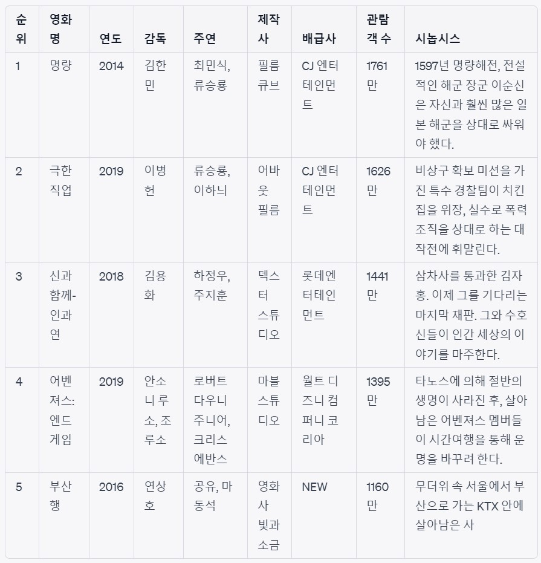{width="481"}
:::

# 챗GPT 인터페이스 <br> 오피스 전쟁

## 구글 검색의 종말(?)

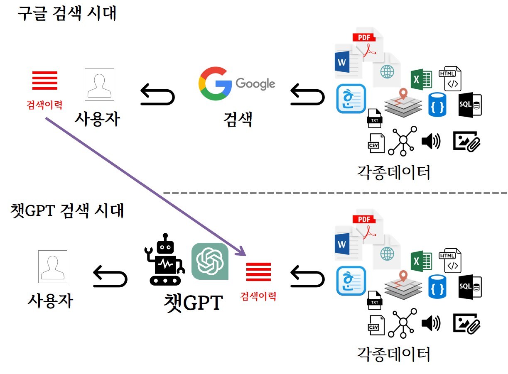

## 글쓰기 역사

<br>

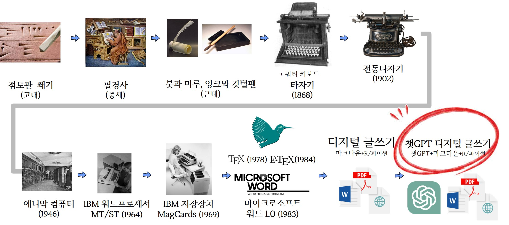

::: aside

- [문자와 종이 역사](https://r2bit.com/quarto/writing_history.html)
:::

## 오피스 전쟁 {.smaller}

|       항목        |                                                      MS 오피스 [^1]                                                       |                                                  구글 오피스 [^2]                                                  |                                                             리브레 오피스 [^3]                                                              |                                                    한컴 오피스 [^4]                                                     |
|:-------------:|:-------------:|:-------------:|:-------------:|:-------------:|
| 문서 작성 및 편집 |                                    워드, 엑셀, 파워포인트 등의 데스크톱 및 웹 앱 제공                                     |                               구글 문서, 스프레드시트, 프레젠테이션 등의 웹 앱 제공                                |                                                라이터, 캘크, 임프레스 등의 데스크톱 앱 제공                                                 |                                    한글, 한셀, 한쇼 등의 데스크톱 및 모바일 앱 제공                                     |
|   협업 및 공유    | 원드라이브를 통해 문서를 클라우드에 저장하고 공유 가능. 여러 사람이 동시에 문서를 수정할 수 있으나 실시간으로 보기 어려움 | 구글 드라이브를 통해 문서를 클라우드에 저장하고 공유 가능. 여러 사람이 동시에 문서를 수정하고 실시간으로 확인 가능 | 드롭박스나 구글 드라이브와 연동하여 문서를 클라우드에 저장하고 공유 가능. 여러 사람이 동시에 문서를 수정할 수 있으나 실시간으로 보기 어려움 | 넷프리즘을 통해 문서를 클라우드에 저장하고 공유 가능. 여러 사람이 동시에 문서를 수정할 수 있으나 실시간으로 보기 어려움 |
|  이메일 및 채팅   |                          Outlook을 통해 비즈니스 메일 제공. Teams을 통해 채팅 및 화상 회의 가능                           |                     Gmail을 통해 비즈니스 메일 제공. Chat과 Meet을 통해 채팅 및 화상 회의 가능                     |                                                          이메일 및 채팅 기능 없음                                                           |                                                이메일 및 채팅 기능 없음                                                 |
|       가격        |                 1인당 월 5\~20달러 다양한 요금제 제공. 데스크톱 앱 사용 가능한 요금제는 12.5달러부터 시작                 |                                     1인당 월 6\~18달러까지 다양한 요금제 제공                                      |                                                                  완전 무료                                                                  |                              개인용은 무료로 사용 가능하며 업무용은 별도로 견적 요청 필요                               |

[^1]: https://www.microsoft.com/ko-kr/microsoft-365/business

[^2]: https://workspace.google.com/intl/ko_kr/

[^3]: https://www.libreoffice.org/

[^4]: https://www.hancom.com/product/productMain.do


## 오피스 전쟁: 패러다임 충돌

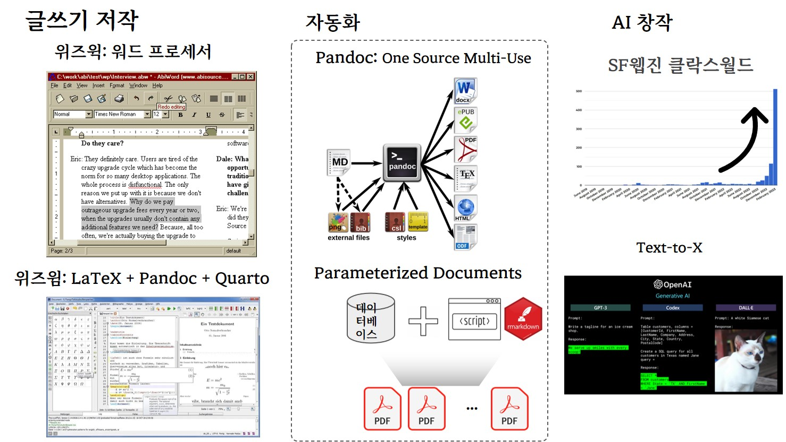


## 챗GPT 시대 사무실

::: panel-tabset
### 챗GPT 사용원인

{width="600"}

### 인터페이스

{width="500"}


### 챗GPT AS-IS

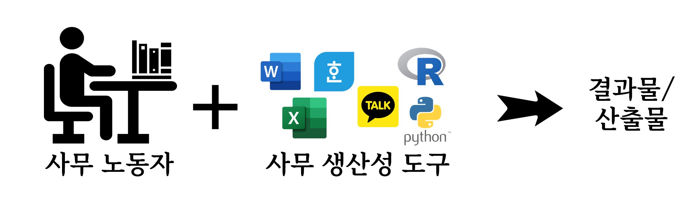

### 챗GPT TO-BE

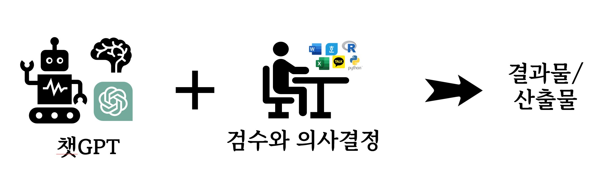
:::


## 챗GPT가 이룬 대통합


## 인터페이스 (Interface) {.smaller}

::: panel-tabset
### 진화과정

<br> <br> <br>

```{mermaid}
flowchart TB
    
    subgraph A["사용자 인터페이스"]
    direction LR
        CLI["CLI<br>Command Line Interface<br> 1950~"]     --> GUI["GUI <br> Graphic User Inferface<br> 1970~"]
        GUI               --> WI["Web Interface <br> 1994~"]
        WI --> MI["Mobile Interface <br> 2007~"]
        MI --> NUI["LUI <br> Language User Interface <br> 2023~"]

    end


class A nodeStyle

classDef nodeStyle fill:#fcfbfa,stroke:#000000,stroke-width:0.7px,font-weight:bold,font-size:14px;
```

### CLI

<br>

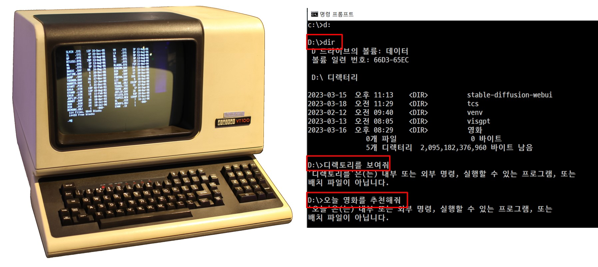

-   <https://en.wikipedia.org/wiki/Computer_terminal>

### GUI

<br>


-   <https://kartsci.org/kocomu/computer-history/graphical-user-interface-history/>

### WUI

<br> <br>

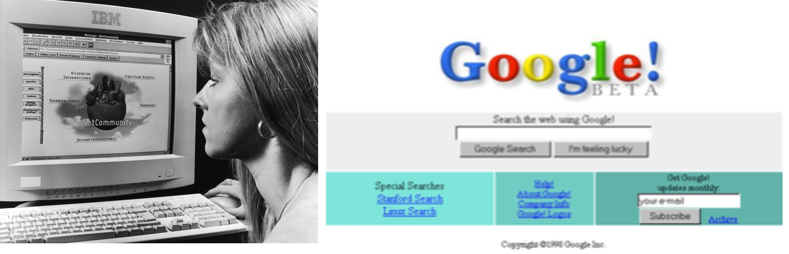

### MUI


-   <https://www.huffpost.com/entry/uber-your-way-through-cit_b_1205446>

### LUI

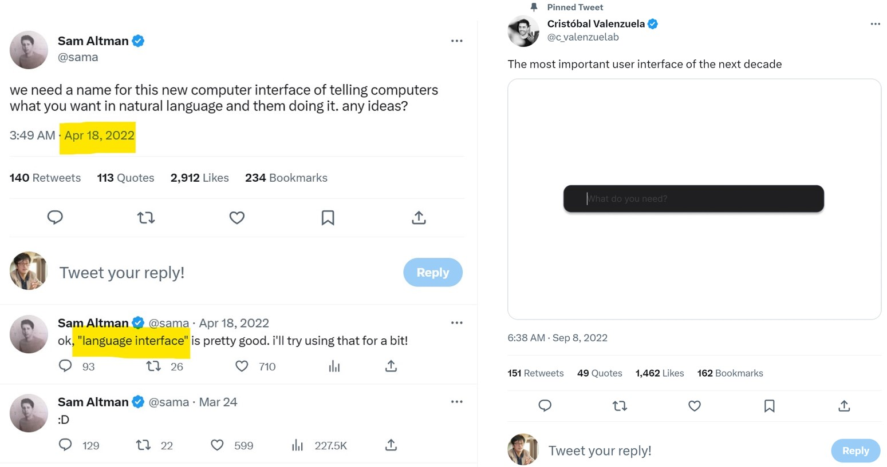

-   <https://twitter.com/sama/status/1515764302904377344>
:::

## 챗GPT NUI {.smaller}

::: panel-tabset
### 1:1 채팅

-   챗GPT (ChatGPT)

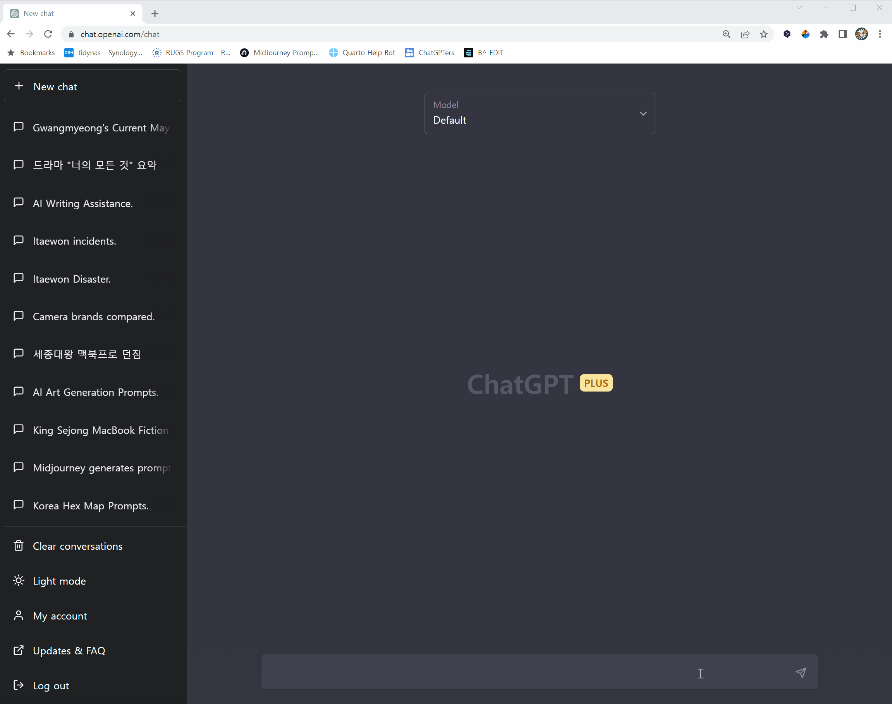{fig-align="center" width="634"}

### 클릭하여 완료

-   OpenAI Playground

{fig-align="center" width="645"}

### 자동완성

-   GitHub Copilot

{fig-align="center"}

-   <https://towardsdatascience.com/some-experiments-using-github-copilot-with-python-90f8065fb72e>

### 명령 팔레트

:::::{.columns}
:::{.column}
#### 사례
::: r-stack
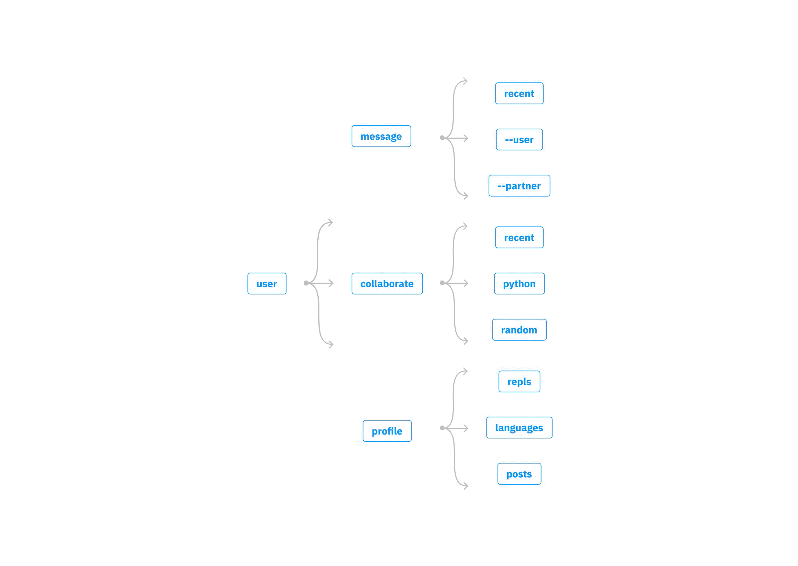

::: fragment

:::

::: fragment

:::


:::

- <https://blog.replit.com/clui>
- <https://blog.replit.com/ai>

:::


:::{.column}
#### Command Palette 역사

- 60년대로 거슬러 올라가는 명령 팔레트는 최근 기술 업계에서 다시 인기를 얻고 있으며 사용자 중심 소프트웨어의 필수적인 부분으로 간주됨.
- CLI는 개인용 컴퓨터가 대중화되기 전 초기 컴퓨팅을 지배했으며 사용자가 시스템을 작동하기 위해 특정 명령을 알아야 했다. 1984년 Apple의 매킨토시와 함께 도입된 그래픽 사용자 인터페이스(GUI)는 중요한 혁신으로 여겨졌지만, 소프트웨어의 복잡성이 증가함에 따라 GUI만으로는 탐색하기가 점점 더 어려워졌다.
- 사용자가 항목 이름의 짧은 약어입력하여 앱과 파일을 검색할 수 있는 런처가 점점 더 보편화 되었다. 예를 들어 2001년에 출시된 Mac OS X용 LaunchBar, Quicksilver, 2005년에 출시된 Apple의 시스템 전체 Spotlight가 있다. 검색과 CLI의 결합은 **Command Palette**의 탄생으로 이어졌다.
- 오늘날 우리가 알고 있는 현대식 명령 팔레트는 2011년 Sublime Text 2 베타 Joe Skinner가 처음 소개. 명령줄 사용에 익숙한 프로그래머들이 단축키를 모두 외울 필요 없이 더 빠르게 작업할 수 있어 중요한 발전이 됨.
:::

:::::

:::

## 실습: 글쓰기 {.smaller}

:::{.panel-tabset}

### 프롬프트

영화전문 시나리오 저작자의 역할을 수행바랍니다.
두편의 영화 시놉시스가 백틱(```)으로 감싸져 있습니다. 다음 두 영화 시놉시스를 하나로 합하여 전혀 새로운 영화 시놉시스를 300자 이내로 작성해주세요.

\```

첫번째 영화: 극한직업

각종 범죄 현장에서 물리적인 고난과 위험을 감수하며 사건을 해결하는 특수 대원들의 이야기. 그러나 그들의 직업은 상상을 초월하는 극한의 직업, 치킨집 사장이었다.

두번째 영화: 국제시장

덕수(황정민)의 가족은 흥남 철수 때 부산 국제시장에 내려온 피난민이다. 전쟁통에 아버지를 잃은 덕수는 졸지에 어머니와 두 동생의 생계를 책임지게 됐다. 동생의 학비와 생활비를 벌기 위해 자신의 꿈을 버린 채 친구 달구(오달수)와 함께 서독의 탄광으로, 베트남전으로 뛰어들어야 했던 덕수. 덕분에 사랑하는 아내 영자(김윤진)를 만날 수 있었고, 토끼 같은 자식들을 대학에 보낼 수 있었지만, 그의 인생에서 ’그’는 한번도 없었다.

\```


### 출력결과

"극한의 시장"

특수대원으로 활동하며 범죄를 막아내던 독특한 팀, 그들은 모두 특별한 신분을 가진 치킨집 사장들이다. 하지만 팀의 리더인 덕수는 더 큰 비밀을 가지고 있다. 그는 흥남 철수 때 부산 국제시장에 피난 온 가족을 부양하기 위해 자신의 꿈을 포기하고 독일 탄광, 베트남전으로 뛰어들어야 했다. 이제 그는 양면의 삶을 이어가면서, 치킨집을 운영하며 범죄를 막아내는 독특한 팀과 함께, 자신의 가족을 보호하고, 사랑하는 아내 영자와 함께 삶을 살아가야 한다. 그의 인생에 '그'는 없지만, 그의 삶은 여전히 희망과 사랑으로 가득 차 있다.

### --

### 영화제목 프롬프트

프롬프트: 매력적인 시놉시스 제목을 5개 이미티콘을 적절히 넣어 작성해주세요.

출력결과: 

- "🔥극한의 선택: 🍗치킨집 특수대원⚔️ vs. 국제시장🌍 생존자"
- "💥덕수의 두 세계: 특수대원으로서의 삶🕵️‍♂️와 국제시장에서의 삶🌏"
- "🐓치킨집에서의 특수작전🔫: 국제시장🌏의 비밀스러운 생존자"
- "🛠️하루아침에 특수대원🔫, 밤에는 국제시장🌏의 생존자: 덕수의 이중생활🎭"
- "🎬영화 속으로: 🔥극한의 시장에서🌏 치킨집 특수대원🕵️‍♂️으로 변신한 덕수의 이야기"

:::


- [ShareGPT](https://sharegpt.com/c/UqcCAkR)


# 챗GPT 개발자 <br> 프롬프트 디자인/엔지니어링

## 소프트웨어 3.0

::: columns
::: column
{width="441"}
:::

::: column
#### Andrej Karpathy

-   소프트웨어 1.0: 코드 작성을 통한 프로그래밍
-   소프트웨어 2.0: 데이터셋 큐레이팅을 통한 프로그래밍
-   소프트웨어 3.0: 프롬프트 엔지니어링을 통한 프로그래밍 (LLM에 입력으로 제공, GPT 스타일)
:::
:::

## 프롬프트 공학

::: panel-tabset
### 언어(?)

<br>

<blockquote class="twitter-tweet">

<p lang="en" dir="ltr">

The hottest new programming language is English

</p>

--- Andrej Karpathy (@karpathy) <a href="https://twitter.com/karpathy/status/1617979122625712128?ref_src=twsrc%5Etfw">January 24, 2023</a>

</blockquote>

```{=html}
<script async src="https://platform.twitter.com/widgets.js" charset="utf-8"></script>
```
### 텍스트 생성

<br>

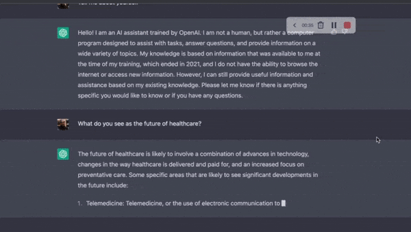{fig-align="center"}

### 언어 모형

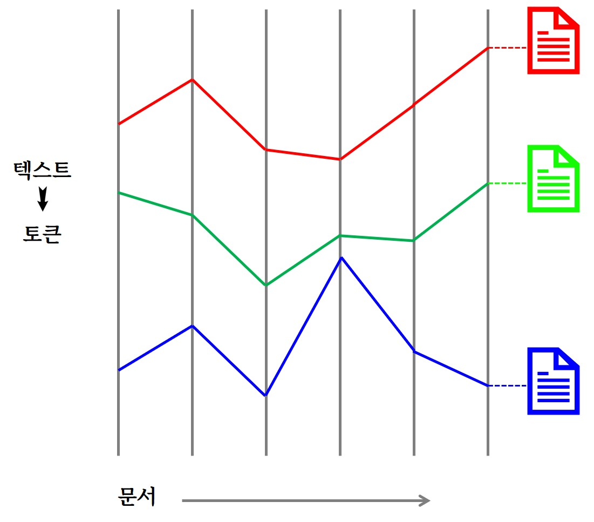{width="626"}

### 프롬프트

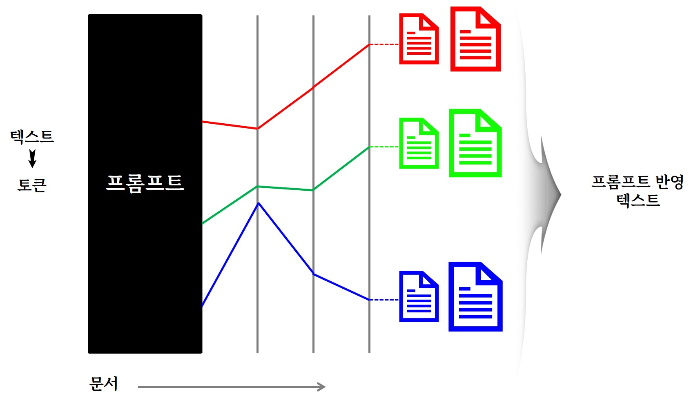{width="952"}

### 첫인사

<br>

::: columns
::: {.column width="33%"}

:::

::: {.column width="33%"}

:::

::: {.column width="33%"}
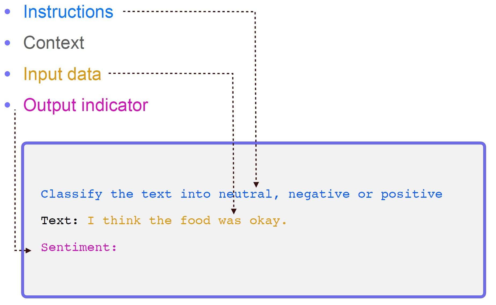
:::
:::
:::

## 프롬프트 공학 사례 {.smaller}

::: {.cell}
::: {.cell-output-display}
```{=html}
<div class="collapsibleTree html-widget html-fill-item-overflow-hidden html-fill-item" id="htmlwidget-8f4626cb51e76a042607" style="width:960px;height:480px;"></div>
<script type="application/json" data-for="htmlwidget-8f4626cb51e76a042607">{"x":{"data":{"name":"챗GPT 활용","children":[{"name":"업무활용","children":[{"name":"보고서 작성용 참고자료 조사"},{"name":"사업기획시 아이디어 도출"},{"name":"글쓰기, 보도자료, 번역 및 교정 등"},{"name":"엑셀 업무 활용"},{"name":"프로그래밍(업무자동화)"}]},{"name":"일상생활 활용","children":[{"name":"법률 자문"},{"name":"건강 상담"},{"name":"심리 상담  "},{"name":"학업, 직업 등 진로 상담  "},{"name":"자동차 정비 문의  "},{"name":"쓰레기 처리 방법 문의  "},{"name":"음식요리 검색  "},{"name":"육아 관련 상담  "}]},{"name":"창작활동 활용","children":[{"name":"글쓰기 활용  "},{"name":"음악 작업 활용  "},{"name":"그림이미지 활용  "}]},{"name":"교육","children":[{"name":"수업 준비","children":[{"name":"코스 설명 생성하기"},{"name":"학습 목표 및 목적 생성하기"},{"name":"강의 계획 작성"},{"name":"교실 활동 만들기"},{"name":"아이스 브레이커 질문 및 활동 목록 개발하기"},{"name":"커뮤니티 구축 활동 파악하기"},{"name":"예시 만들기"},{"name":"수업 시작을 위한 아이디어"},{"name":"강의 노트 만들기"},{"name":"화이트보드 레이아웃"},{"name":"루브릭 만들기"},{"name":"프로젝트 아이디어 생성"},{"name":"토론 질문 생성하기"},{"name":"과제 프롬프트 테스트하기"}]},{"name":"교육 지원 제공","children":[{"name":"에세이 채점"},{"name":"독해력"},{"name":"매들리브 스토리 만들기"},{"name":"주제 개요 만들기"},{"name":"글쓰기 프롬프트 생성"},{"name":"쓰기 샘플 준비"},{"name":"다양한 작업에 대한 쓰기 지침 작성"},{"name":"개인 맞춤형 학습 계획"},{"name":"프레젠테이션 개요 작성"},{"name":"더미 데이터 생성"}]},{"name":"평가","children":[{"name":"빈칸 채우기 연습 문제 만들기"},{"name":"시험 문제 생성하기"},{"name":"대화형 퀴즈"}]},{"name":"학습보조도구 제작","children":[{"name":"학습 가이드 만들기"},{"name":"어휘 목록 만들기"},{"name":"플래시 카드 만들기"}]},{"name":"교실 모둠활동 개발","children":[{"name":"에세이를 확인하여 AI가 작성했는지 확인하기"},{"name":"AI 생성 텍스트에 대한 비판적 분석"},{"name":"토론 지원"},{"name":"인터랙티브 소설 쓰기"},{"name":"시뮬레이션 기반 학습"},{"name":"대화 생성"},{"name":"과제의 일부로 AI 사용 필요"},{"name":"학생이 학과에서 AI를 사용할 수 있는 방법 나열하기"},{"name":"생각하기, 짝짓기, 공유와 함께 사용"},{"name":"채팅GPT의 반응 예측하기"},{"name":"채팅GPT의 응답 채점하기"}]},{"name":"학생이 챗GPT 활용","children":[{"name":"작문 지원"},{"name":"언어 번역"},{"name":"언어 토론 파트너"},{"name":"디지털 튜터"},{"name":"Q&A 세션"},{"name":"스피치 및 프레젠테이션 지원"},{"name":"디지털 스토리텔링"},{"name":"기사 요약"},{"name":"주제 명확히 하기"},{"name":"개인 맞춤형 학습"},{"name":"연구 지원"},{"name":"불완전한 노트 필기 구체화"}]},{"name":"컴퓨터 프로그래밍","children":[{"name":"코드 작성하기"},{"name":"코드가 하는 일 설명하기"},{"name":"스크립트 문제 해결"},{"name":"SQL 코드 작성"},{"name":"HTML 코드 정리"},{"name":"애플리케이션 스크립트 작성"},{"name":"코드에 주석 추가하기"}]}]}]},"options":{"hierarchy":["대구분","중구분","소구분"],"input":null,"attribute":"leafCount","linkLength":null,"fontSize":10,"tooltip":false,"collapsed":true,"zoomable":true,"margin":{"top":20,"bottom":20,"left":60,"right":170},"fill":"lightsteelblue"}},"evals":[],"jsHooks":[]}</script>
```
:::
:::

::: aside
[서울 디지털재단](https://sdf.seoul.kr/)에서 챗GPT 활용 사례집을 업무활용과 일상생활/창작활동/교육분야 로 나눠 두번에 걸쳐 보고서를 발간했다. [@sdf2023] [@sdf2023v2] 최근에는 교육분야 전반에 챗GPT 활용 책도 출간되었다. [@stan2023]
:::

## 개발자를 위한 프롬프트 공학 {.smaller}

::: panel-tabset
### 두가지 원칙

::: {.cell}
::: {.cell-output-display}
```{=html}
<div class="collapsibleTree html-widget html-fill-item-overflow-hidden html-fill-item" id="htmlwidget-2f81ed486f153f10785c" style="width:960px;height:480px;"></div>
<script type="application/json" data-for="htmlwidget-2f81ed486f153f10785c">{"x":{"data":{"name":"프롬프트 작성원칙","children":[{"name":"명확한 지시명령어 작성","children":[{"name":"구분자 사용(Delimiter)"},{"name":"출력형식(HTML, JSON)"},{"name":"조건 확인"},{"name":"퓨삿(Few-Shot) 학습"}]},{"name":"모형에게 생각시간 제공","children":[{"name":"수행작업 단계 명시"},{"name":"모델 스스로 해결책 찾도록 지시"}]}]},"options":{"hierarchy":["원칙","세부책략"],"input":null,"attribute":"leafCount","linkLength":null,"fontSize":10,"tooltip":false,"collapsed":true,"zoomable":true,"margin":{"top":20,"bottom":20,"left":70,"right":110},"fill":"lightsteelblue"}},"evals":[],"jsHooks":[]}</script>
```
:::
:::

### NLP 개발업무

::: {.cell}
::: {.cell-output-display}
```{=html}
<div class="collapsibleTree html-widget html-fill-item-overflow-hidden html-fill-item" id="htmlwidget-4b7e72a32a7093639d71" style="width:960px;height:480px;"></div>
<script type="application/json" data-for="htmlwidget-4b7e72a32a7093639d71">{"x":{"data":{"name":"프롬프트\n 개발업무","children":[{"name":"요약","children":[{"name":"간략한 요약"},{"name":"(배송/배달/가격) 초점 두고 요약"},{"name":"요약 대신 관련부문 추출"}]},{"name":"추론","children":[{"name":"(긍/부정) 감성"},{"name":"감정 유형 식별"},{"name":"고객 분노 여부"},{"name":"제품과 회사명 추출"},{"name":"한번에 반복작업"},{"name":"토필 추론"}]},{"name":"번역","children":[{"name":"언어감지"},{"name":"번역"},{"name":"격시 및 비격식 문장"},{"name":"범용 글로벌 번역기"},{"name":"어조 변환"},{"name":"자료형(JSON 등) 변환"},{"name":"문법/맞춤법 교정"},{"name":"교정"}]},{"name":"챗봇","children":[{"name":"챗봇"}]}]},"options":{"hierarchy":["실무작업","세부작업"],"input":null,"attribute":"leafCount","linkLength":null,"fontSize":10,"tooltip":false,"collapsed":true,"zoomable":true,"margin":{"top":20,"bottom":20,"left":75,"right":120},"fill":"lightsteelblue"}},"evals":[],"jsHooks":[]}</script>
```
:::
:::
:::

::: aside
-   [프롬프트 공학](https://r2bit.com/chatGPT/prompt.html)
-   [고급 프롬프트 공학](https://r2bit.com/chatGPT/prompt_adv.html)
-   [(개발자) 프롬프트 공학](https://r2bit.com/chatGPT/prompt_for_develoopers.html)
:::

## 배경 - 프롬프트 엔지니어링

<br>

::: {#context layout-ncol="2"}
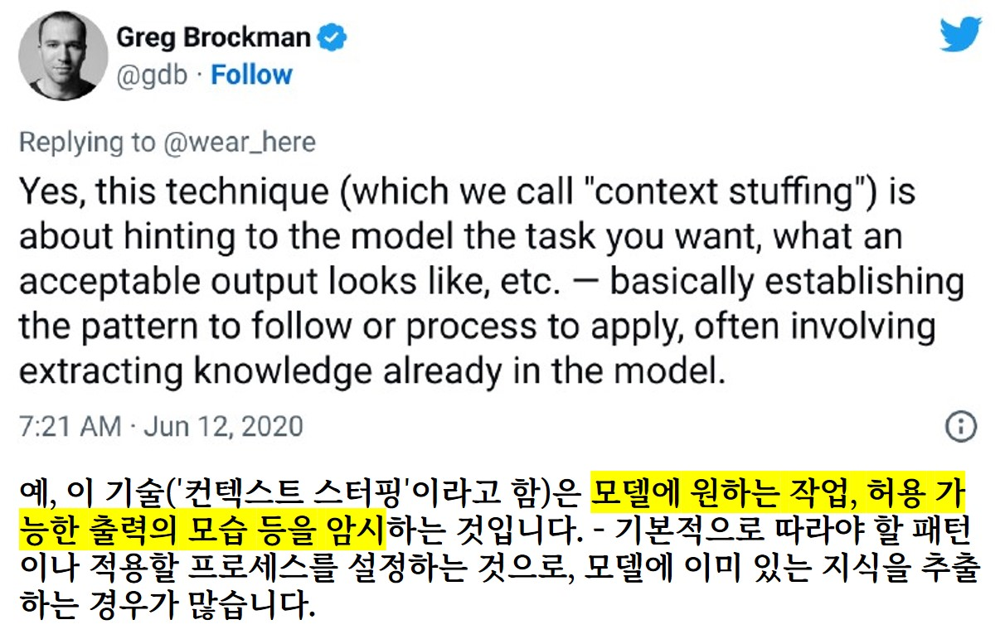

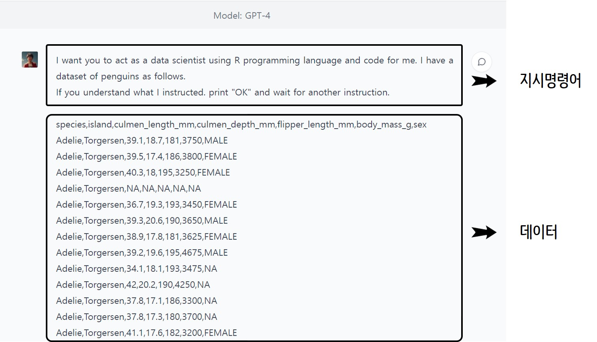

프롬프트 엔지니어링 (Context Stuffing)
:::

::: aside
-   [챗GPT시대 데이터 과학 - 파머 펭귄](https://shareg.pt/mcr4YOM)
:::

## 보안사고 {.smaller}

::: panel-tabset
### 삼성전자와 이탈리아

::: columns
::: {.column width="50%"}
### 삼성전자

> 삼성전자 DS 부문 임직원 A씨는 반도체 설비 계측 데이터베이스(DB) 다운로드 프로그램의 소스 코드를 실행 중 오류를 확인했다. 문제가 된 소스 코드 전부를 복사해 챗GPT에 입력, 해결 방법을 문의했다. 삼성전자 설비 계측과 관련한 소스 코드가 오픈AI 학습 데이터로 입력된 셈이다.

> 임직원 B씨는 수율·불량 설비 파악을 위해 작성한 프로그램 코드를 챗GPT에 입력하는 사고를 냈다. 관련 소스 전체를 챗GPT에 입력하고 코드 최적화를 요청했다. 임직원 C씨는 스마트폰으로 녹음한 회의 내용을 네이버 클로바 애플리케이션(앱)을 통해 문서 파일로 변환한 뒤 챗GPT에 입력했다. 회의록 작성 요청이 목적이다.
:::

::: {.column width="50%"}
### 이탈리아

> 로이터 통신 등에 따르면 이탈리아 데이터 보호청은 "챗GPT가 이탈리아의 개인정보 보호 기준과 규정을 충족할 때까지 서비스 접속을 일시적으로 차단할 것"이라고 밝혔다.<br>

> 접속 차단 이유는 개인정보 침해 우려 때문이다. 이탈리아 당국은 챗GPT가 알고리즘 학습을 이유로, 개인정보를 대량으로 수집하고 저장하는 행위를 정당화할 법적 근거가 없다고 지적했다. 보호청은 챗GPT 개발사 오픈AI가 20일 이내에 해결책을 내놓지 않으면 전 세계 매출액의 최대 4%에 달하는 벌금을 물게 될 것이라고 경고하기도 했다.
:::
:::

### 보안과 효율

**보안 vs 효율** 을 높고 많은 공공기관을 비롯한 기업들이 고민을 하고 있다. 거대언어모형(LLM)에 기반하여 모든 것을 자체 개발하면 상관이 없으나 현실적으로 GPT-3/3.5/4 모형을 갖춘 조직이 전무하지만, 이미 대다수의 사람이 오픈AI 챗GPT를 맛보았기 때문에 생산성 향상을 그냥 두고 넘어가기도 어려운 상황이다. 이런 점에서 챗GPT 제한적 사용이 현재시점('23년 3월) 최선으로 보이며 점차 오픈소스 거대언어모형(LLM)과 전략적 제휴를 통한 챗GPT 사용이 중장기적 추진방향으로 자리 잡고 있다.

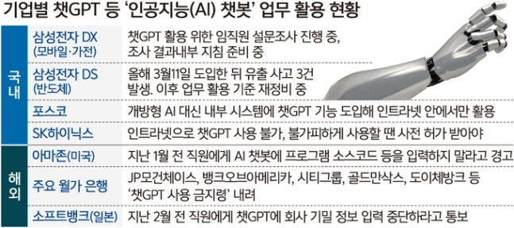
:::

::: aside
-   [정두용 (2023-03-30), "우려가 현실로...삼성전자, 챗GPT 빗장 풀자마자 '오남용' 속출", 이코노미스트](https://economist.co.kr/article/view/ecn202303300057)

-   [민재용 (2023.04.02), "이탈리아도 챗GPT '차단'...서방 국가중 처음", 한국일보](https://m.hankookilbo.com/News/Read/A2023040208490005108)

-   [이동수 (2023.04.02.), "대기업 회의 내용 유출... '챗GPT 기밀 유출' 우려가 현실로", 세계일보](https://n.news.naver.com/mnews/article/022/0003798570?sid=101)
:::

## 실습

::: panel-tabset
### Text-to-Image 프롬프트

프롬프트를 사용하여 생성형 이미지 제작 전문가로 역할을 해주세요. Dall-E 2를 생성형 이미지 제작을 위한 기본 엔진으로 설정하고 다음 텍스트를 이미지 생성용 텍스트 프롬프트로 작성한 10단어 내외로 작성 후 영어로 번역하시오.

특수대원으로 활동하며 범죄를 막아내던 독특한 팀, 그들은 모두 특별한 신분을 가진 치킨집 사장들이다. 하지만 팀의 리더인 덕수는 더 큰 비밀을 가지고 있다. 그는 흥남 철수 때 부산 국제시장에 피난 온 가족을 부양하기 위해 자신의 꿈을 포기하고 독일 탄광, 베트남전으로 뛰어들어야 했다. 이제 그는 양면의 삶을 이어가면서, 치킨집을 운영하며 범죄를 막아내는 독특한 팀과 함께, 자신의 가족을 보호하고, 사랑하는 아내 영자와 함께 삶을 살아가야 한다. 그의 인생에 '그'는 없지만, 그의 삶은 여전히 희망과 사랑으로 가득 차 있다.

<br>

[ShareGPT](https://sharegpt.com/c/4wxy0Pz)

### 출력결과

<br>

텍스트 프롬프트(10단어): "특별대원이자 치킨집 사장들의 팀, 덕수의 양면적인 삶."

English translation: "The double life of Deok-su, a special agent and a team of chicken shop owners."

### --

### 이미지 생성자

{fig-align="center" width="500"}

-   [바로가기](https://www.bing.com/images/create/the-double-life-of-deok-su2c-a-special-agent-and-a-/647bf625534745f991d24e18bc1f8d7f?id=aVZQTeLr7wd7X2MHqWnqCQ%3d%3d&view=detailv2&idpp=genimg&FORM=GCRIDP&mode=overlay)

### 스타일 적용

:::::{.columns}
:::{.column}
The double life of Deok-su, a special agent and a team of chicken shop owners, no characters, Peter Mohrbacher, uplight, hyper detail, street level view, analog photography, digital painting

<br>

- [바로가기](https://www.bing.com/images/create/the-double-life-of-deok-su2c-a-special-agent-and-a-/647bf8d1338646d9a2fcb56dc098c17b?id=0In2NDCSDGkecC8aTOeNvg%3d%3d&view=detailv2&idpp=genimg&FORM=GCRIDP&mode=overlay)
:::
:::{.column}

:::
:::::


:::

::: aside

- [Text-to-Image](https://r2bit.com/chatGPT/text_to_images.html)

:::


# 챗GPT 사용자 <br> Text-to-**X**

## openAI 마이크로소프트 3 대장 + $\alpha$


## chatGPT 3대장

::: panel-tabset
### 최강 3대장 {.unnumbered}

{width="800"}

### `chatGPT` 3대장 {.unnumbered}

{width="800"}

### --- {.unnumbered}

### 글쓰기 {.unnumbered}

{width="700"}

### 그리기 {.unnumbered}

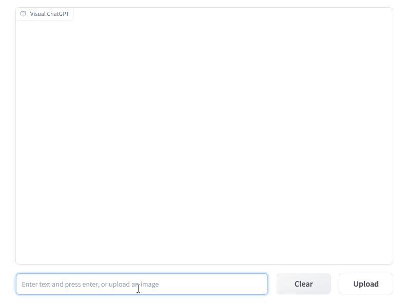{width="700"}

### 코딩 {.unnumbered}

{width="700"}
:::

## chatGPT 3대장 + $\alpha$ 추론

::: panel-tabset
### 문제

#### 디오판토스 묘비

신의 축복으로 태어난 그는 인생의 $\frac{1}{6}$을 소년으로 보냈다. 그리고 다시 인생의 $\frac{1}{12}$ 이 지난 뒤에는 얼굴에 수염이 자라기 시작했다. 다시 $\frac{1}{7}$이 지난 뒤 그는 아름다운 여인을 맞이하여 화촉을 밝혔으며, 결혼한 지 5년 만에 귀한 아들을 얻었다. 아! 그러나 그의 가엾은 아들은 아버지의 반 밖에 살지 못했다. 아들을 먼저 보내고 깊은 슬픔에 빠진 그는 그 뒤 4년간 정수론에 몰입하여 스스로를 달래다가 일생을 마쳤다. \[\^1\]

### 수식

디오판토스가 정확히 언제 태어나고 언제 죽었는지는 명확하지 않지만, 그가 죽었을 때의 나이는 정확히 알 수 있다. 이를 방정식을 통해 풀어보자. 수식을 $x$에 대해 정리해서 풀면 84가 나온다.

$$\frac {x} {6} + \frac {x} {12} + \frac {x} {7} +  5 + \frac {x} {2} + 4 = x$$

### 손 풀기

{width="486"}

### `Sympy`

::: {.cell}

```{.python .cell-code}
from sympy import *
x = Symbol('x')
Diophantus_puzzle = x/6 + x/12 + x/7 + 5 + x/2 + 4 - x
solve(Diophantus_puzzle, x, dict = True)
```
:::

```         
[{x: 84}]
```

### `chatGPT`

{width="400"}

### Wolfram Plugin

::: columns
::: column
{width="400"}
:::

::: column
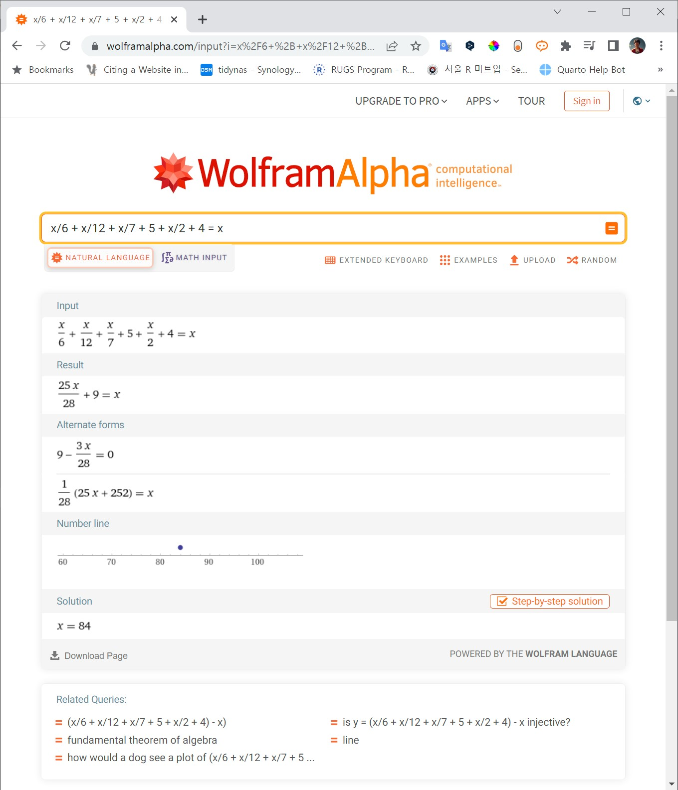{width="400"}
:::
:::

[울프람 웹사이트](https://www.wolframalpha.com/input?i=x%2F6+%2B+x%2F12+%2B+x%2F7+%2B+5+%2B+x%2F2+%2B+4+%3D+x)
:::

## AutoGPT: Text-to-Task

<br>



::: aside
-   [Auto-GPT: An Autonomous GPT-4 Experiment](https://github.com/Significant-Gravitas/Auto-GPT)
:::

## 데이터 분석: Text-to-Analytics

::: panel-tabset
### PandasAI

[Pandas AI](https://github.com/gventuri/pandas-ai)는 널리 사용되는 데이터 분석 및 조작 도구인 Pandas에 생성 인공 지능 기능을 추가한 Python 라이브러리다. [Pandas AI](https://github.com/gventuri/pandas-ai)는 판다스와 함께 사용하도록 설계되었으며, 판다스를 대체할 수 없다.

<br> <br>

-   [chatGPT: 판다스 AI](https://r2bit.com/chatGPT/pandasai.html)

### LlamaIndex

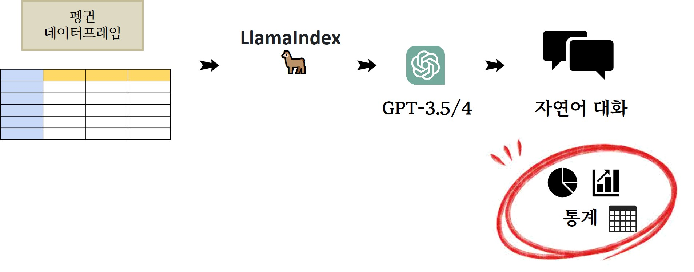{width="1274"}

-   [chatGPT: 펭귄 - 라마인덱스](https://r2bit.com/chatGPT/llama_penguins.html)

### 챗GPT SQL

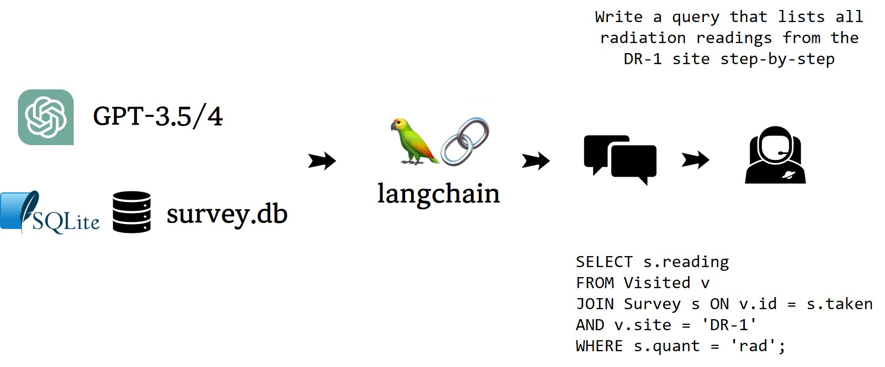{width="1274"}

-   [chatGPT: 챗GPT SQL](https://r2bit.com/chatGPT/sql_openai.html)

### RTutor.ai



-   [Chat with your data with RTutor](https://youtube.com/shorts/n4G8UuLc0Bs?feature=share)
-   [RTutor](http://rtutor.ai/)
:::

## 실습 {.smaller}

::: panel-tabset
### 수능영어문제

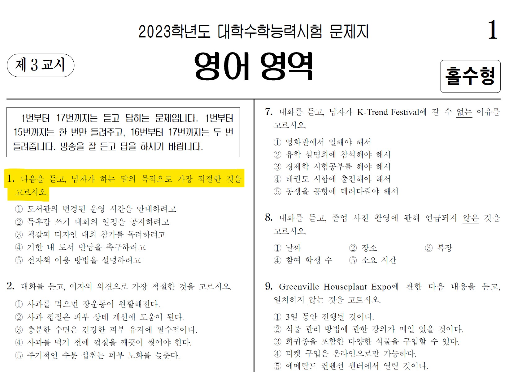{fig-align="center" width="688"}

::: {.cell}
::: {.cell-output-display}
```{=html}
<audio controls="">
<source src="data/01_문제 01.mp3" type="audio/mp3"/>
</audio>
```
:::
:::

### 프롬프트

다음 지문을 보고 문제를 푸세요. 지문과 문제는 백틱(`) 세개로 감싸여 있고 다음과 같이 되어 있습니다.


\``` <br>

지문과 문제 <br>
\```

출력:

1. 영어지문 전체를 한글로 번역한다.
2. 정답을 제시하고 이유도 설명한다.


\``` <br>

다음을 듣고, 남자가 하는 말의 목적으로 가장 적절한 것을 고르시오.
M: Hello, Lockwood High School students. This is your school librarian, Mr. Wilkins. I’m sure you’re aware that our school librar y is hosting a bookmark design competition. I encourage students of all grades to par ticipate in the competition. The winning designs will be made into bookmarks, which will be distributed to librar y visitors. We’re also giving out a variety of other prizes. So don’t let this great oppor tunity slip away. Since the registration period for the bookmark design competition ends this Friday, make sure you visit our school librar y to submit your application. Come and par ticipate to display your creativity and talents.

다음을 듣고, 남자가 하는 말의 목적으로 가장 적절한 것을 고르시오. ① 도서관의 변경된 운영 시간을 안내하려고 ② 독후감 쓰기 대회의 일정을 공지하려고 ③ 책갈피 디자인 대회 참가를 독려하려고 ④ 기한 내 도서 반납을 촉구하려고 ⑤ 전자책 이용 방법을 설명하려고 <br>
\```

### 출력결과

다음은 영어 지문의 한글 번역입니다:

안녕하세요, 록우드 고등학교 학생 여러분. 저는 교사 월킨스입니다. 아마도 여러분들은 저희 학교 도서관에서 책갈피 디자인 대회를 개최한다는 사실을 알고 있을 것입니다. 저희는 모든 학년의 학생들이 이 대회에 참가하도록 권장합니다. 우승 디자인은 책갈피로 만들어져서 도서관 방문자들에게 배포될 것입니다. 우리는 또한 다양한 상품을 제공하고 있습니다. 그러니 이 좋은 기회를 놓치지 마십시오. 책갈피 디자인 대회의 등록 기간은 이번 주 금요일에 종료되기 때문에, 신청을 제출하려면 반드시 학교 도서관을 방문해야 합니다. 참여하여 여러분의 창의력과 재능을 표출해보세요.

위 지문에 대한 문제는 다음과 같습니다:

다음을 듣고, 남자가 하는 말의 목적으로 가장 적절한 것을 고르시오.
① 도서관의 변경된 운영 시간을 안내하려고
② 독후감 쓰기 대회의 일정을 공지하려고
③ 책갈피 디자인 대회 참가를 독려하려고
④ 기한 내 도서 반납을 촉구하려고
⑤ 전자책 이용 방법을 설명하려고

정답은 **③ 책갈피 디자인 대회 참가를 독려하려고 **입니다.

남자의 말에서는 책갈피 디자인 대회를 언급하고, 학생들에게 대회에 참가할 것을 권장하고 있습니다. 그래서 남자의 목적은 책갈피 디자인 대회 참가를 독려하는 것입니다.

:::

::: aside

- [ShareGPT](https://sharegpt.com/c/hgMYJTM)
:::

# 참고문헌

::: {#refs}
:::


    
    


