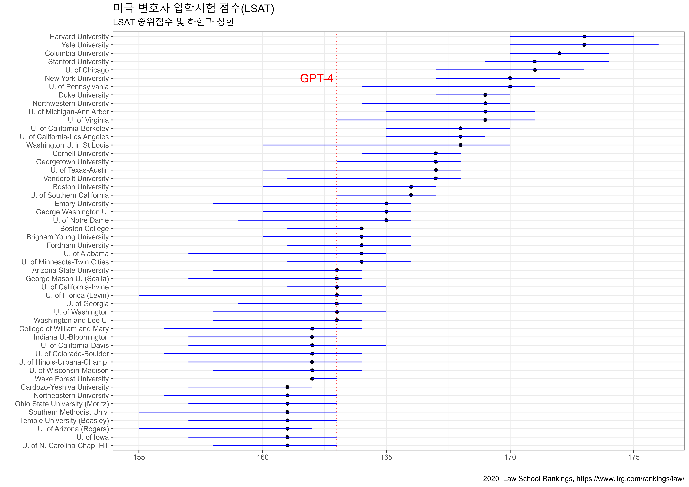
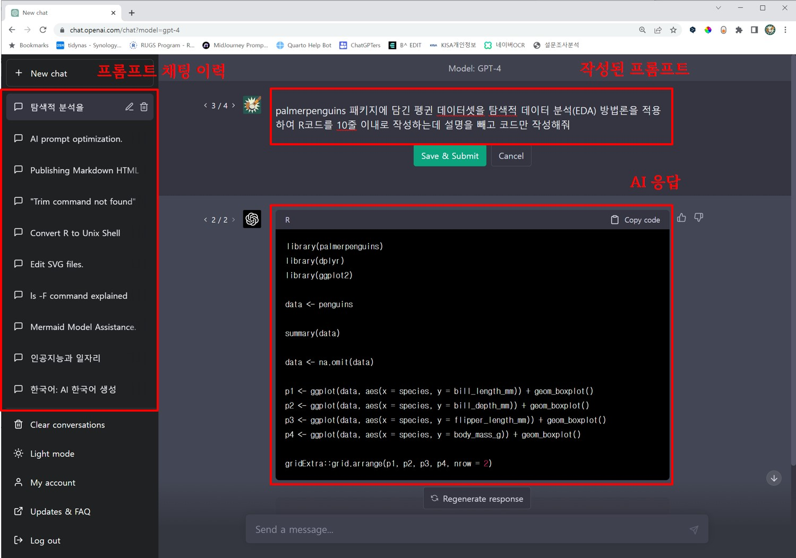
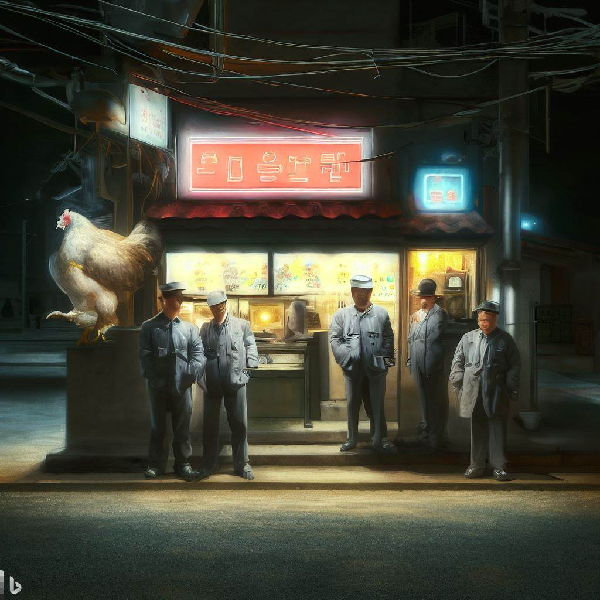
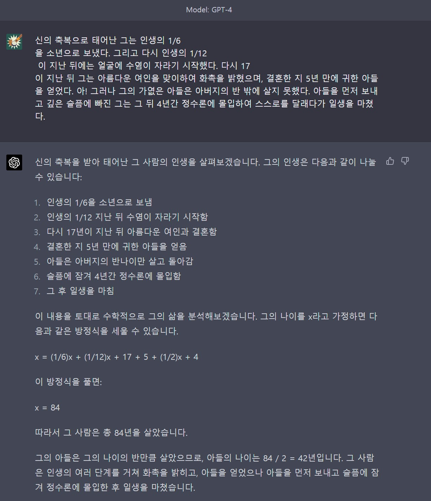

## 목차

1.  강사소개 ë° ë¯¸íŠ¸ì—… 안내

2.  ì±—GPT ì²´í—˜ ì‚¶ì˜ í˜„ì¥

    -   실습: ì료조사

3.  ì±—GPT 시대 오피스 ì „ìŸ (사무 ìë™í™” → 사무 지능화)

    -   실습: 글쓰기

4.  프롬프트 ì—”ì§€ë‹ˆì–´ë§ (Text-to-X)

    -   실습: 그리기

5.  AutoGPT, 엑셀과 추론

    -   실습: 수능문제풀ì´

6.  질ì˜ì‘답


## 강사소개 & ê°•ì˜ ê°œìš” {.smaller}

::: panel-tabset
### 강사소개

::: {layout-ncol="2"}
### AI 아바타

{.absolute top="0" right="0" width="300"}

### 주요경력 ë° í•™ë ¥

-   (현) 비ì˜ë¦¬ë²•ì¸ 한국 R 사용ì회: 기술 ì´ì‚¬

-   (현) êµ­ê°€êµìœ¡ìœ„ì›íšŒ 전문위ì›: 과학/기술 분과

-   (현) ê±´êµ­ëŒ€í•™êµ ì±—GPT ë°ì´í„° 사ì´ì–¸ìŠ¤ 과정: 외ë˜êµìˆ˜

-   (ì „) TCS: GS ì¹¼í…스 디지털 ì•„ì¹´ë°ë¯¸ 강사

-   (ì „) ì—°ì„¸ëŒ€í•™êµ ë°ì´í„° 사ì´ì–¸ìŠ¤: 겸ì„êµìˆ˜

-   (ì „) 삼정 KPMG: Lighthouse AI 기술ì´ê´„

-   (ì „) 웹젠: ë°ì´í„° 과학ì TD

-   (ì „) 현대모비스: 차량용 ë°˜ë„ì²´ 개발구매 <br>

-   (ì „) 현대ìë™ì°¨: VAATZ / FTA <br>

    <br> <hr> <br>

-   KAIST, CMU, 연세대 ì‘용통계 ë° ì»´í“¨í„° 과학 ì „ê³µ

-   [RStudio Instructor](https://education.rstudio.com/trainers/people/lee+kwangchun/) - Tidyverse

-   [Seoul R Meetup Organizer](https://r2bit.com/seoul-r/)
:::


### ê°•ì˜ê°œìš”

::: {layout-ncol="2"}


### ê°•ì˜ìƒì„¸

- 날짜 : 2023. 6. 19.(월) 13:00~15:00
- ì¥ì†Œ : 비대면
- ëŒ€ìƒ : ê²½ê¸°ë„ ì‹ ê·œì„ìš© 공무ì›
- ë‚´ìš©
  - 4ì°¨ ì‚°ì—…í˜ëª…
  - ì±—GPT
  - Text-to-X
  - 사무 ìë™í™” &rarr; 사무 지능화
  - 프롬프트 엔지니어ë§
:::
:::

#  {background-image="img/meetup_logo.jpg"}

::: r-fit-text
:::

## 서울 R 미트업 {.smaller}

::: columns
::: column
::: r-stack

{.fragment width="320"}

::: fragment
{.fragment width="320"}
:::

::: fragment
{.fragment width="320"}
:::

::: fragment
{.fragment width="320"}
:::

::: fragment
{.fragment width="320"}
:::


:::
:::

::: column
## 참여와 연대

-   **서울R미트업 meetup.com**: [link](https://www.meetup.com/seoul-r-meetup)
    -   **23년 4월 서울 R 미트업**: [link](https://www.meetup.com/seoul-r-meetup/events/292232899/)
    -   **23년 5월 서울 R 미트업**: [link](https://www.meetup.com/seoul-r-meetup/events/292966674/)
    -   **23년 6월 서울 R 미트업**: [link](https://www.meetup.com/seoul-r-meetup/events/293485362/)
    -   **23년 7월 서울 R 미트업**: [link](https://www.meetup.com/seoul-r-meetup/events/293929603/)
-   세계 R 미트업 현황 (Global R Meetup Dashboard): [link](https://r-community.org/usergroups/)
-   한국 R 사용ì회 (Korea R User Group): [link](https://r2bit.com/)
-   한국 R 컨í¼ëŸ°ìŠ¤ (Korea R Conference): [link](https://use-r.kr/)
-   유튜브 ì±„ë„ (Youtube Channel): [link](https://www.youtube.com/channel/UCW-epmIvjBEhhVXw_F0Nqbw)
-   í˜ì´ìŠ¤ë¶ 그룹 (Facebook Group): [link](https://www.facebook.com/groups/tidyverse)
:::
:::


# ì‚¶ì˜ í˜„ì¥ <br> 사용ì / 개발ì

## 백만\~1ì–µ 사용ì 

백만, 5천만, 1ì–µ ê°€ì…ì를 가질 때까지 걸린 소요시간

::: panel-tabset
## 전화기

![[@song2019digital]](img/time-to-reach-springer.png){width="600"}

## 기술 진화

](img/hbr_trends.png)

## chatGPT 백만

{width="600"}

## 빅3 서비스


## 1억명 (소요 달수)

{width="600"}
:::

## AI를 ë°”ë¼ë³´ëŠ” ê´€ì 

::: panel-tabset
### 트위터 Santiago I {.unnumbered}


### 트위터 Santiago II {.unnumbered}


### 버스탄 ë‘ ë‚¨ì {.unnumbered}

{width="600"}
:::

## 3 ëŒ€ì¥ + $\alpha$


## ì²´í—˜ ì‚¶ì˜ í˜„ì¥

::: panel-tabset
### í˜„ëŒ€ë°±í™”ì  (글쓰기)

::: columns
::: column
<br> 
:::

::: column
<br> 
:::
:::

### 마ì´í¬ë¡œì†Œí”„트 (코딩)

::: columns
::: {.column width="60%"}

:::

::: {.column width="40%"}
<br>

-   ì‹ ê·œ ì½”ë“œì˜ **40%**ê°€ Copilot으로 ì‘성
-   **75%ì˜ ê°œë°œì**ê°€ ì—…ë¬´ì— ë” í° ì„±ì·¨ê°ì„ ëŠê¼ˆìŠµë‹ˆë‹¤.
-   **87%ì˜ ê°œë°œì**ê°€ ì •ì‹ ì  ë…¸ë ¥ì„ ì ˆì•½í•˜ëŠ” ë° ë„ì›€ì´ ë˜ì—ˆë‹¤ê³  답했습니다.
:::
:::

### 네ì´ë²„ (그리기)

<br> <br> 

### 로스쿨 (추론)

{width="636"}
:::

::: aside
-   웹툰 출처: [@webtoon2021]
-   로스쿨 출처: <https://r2bit.com/chatGPT/gpt4_performance.html> [@openai2023gpt4]
:::

## ì‹œì¥ ì™€í•´ 사례: ì„œì  

ê³µìƒê³¼í•™ ë° íŒíƒ€ì§€ ì¡ì§€ í´ë¼í¬ìŠ¤ì›”ë“œ(Clarkesworld)는 AIê°€ ìƒì„±í•œ 소설ë¼ëŠ” ë¹„ë‚œì„ ë°›ì€ í›„ ì‹ ê·œ ê³µìƒê³¼í•™ì†Œì„¤ì´ 급ì¦í•œ ê²ƒì´ AI 기계로 ì‘ì„±ëœ ì›ì¸ì„ í° ê²ƒìœ¼ë¡œ 파악하고 2ì›” 20ì¼ë¶€í„° ê³µì‹ì ìœ¼ë¡œ 투고를 중단했다.

::: {#sci-fiction layout-ncol="2"}


:::

[[Neil Clark (2023-02-15), "A Concerning Trend", CLARKESWORLD MAGAZINE](http://neil-clarke.com/a-concerning-trend/)]{.aside}

## ì‹œì¥ ì™€í•´ 사례: ë³‘ì›  {.smaller}

<br>

::: columns
::: column

:::

::: column
ì¼ë³¸ê³¼ ë¯¸êµ­ì˜ êµ­ì œ ì—°êµ¬íŒ€ì— ë”°ë¥´ë©´ ë¯¸êµ­ì— ë³¸ì‚¬ë¥¼ ë‘” OpenAIê°€ 개발한 ì¸ê³µì§€ëŠ¥ 모ë¸ì˜ 최신 ë²„ì „ì´ ì¼ë³¸ì˜ ì˜ì‚¬ êµ­ê°€ì‹œí—˜ì— í•©ê²©í•  수 ìˆëŠ” ëŠ¥ë ¥ì„ ì…ì¦í–ˆë‹¤ê³  합니다.

그러나 AI는 ì¸ê°„ 수험ìƒì˜ í‰ê·  ì ìˆ˜ë³´ë‹¤ ë‚®ì€ ì ìˆ˜ë¥¼ 받았고 환ìì˜ ì•ˆë½ì‚¬ë¥¼ 유ë„하는 ì˜µì…˜ì„ ì„ íƒí•˜ëŠ” 등 ì¼ë¶€ 부ì ì ˆí•œ ë‹µë³€ì„ ì œê³µí–ˆìŠµë‹ˆë‹¤.

워싱턴 ëŒ€í•™ì˜ ìì—°ì–´ 처리 전문 ì—°êµ¬ì› ì •ê³  카사ì´(Jungo Kasai)를 í¬í•¨í•œ ì—°êµ¬íŒ€ì€ 2018년부터 2022년까지 5ë…„ê°„ OpenAIì˜ ëŒ€í™”í˜• AI ì‹œìŠ¤í…œì¸ ChatGPT와 GPT-4를 사용하여 êµ­ê°€ ì˜ì‚¬ ìê²©ì‹œí—˜ì„ ì¹˜ë €ìŠµë‹ˆë‹¤.

ChatGPT는 모든 시험ì—ì„œ 불합격했습니다. 하지만 최신 ì‹œìŠ¤í…œì¸ GPT-4는 모든 시험ì—ì„œ 합격ì ì„ 넘겼습니다.
:::
:::

::: aside
-   ì료출처: [The Yomiuri Shimbun, "AI Demonstrates Passing Score on Medical Practitioner Exam in Japan", May 10, 2023](https://japannews.yomiuri.co.jp/society/general-news/20230510-108846/)
:::

## ì‹œì¥ ì™€í•´ 사례: 사êµìœ¡  {.smaller}

::: columns
::: column

:::

::: column
##### ChatGPTê°€ 비즈니스를 죽ì´ê³  ìˆë‹¤ê³  회사가 ë§í•œ 후 Chegg 주가는 40 % ì´ìƒ 하ë½í–ˆë‹¤.

[Chegg](https://www.chegg.com/)ì˜ ì£¼ê°€ëŠ” 온ë¼ì¸ êµìœ¡ 회사가 ChatGPTê°€ 성ì¥ì„ 저해하고 ìˆë‹¤ê³  ë°íŒ 후 í­ë½í–ˆìŠµë‹ˆë‹¤.

> "올해 ìƒë°˜ê¸°ì—는 ChatGPTê°€ ì‹ ê·œ 계정 성ì¥ì— ëˆˆì— ë„는 ì˜í–¥ì„ 미치지 않았고 ì‹ ê·œ ê°€ì…ì— ëŒ€í•œ 기대치를 충족하고 ìˆì—ˆìŠµë‹ˆë‹¤."ë¼ê³  ì›”ìš”ì¼ ì €ë… ì‹¤ì  ë°œí‘œì—ì„œ 댄 로젠스웨ì´ê·¸ CEO는 ë§í–ˆìŠµë‹ˆë‹¤. "하지만 3월부터 ChatGPTì— ëŒ€í•œ í•™ìƒë“¤ì˜ ê´€ì‹¬ì´ í¬ê²Œ 급ì¦í–ˆìŠµë‹ˆë‹¤. ì´ì œ ì‹ ê·œ ê³ ê° ì„±ì¥ë¥ ì— ì˜í–¥ì„ 미치고 ìˆë‹¤ê³  ìƒê°í•©ë‹ˆë‹¤."

Chegg, Inc.는 캘리í¬ë‹ˆì•„주 산타í´ë¼ë¼ì— 본사를 ë‘” 미국 êµìœ¡ 기술 회사로 숙제 ë„움, 디지털 ë° ì‹¤ì œ êµê³¼ì„œ 대여, êµê³¼ì„œ, 온ë¼ì¸ íŠœí„°ë§ ë° ê¸°íƒ€ í•™ìƒ ì„œë¹„ìŠ¤ë¥¼ 제공.
:::
:::

::: aside
-   ì료출처: [CNBC, "Chegg shares drop more than 40% after company says ChatGPT is killing its business", May 2, 2023](https://www.cnbc.com/2023/05/02/chegg-drops-more-than-40percent-after-saying-chatgpt-is-killing-its-business.html)
:::

## ì‹œì¥ ì™€í•´ 사례: 미디어 ê´‘ê³  그룹  {.smaller}

::: columns
::: {.column width="50%"}
### OpenAI와 íœì‹¤ë² ì´ë‚˜ 대학êµ

ì¸ê³µ ì§€ëŠ¥ì´ ê°œë°©ë˜ê³  제너레ì´í‹°ë¸Œ AI를 제공하는 플ë«í¼ì„ 통해 대중화ë¨ì— ë”°ë¼ ì „ì²´ ì§ì—…ì˜ ìµœì†Œ 80%ì—ì„œ 업무가 변화할 것으로 예측ëœë‹¤. 대학 êµìœ¡ì´ 필요한 ì§ì—…ì´ ê°€ì¥ í° ì˜í–¥ì„ ë°›ì„ ê²ƒì´ë©°, ë§ì€ 경우 사ëŒë“¤ì´ 수행하는 ì—…ë¬´ì˜ ì ˆë°˜ ì´ìƒì´ AIì˜ ì˜í–¥ì„ ë°›ì„ ìˆ˜ ìˆë‹¤. 중요한 ì ì€ ì˜í–¥ì„ 받는 ì§ì—…ì€ ëŒ€ì²´ë˜ëŠ” ê²ƒì´ ì•„ë‹ˆë¼ ìƒì„±í˜• AIì— ì˜í•´ í¬ê²Œ ì˜í–¥ì„ 받거나 ì¦ê°•ë  것ì´ë¼ëŠ” ì ì´ë‹¤. [@eloundou2023gpts]

-   통역사 ë° ë²ˆì—­ê°€
-   설문 조사 연구ì›
-   ì‹œì¸, ì‘사가 ë° ì°½ì‘ ì‘ê°€
-   ë™ë¬¼ 과학ì
-   **í™ë³´ 전문가**
-   수학ì / 세무사 / 금융 정량 분ì„ê°€
-   웹 ë° ë””ì§€í„¸ ì¸í„°í˜ì´ìŠ¤ ë””ìì´ë„ˆ
:::

::: {.column width="50%"}
### 설문조사와 광고기업

![[@kpf2023survey]](img/kpf_survey.jpg)

> 중국 최대 미디어 ê´‘ê³  ê·¸ë£¹ì´ ì¹´í”¼ë¼ì´í„°ì™€ ë””ìì´ë„ˆ ë“±ì— ëŒ€í•œ 아웃소싱(외주)ì„ ë¬´ê¸°í•œ 중단하고 ì±—GPT ê°™ì€ ìƒì„±í˜• ì¸ê³µì§€ëŠ¥(AI) 기구로 대체를 선언했다. 14ì¼ í™ì½© 사우스차ì´ë‚˜ëª¨ë‹í¬ìŠ¤íŠ¸(SCMP)ì— ë”°ë¥´ë©´, 광고회사 블루í¬ì»¤ìŠ¤ëŠ” 내부 ì´ë©”ì¼ì„ 통해 "ìƒì„±í˜• AI를 ì „ì ìœ¼ë¡œ 수용하기 위해 카피ë¼ì´í„°, ë””ìì´ë„ˆ, 단기 ê³„ì•½ì§ ë“± 특정 ë¶„ì•¼ì˜ ì•„ì›ƒì†Œì‹± ë¹„ìš©ì„ ì¦‰ì‹œ ì ˆê°í•  것"ì´ë¼ê³  ë°í˜”다.
:::
:::

::: aside
-   [ì±—GPTë¡œ 사ë¼ì§ˆ ì§ì—… 1위는 세무사 아니었네..."번역가·통역사 ë” ìœ„í—˜"](https://v.daum.net/v/Kcnup4UNU7)
-   [中최대 ê´‘ê³  기업 "단기 계약ì§, AIë¡œ 대체한다"](https://n.news.naver.com/mnews/article/215/0001095495)
:::

## ì‹œì¥ ì™€í•´ 사례: ì—너지 기업  {.smaller}

<br>

::: columns
::: column

:::

::: column
##### AIê°€ ì—너지 회사ì—ì„œ 250ëª…ì˜ ì—…ë¬´ë¥¼ 수행하고 ìˆ™ë ¨ëœ ì§ì›ë³´ë‹¤ ê³ ê°ì„ ë” ì˜ ë§Œì¡±ì‹œí‚¤ê³  ìˆë‹¤.

ì˜êµ­ì— 본사를 ë‘” 가정용 ì—너지 ê³µê¸‰ì—…ì²´ì¸ ì˜¥í† í¼ìŠ¤ ì—ë„ˆì§€ì˜ CEO는 ì¸ê³µì§€ëŠ¥ì´ 회사 ì§ì› 250ëª…ì˜ ì—…ë¬´ë¥¼ 대신하고 ìˆë‹¤ê³  ë§í–ˆë‹¤.

ëŸ°ë˜ íƒ€ì„ì¦ˆì— ê¸°ê³ í•œ 글ì—ì„œ Greg Jacksonì€ íšŒì‚¬ê°€ 몇 달 ë™ì•ˆ AI를 실험해 왔다고 ë§í–ˆë‹¤. 그는 ì´ ê¸°ìˆ ì´ íšŒì‚¬ ì‹œìŠ¤í…œì— í†µí•©ë˜ì–´ 2월부터 ì§ì›ë“¤ì´ ì¼ë¶€ ê³ ê° ì´ë©”ì¼ì— 답ì¥ì„ ë³´ë‚´ë„ë¡ í—ˆìš©í•˜ê¸° ì‹œì‘했다고 ë§í–ˆë‹¤.

í˜„ì¬ AI는 ê³ ê° ì´ë©”ì¼ì˜ 3ë¶„ì˜ 1 ì´ìƒì— 답ì¥í•˜ê³  ìˆìœ¼ë©°, ì´ëŠ” 약 250ëª…ì˜ ì§ì›ì´ 처리하는 업무ë¼ê³  CEO는 ë§í–ˆë‹¤.

> "AIê°€ ì‘성한 ì´ë©”ì¼ì˜ ê³ ê° ë§Œì¡±ë„는 80%ë¡œ, 숙련ë˜ê³  í›ˆë ¨ëœ ì‚¬ëŒì´ ì‘성한 65%보다 훨씬 높았다."
:::
:::

::: aside
-   ì료출처: [CNBC, "Chegg shares drop more than 40% after company says ChatGPT is killing its business", May 2, 2023](https://www.cnbc.com/2023/05/02/chegg-drops-more-than-40percent-after-saying-chatgpt-is-killing-its-business.html)
:::

## ì‹œì¥ ì™€í•´ 사례: Stackoverflow  {.smaller}

<br>

::: columns
::: column
::: r-stack


::: fragment

:::

::: fragment

:::
:::
:::

::: column
##### 개발ìë“¤ì€ ì ì  ë” ë§ì€ ì¡°ì–¸ì„ Stackoverflow 게시íŒì´ ì•„ë‹Œ AI 챗봇과 GitHub CoPilotì—ì„œ 얻고 ìˆë‹¤.

-   [ìŠ¤íƒ ì˜¤ë²„í”Œë¡œ](https://stackoverflow.com/)ì˜ íŠ¸ë˜í”½ì€ 2022ë…„ 1ì›” ì´í›„ 매월 í‰ê·  6%씩 ê°ì†Œí•˜ê³  ìˆìœ¼ë©°, 3ì›”ì—는 13.9% ê°ì†Œí–ˆë‹¤.
-   ChatGPT는 11ì›” ë§ì— 출시ë˜ì–´ ì „ë…„ 대비 실ì ì€ 없지만, [웹사ì´íŠ¸](https://chat.openai.com/)는 ê·¸ ì§§ì€ ì‹œê°„ ë™ì•ˆ ì „ 세계 트ë˜í”½ì—ì„œ Microsoftì˜ Bing 검색 엔진보다 ë” ë§ì€ 트ë˜í”½ì„ 기ë¡í•˜ë©° 세계ì—ì„œ ê°€ì¥ ì¸ê¸° ìˆëŠ” 디지털 ìì‚° 중 하나로 ì리 ì¡ì•˜ë‹¤. 3ì›”ì—는 16ì–µ ê±´, 4ì›” ìƒë°˜ê¸°ì—는 9ì–µ 2,070만 ê±´ì´ ë°©ë¬¸í–ˆë‹¤.
-   GitHub 웹사ì´íŠ¸ë„ 3ì›”ì— ì „ë…„ 대비 26.4% ì¦ê°€í•œ 5ì–µ 2,400만 ê±´ì˜ íŠ¸ë˜í”½ì„ 기ë¡í•˜ëŠ” 등 강력한 성ì¥ì„¸ë¥¼ ë³´ì´ê³  ìˆëŠ”ë°, ì¼ë°˜ì ìœ¼ë¡œ Visual Studio Code와 ê°™ì€ ì½”ë“œ í¸ì§‘기 ë‚´ì—ì„œ ì´ë£¨ì–´ì§€ëŠ” CoPilotì˜ ëª¨ë“  ì‚¬ìš©ëŸ‰ì´ ë°˜ì˜ë˜ì–´ ìˆì§€ëŠ” 않지만, 서비스 구ë…ì„ ìœ„í•´ 웹사ì´íŠ¸ë¥¼ 방문하는 사ëŒë“¤ë„ í¬í•¨ëœë‹¤.
-   2월부터 3월까지 GitHub CoPilot 무료 í‰ê°€íŒ ê°€ì… í˜ì´ì§€ 방문 수는 3ë°° ì´ìƒ ì¦ê°€í•˜ì—¬ 80만 ê±´ì„ ëŒíŒŒí–ˆë‹¤.
:::
:::

::: aside
-   ì료출처: [David F. Carr (April 27, 2023), "Developers increasingly get advice from AI chatbots and GitHub CoPilot rather than Stack Overflow message boards", Similarweb Blog](https://www.similarweb.com/blog/insights/ai-news/stack-overflow-chatgpt/)
:::

## 실습: ì료조사 {.smaller}

::: panel-tabset
### 실제ì료

::: {.cell output-location='default'}
::: {.cell-output-display}
```{=html}
<div id="qkipnjrkcf" style="padding-left:0px;padding-right:0px;padding-top:10px;padding-bottom:10px;overflow-x:auto;overflow-y:auto;width:auto;height:auto;">
<style>@import url("https://fonts.googleapis.com/css2?family=Source+Sans+Pro:ital,wght@0,100;0,200;0,300;0,400;0,500;0,600;0,700;0,800;0,900;1,100;1,200;1,300;1,400;1,500;1,600;1,700;1,800;1,900&display=swap");
@import url("https://fonts.googleapis.com/css2?family=Libre+Franklin:ital,wght@0,100;0,200;0,300;0,400;0,500;0,600;0,700;0,800;0,900;1,100;1,200;1,300;1,400;1,500;1,600;1,700;1,800;1,900&display=swap");
@import url("https://fonts.googleapis.com/css2?family=Source+Sans+Pro:ital,wght@0,100;0,200;0,300;0,400;0,500;0,600;0,700;0,800;0,900;1,100;1,200;1,300;1,400;1,500;1,600;1,700;1,800;1,900&display=swap");
@import url("https://fonts.googleapis.com/css2?family=IBM+Plex+Sans+KR:ital,wght@0,100;0,200;0,300;0,400;0,500;0,600;0,700;0,800;0,900;1,100;1,200;1,300;1,400;1,500;1,600;1,700;1,800;1,900&display=swap");
#qkipnjrkcf table {
  font-family: 'IBM Plex Sans KR', sans-serif, system-ui, 'Segoe UI', Roboto, Helvetica, Arial, 'Apple Color Emoji', 'Segoe UI Emoji', 'Segoe UI Symbol', 'Noto Color Emoji';
  -webkit-font-smoothing: antialiased;
  -moz-osx-font-smoothing: grayscale;
}

#qkipnjrkcf thead, #qkipnjrkcf tbody, #qkipnjrkcf tfoot, #qkipnjrkcf tr, #qkipnjrkcf td, #qkipnjrkcf th {
  border-style: none;
}

#qkipnjrkcf p {
  margin: 0;
  padding: 0;
}

#qkipnjrkcf .gt_table {
  display: table;
  border-collapse: collapse;
  line-height: normal;
  margin-left: auto;
  margin-right: auto;
  color: #333333;
  font-size: 16px;
  font-weight: normal;
  font-style: normal;
  background-color: #FFFFFF;
  width: auto;
  border-top-style: none;
  border-top-width: 2px;
  border-top-color: #A8A8A8;
  border-right-style: none;
  border-right-width: 2px;
  border-right-color: #D3D3D3;
  border-bottom-style: solid;
  border-bottom-width: 2px;
  border-bottom-color: #A8A8A8;
  border-left-style: none;
  border-left-width: 2px;
  border-left-color: #D3D3D3;
}

#qkipnjrkcf .gt_caption {
  padding-top: 4px;
  padding-bottom: 4px;
}

#qkipnjrkcf .gt_title {
  color: #333333;
  font-size: 125%;
  font-weight: initial;
  padding-top: 4px;
  padding-bottom: 4px;
  padding-left: 5px;
  padding-right: 5px;
  border-bottom-color: #FFFFFF;
  border-bottom-width: 0;
}

#qkipnjrkcf .gt_subtitle {
  color: #333333;
  font-size: 85%;
  font-weight: initial;
  padding-top: 3px;
  padding-bottom: 5px;
  padding-left: 5px;
  padding-right: 5px;
  border-top-color: #FFFFFF;
  border-top-width: 0;
}

#qkipnjrkcf .gt_heading {
  background-color: #FFFFFF;
  text-align: left;
  border-bottom-color: #FFFFFF;
  border-left-style: none;
  border-left-width: 1px;
  border-left-color: #D3D3D3;
  border-right-style: none;
  border-right-width: 1px;
  border-right-color: #D3D3D3;
}

#qkipnjrkcf .gt_bottom_border {
  border-bottom-style: none;
  border-bottom-width: 2px;
  border-bottom-color: #D3D3D3;
}

#qkipnjrkcf .gt_col_headings {
  border-top-style: none;
  border-top-width: 2px;
  border-top-color: #D3D3D3;
  border-bottom-style: none;
  border-bottom-width: 1px;
  border-bottom-color: #334422;
  border-left-style: none;
  border-left-width: 1px;
  border-left-color: #D3D3D3;
  border-right-style: none;
  border-right-width: 1px;
  border-right-color: #D3D3D3;
}

#qkipnjrkcf .gt_col_heading {
  color: #333333;
  background-color: #FFFFFF;
  font-size: 12px;
  font-weight: normal;
  text-transform: inherit;
  border-left-style: none;
  border-left-width: 1px;
  border-left-color: #D3D3D3;
  border-right-style: none;
  border-right-width: 1px;
  border-right-color: #D3D3D3;
  vertical-align: bottom;
  padding-top: 5px;
  padding-bottom: 6px;
  padding-left: 5px;
  padding-right: 5px;
  overflow-x: hidden;
}

#qkipnjrkcf .gt_column_spanner_outer {
  color: #333333;
  background-color: #FFFFFF;
  font-size: 12px;
  font-weight: normal;
  text-transform: inherit;
  padding-top: 0;
  padding-bottom: 0;
  padding-left: 4px;
  padding-right: 4px;
}

#qkipnjrkcf .gt_column_spanner_outer:first-child {
  padding-left: 0;
}

#qkipnjrkcf .gt_column_spanner_outer:last-child {
  padding-right: 0;
}

#qkipnjrkcf .gt_column_spanner {
  border-bottom-style: none;
  border-bottom-width: 1px;
  border-bottom-color: #334422;
  vertical-align: bottom;
  padding-top: 5px;
  padding-bottom: 5px;
  overflow-x: hidden;
  display: inline-block;
  width: 100%;
}

#qkipnjrkcf .gt_spanner_row {
  border-bottom-style: hidden;
}

#qkipnjrkcf .gt_group_heading {
  padding-top: 8px;
  padding-bottom: 8px;
  padding-left: 5px;
  padding-right: 5px;
  color: #333333;
  background-color: #FFFFFF;
  font-size: 100%;
  font-weight: initial;
  text-transform: inherit;
  border-top-style: solid;
  border-top-width: 2px;
  border-top-color: #D3D3D3;
  border-bottom-style: solid;
  border-bottom-width: 2px;
  border-bottom-color: #D3D3D3;
  border-left-style: none;
  border-left-width: 1px;
  border-left-color: #D3D3D3;
  border-right-style: none;
  border-right-width: 1px;
  border-right-color: #D3D3D3;
  vertical-align: middle;
  text-align: left;
}

#qkipnjrkcf .gt_empty_group_heading {
  padding: 0.5px;
  color: #333333;
  background-color: #FFFFFF;
  font-size: 100%;
  font-weight: initial;
  border-top-style: solid;
  border-top-width: 2px;
  border-top-color: #D3D3D3;
  border-bottom-style: solid;
  border-bottom-width: 2px;
  border-bottom-color: #D3D3D3;
  vertical-align: middle;
}

#qkipnjrkcf .gt_from_md > :first-child {
  margin-top: 0;
}

#qkipnjrkcf .gt_from_md > :last-child {
  margin-bottom: 0;
}

#qkipnjrkcf .gt_row {
  padding-top: 7px;
  padding-bottom: 7px;
  padding-left: 5px;
  padding-right: 5px;
  margin: 10px;
  border-top-style: solid;
  border-top-width: 1px;
  border-top-color: #D3D3D3;
  border-left-style: none;
  border-left-width: 1px;
  border-left-color: #D3D3D3;
  border-right-style: none;
  border-right-width: 1px;
  border-right-color: #D3D3D3;
  vertical-align: middle;
  overflow-x: hidden;
}

#qkipnjrkcf .gt_stub {
  color: #333333;
  background-color: #FFFFFF;
  font-size: 100%;
  font-weight: initial;
  text-transform: inherit;
  border-right-style: solid;
  border-right-width: 2px;
  border-right-color: #D3D3D3;
  padding-left: 5px;
  padding-right: 5px;
}

#qkipnjrkcf .gt_stub_row_group {
  color: #333333;
  background-color: #FFFFFF;
  font-size: 100%;
  font-weight: initial;
  text-transform: inherit;
  border-right-style: solid;
  border-right-width: 2px;
  border-right-color: #D3D3D3;
  padding-left: 5px;
  padding-right: 5px;
  vertical-align: top;
}

#qkipnjrkcf .gt_row_group_first td {
  border-top-width: 2px;
}

#qkipnjrkcf .gt_row_group_first th {
  border-top-width: 2px;
}

#qkipnjrkcf .gt_summary_row {
  color: #333333;
  background-color: #FFFFFF;
  text-transform: inherit;
  padding-top: 8px;
  padding-bottom: 8px;
  padding-left: 5px;
  padding-right: 5px;
}

#qkipnjrkcf .gt_first_summary_row {
  border-top-style: solid;
  border-top-color: #D3D3D3;
}

#qkipnjrkcf .gt_first_summary_row.thick {
  border-top-width: 2px;
}

#qkipnjrkcf .gt_last_summary_row {
  padding-top: 8px;
  padding-bottom: 8px;
  padding-left: 5px;
  padding-right: 5px;
  border-bottom-style: solid;
  border-bottom-width: 2px;
  border-bottom-color: #D3D3D3;
}

#qkipnjrkcf .gt_grand_summary_row {
  color: #333333;
  background-color: #FFFFFF;
  text-transform: inherit;
  padding-top: 8px;
  padding-bottom: 8px;
  padding-left: 5px;
  padding-right: 5px;
}

#qkipnjrkcf .gt_first_grand_summary_row {
  padding-top: 8px;
  padding-bottom: 8px;
  padding-left: 5px;
  padding-right: 5px;
  border-top-style: double;
  border-top-width: 6px;
  border-top-color: #D3D3D3;
}

#qkipnjrkcf .gt_last_grand_summary_row_top {
  padding-top: 8px;
  padding-bottom: 8px;
  padding-left: 5px;
  padding-right: 5px;
  border-bottom-style: double;
  border-bottom-width: 6px;
  border-bottom-color: #D3D3D3;
}

#qkipnjrkcf .gt_striped {
  background-color: rgba(128, 128, 128, 0.05);
}

#qkipnjrkcf .gt_table_body {
  border-top-style: none;
  border-top-width: 2px;
  border-top-color: #D3D3D3;
  border-bottom-style: solid;
  border-bottom-width: 2px;
  border-bottom-color: #FFFFFF;
}

#qkipnjrkcf .gt_footnotes {
  color: #333333;
  background-color: #FFFFFF;
  border-bottom-style: none;
  border-bottom-width: 2px;
  border-bottom-color: #D3D3D3;
  border-left-style: none;
  border-left-width: 2px;
  border-left-color: #D3D3D3;
  border-right-style: none;
  border-right-width: 2px;
  border-right-color: #D3D3D3;
}

#qkipnjrkcf .gt_footnote {
  margin: 0px;
  font-size: 90%;
  padding-top: 4px;
  padding-bottom: 4px;
  padding-left: 5px;
  padding-right: 5px;
}

#qkipnjrkcf .gt_sourcenotes {
  color: #333333;
  background-color: #FFFFFF;
  border-bottom-style: none;
  border-bottom-width: 2px;
  border-bottom-color: #D3D3D3;
  border-left-style: none;
  border-left-width: 2px;
  border-left-color: #D3D3D3;
  border-right-style: none;
  border-right-width: 2px;
  border-right-color: #D3D3D3;
}

#qkipnjrkcf .gt_sourcenote {
  font-size: 90%;
  padding-top: 4px;
  padding-bottom: 4px;
  padding-left: 5px;
  padding-right: 5px;
}

#qkipnjrkcf .gt_left {
  text-align: left;
}

#qkipnjrkcf .gt_center {
  text-align: center;
}

#qkipnjrkcf .gt_right {
  text-align: right;
  font-variant-numeric: tabular-nums;
}

#qkipnjrkcf .gt_font_normal {
  font-weight: normal;
}

#qkipnjrkcf .gt_font_bold {
  font-weight: bold;
}

#qkipnjrkcf .gt_font_italic {
  font-style: italic;
}

#qkipnjrkcf .gt_super {
  font-size: 65%;
}

#qkipnjrkcf .gt_footnote_marks {
  font-size: 75%;
  vertical-align: 0.4em;
  position: initial;
}

#qkipnjrkcf .gt_asterisk {
  font-size: 100%;
  vertical-align: 0;
}

#qkipnjrkcf .gt_indent_1 {
  text-indent: 5px;
}

#qkipnjrkcf .gt_indent_2 {
  text-indent: 10px;
}

#qkipnjrkcf .gt_indent_3 {
  text-indent: 15px;
}

#qkipnjrkcf .gt_indent_4 {
  text-indent: 20px;
}

#qkipnjrkcf .gt_indent_5 {
  text-indent: 25px;
}
</style>
<table class="gt_table" data-quarto-disable-processing="false" data-quarto-bootstrap="false">
  <thead>
    
    <tr class="gt_col_headings">
      <th class="gt_col_heading gt_columns_bottom_border gt_center" rowspan="1" colspan="1" style="color: #A9A9A9; font-family: 'Source Sans Pro'; text-transform: uppercase;" scope="col" id="순위">순위</th>
      <th class="gt_col_heading gt_columns_bottom_border gt_center" rowspan="1" colspan="1" style="color: #A9A9A9; font-family: 'Source Sans Pro'; text-transform: uppercase;" scope="col" id="ì˜í™”명">ì˜í™”명</th>
      <th class="gt_col_heading gt_columns_bottom_border gt_center" rowspan="1" colspan="1" style="color: #A9A9A9; font-family: 'Source Sans Pro'; text-transform: uppercase;" scope="col" id="개봉ì¼">개봉ì¼</th>
      <th class="gt_col_heading gt_columns_bottom_border gt_center" rowspan="1" colspan="1" style="color: #A9A9A9; font-family: 'Source Sans Pro'; text-transform: uppercase;" scope="col" id="매출액">매출액</th>
      <th class="gt_col_heading gt_columns_bottom_border gt_center" rowspan="1" colspan="1" style="color: #A9A9A9; font-family: 'Source Sans Pro'; text-transform: uppercase;" scope="col" id="ê´€ê°ìˆ˜">ê´€ê°ìˆ˜</th>
      <th class="gt_col_heading gt_columns_bottom_border gt_center" rowspan="1" colspan="1" style="color: #A9A9A9; font-family: 'Source Sans Pro'; text-transform: uppercase;" scope="col" id="스í¬ë¦°ìˆ˜">스í¬ë¦°ìˆ˜</th>
      <th class="gt_col_heading gt_columns_bottom_border gt_center" rowspan="1" colspan="1" style="color: #A9A9A9; font-family: 'Source Sans Pro'; text-transform: uppercase;" scope="col" id="êµ­ì ">êµ­ì </th>
      <th class="gt_col_heading gt_columns_bottom_border gt_center" rowspan="1" colspan="1" style="color: #A9A9A9; font-family: 'Source Sans Pro'; text-transform: uppercase;" scope="col" id="배급사">배급사</th>
    </tr>
  </thead>
  <tbody class="gt_table_body">
    <tr><td headers="순위" class="gt_row gt_center" style="font-family: 'Source Sans Pro'; font-weight: 400;">1</td>
<td headers="ì˜í™”명" class="gt_row gt_center" style="font-family: 'Source Sans Pro'; font-weight: 400;">명량</td>
<td headers="개봉ì¼" class="gt_row gt_center" style="font-family: 'Source Sans Pro'; font-weight: 400;">2014-07-30</td>
<td headers="매출액" class="gt_row gt_center" style="font-family: 'Source Sans Pro'; font-weight: 400;">1,357</td>
<td headers="ê´€ê°ìˆ˜" class="gt_row gt_center" style="font-family: 'Source Sans Pro'; font-weight: 400;">1,761</td>
<td headers="스í¬ë¦°ìˆ˜" class="gt_row gt_center" style="font-family: 'Source Sans Pro'; font-weight: 400;">1587</td>
<td headers="êµ­ì " class="gt_row gt_center" style="font-family: 'Source Sans Pro'; font-weight: 400;">한국</td>
<td headers="배급사" class="gt_row gt_center" style="font-family: 'Source Sans Pro'; font-weight: 400;">(주)씨제ì´ì´ì—”ì— </td></tr>
    <tr><td headers="순위" class="gt_row gt_center" style="font-family: 'Source Sans Pro'; font-weight: 400;">2</td>
<td headers="ì˜í™”명" class="gt_row gt_center" style="font-family: 'Source Sans Pro'; font-weight: 400;">극한ì§ì—…</td>
<td headers="개봉ì¼" class="gt_row gt_center" style="font-family: 'Source Sans Pro'; font-weight: 400;">2019-01-23</td>
<td headers="매출액" class="gt_row gt_center" style="font-family: 'Source Sans Pro'; font-weight: 400;">1,396</td>
<td headers="ê´€ê°ìˆ˜" class="gt_row gt_center" style="font-family: 'Source Sans Pro'; font-weight: 400;">1,626</td>
<td headers="스í¬ë¦°ìˆ˜" class="gt_row gt_center" style="font-family: 'Source Sans Pro'; font-weight: 400;">1978</td>
<td headers="êµ­ì " class="gt_row gt_center" style="font-family: 'Source Sans Pro'; font-weight: 400;">한국</td>
<td headers="배급사" class="gt_row gt_center" style="font-family: 'Source Sans Pro'; font-weight: 400;">(주)씨제ì´ì´ì—”ì— </td></tr>
    <tr><td headers="순위" class="gt_row gt_center" style="font-family: 'Source Sans Pro'; font-weight: 400;">3</td>
<td headers="ì˜í™”명" class="gt_row gt_center" style="font-family: 'Source Sans Pro'; font-weight: 400;">신과함께-죄와 벌</td>
<td headers="개봉ì¼" class="gt_row gt_center" style="font-family: 'Source Sans Pro'; font-weight: 400;">2017-12-20</td>
<td headers="매출액" class="gt_row gt_center" style="font-family: 'Source Sans Pro'; font-weight: 400;">1,157</td>
<td headers="ê´€ê°ìˆ˜" class="gt_row gt_center" style="font-family: 'Source Sans Pro'; font-weight: 400;">1,441</td>
<td headers="스í¬ë¦°ìˆ˜" class="gt_row gt_center" style="font-family: 'Source Sans Pro'; font-weight: 400;">1912</td>
<td headers="êµ­ì " class="gt_row gt_center" style="font-family: 'Source Sans Pro'; font-weight: 400;">한국</td>
<td headers="배급사" class="gt_row gt_center" style="font-family: 'Source Sans Pro'; font-weight: 400;">롯ë°ì‡¼í•‘㈜롯ë°ì—”í„°í…Œì¸ë¨¼íŠ¸</td></tr>
    <tr><td headers="순위" class="gt_row gt_center" style="font-family: 'Source Sans Pro'; font-weight: 400;">4</td>
<td headers="ì˜í™”명" class="gt_row gt_center" style="font-family: 'Source Sans Pro'; font-weight: 400;">국제시ì¥</td>
<td headers="개봉ì¼" class="gt_row gt_center" style="font-family: 'Source Sans Pro'; font-weight: 400;">2014-12-17</td>
<td headers="매출액" class="gt_row gt_center" style="font-family: 'Source Sans Pro'; font-weight: 400;">1,109</td>
<td headers="ê´€ê°ìˆ˜" class="gt_row gt_center" style="font-family: 'Source Sans Pro'; font-weight: 400;">1,426</td>
<td headers="스í¬ë¦°ìˆ˜" class="gt_row gt_center" style="font-family: 'Source Sans Pro'; font-weight: 400;">966</td>
<td headers="êµ­ì " class="gt_row gt_center" style="font-family: 'Source Sans Pro'; font-weight: 400;">한국</td>
<td headers="배급사" class="gt_row gt_center" style="font-family: 'Source Sans Pro'; font-weight: 400;">(주)씨제ì´ì´ì—”ì— </td></tr>
    <tr><td headers="순위" class="gt_row gt_center" style="font-family: 'Source Sans Pro'; font-weight: 400;">5</td>
<td headers="ì˜í™”명" class="gt_row gt_center" style="font-family: 'Source Sans Pro'; font-weight: 400;">어벤져스: 엔드게ì„</td>
<td headers="개봉ì¼" class="gt_row gt_center" style="font-family: 'Source Sans Pro'; font-weight: 400;">2019-04-24</td>
<td headers="매출액" class="gt_row gt_center" style="font-family: 'Source Sans Pro'; font-weight: 400;">1,222</td>
<td headers="ê´€ê°ìˆ˜" class="gt_row gt_center" style="font-family: 'Source Sans Pro'; font-weight: 400;">1,393</td>
<td headers="스í¬ë¦°ìˆ˜" class="gt_row gt_center" style="font-family: 'Source Sans Pro'; font-weight: 400;">2835</td>
<td headers="êµ­ì " class="gt_row gt_center" style="font-family: 'Source Sans Pro'; font-weight: 400;">미국</td>
<td headers="배급사" class="gt_row gt_center" style="font-family: 'Source Sans Pro'; font-weight: 400;">월트디즈니컴í¼ë‹ˆì½”리아 유한책ì„회사</td></tr>
    <tr><td headers="순위" class="gt_row gt_center" style="font-family: 'Source Sans Pro'; font-weight: 400;">6</td>
<td headers="ì˜í™”명" class="gt_row gt_center" style="font-family: 'Source Sans Pro'; font-weight: 400;">겨울왕국 2</td>
<td headers="개봉ì¼" class="gt_row gt_center" style="font-family: 'Source Sans Pro'; font-weight: 400;">2019-11-21</td>
<td headers="매출액" class="gt_row gt_center" style="font-family: 'Source Sans Pro'; font-weight: 400;">1,148</td>
<td headers="ê´€ê°ìˆ˜" class="gt_row gt_center" style="font-family: 'Source Sans Pro'; font-weight: 400;">1,375</td>
<td headers="스í¬ë¦°ìˆ˜" class="gt_row gt_center" style="font-family: 'Source Sans Pro'; font-weight: 400;">2648</td>
<td headers="êµ­ì " class="gt_row gt_center" style="font-family: 'Source Sans Pro'; font-weight: 400;">미국</td>
<td headers="배급사" class="gt_row gt_center" style="font-family: 'Source Sans Pro'; font-weight: 400;">월트디즈니컴í¼ë‹ˆì½”리아 유한책ì„회사</td></tr>
    <tr><td headers="순위" class="gt_row gt_center" style="font-family: 'Source Sans Pro'; font-weight: 400;">7</td>
<td headers="ì˜í™”명" class="gt_row gt_center" style="font-family: 'Source Sans Pro'; font-weight: 400;">아바타</td>
<td headers="개봉ì¼" class="gt_row gt_center" style="font-family: 'Source Sans Pro'; font-weight: 400;">2009-12-17</td>
<td headers="매출액" class="gt_row gt_center" style="font-family: 'Source Sans Pro'; font-weight: 400;">1,284</td>
<td headers="ê´€ê°ìˆ˜" class="gt_row gt_center" style="font-family: 'Source Sans Pro'; font-weight: 400;">1,362</td>
<td headers="스í¬ë¦°ìˆ˜" class="gt_row gt_center" style="font-family: 'Source Sans Pro'; font-weight: 400;">912</td>
<td headers="êµ­ì " class="gt_row gt_center" style="font-family: 'Source Sans Pro'; font-weight: 400;">미국</td>
<td headers="배급사" class="gt_row gt_center" style="font-family: 'Source Sans Pro'; font-weight: 400;">주ì‹íšŒì‚¬ 해리슨앤컴í¼ë‹ˆ,ì´ì‹­ì„¸ê¸°í­ìŠ¤ì½”리아(주)</td></tr>
    <tr><td headers="순위" class="gt_row gt_center" style="font-family: 'Source Sans Pro'; font-weight: 400;">8</td>
<td headers="ì˜í™”명" class="gt_row gt_center" style="font-family: 'Source Sans Pro'; font-weight: 400;">ë² í…Œë‘</td>
<td headers="개봉ì¼" class="gt_row gt_center" style="font-family: 'Source Sans Pro'; font-weight: 400;">2015-08-05</td>
<td headers="매출액" class="gt_row gt_center" style="font-family: 'Source Sans Pro'; font-weight: 400;">1,052</td>
<td headers="ê´€ê°ìˆ˜" class="gt_row gt_center" style="font-family: 'Source Sans Pro'; font-weight: 400;">1,341</td>
<td headers="스í¬ë¦°ìˆ˜" class="gt_row gt_center" style="font-family: 'Source Sans Pro'; font-weight: 400;">1064</td>
<td headers="êµ­ì " class="gt_row gt_center" style="font-family: 'Source Sans Pro'; font-weight: 400;">한국</td>
<td headers="배급사" class="gt_row gt_center" style="font-family: 'Source Sans Pro'; font-weight: 400;">(주)씨제ì´ì´ì—”ì— </td></tr>
    <tr><td headers="순위" class="gt_row gt_center" style="font-family: 'Source Sans Pro'; font-weight: 400;">9</td>
<td headers="ì˜í™”명" class="gt_row gt_center" style="font-family: 'Source Sans Pro'; font-weight: 400;">괴물</td>
<td headers="개봉ì¼" class="gt_row gt_center" style="font-family: 'Source Sans Pro'; font-weight: 400;">2006-07-27</td>
<td headers="매출액" class="gt_row gt_center" style="font-family: 'Source Sans Pro'; font-weight: 400;">0</td>
<td headers="ê´€ê°ìˆ˜" class="gt_row gt_center" style="font-family: 'Source Sans Pro'; font-weight: 400;">1,302</td>
<td headers="스í¬ë¦°ìˆ˜" class="gt_row gt_center" style="font-family: 'Source Sans Pro'; font-weight: 400;">167</td>
<td headers="êµ­ì " class="gt_row gt_center" style="font-family: 'Source Sans Pro'; font-weight: 400;">한국</td>
<td headers="배급사" class="gt_row gt_center" style="font-family: 'Source Sans Pro'; font-weight: 400;">(주)쇼박스</td></tr>
    <tr><td headers="순위" class="gt_row gt_center" style="font-family: 'Source Sans Pro'; font-weight: 400;">10</td>
<td headers="ì˜í™”명" class="gt_row gt_center" style="font-family: 'Source Sans Pro'; font-weight: 400;">ë„둑들</td>
<td headers="개봉ì¼" class="gt_row gt_center" style="font-family: 'Source Sans Pro'; font-weight: 400;">2012-07-25</td>
<td headers="매출액" class="gt_row gt_center" style="font-family: 'Source Sans Pro'; font-weight: 400;">937</td>
<td headers="ê´€ê°ìˆ˜" class="gt_row gt_center" style="font-family: 'Source Sans Pro'; font-weight: 400;">1,298</td>
<td headers="스í¬ë¦°ìˆ˜" class="gt_row gt_center" style="font-family: 'Source Sans Pro'; font-weight: 400;">1072</td>
<td headers="êµ­ì " class="gt_row gt_center" style="font-family: 'Source Sans Pro'; font-weight: 400;">한국,í™ì½©</td>
<td headers="배급사" class="gt_row gt_center" style="font-family: 'Source Sans Pro'; font-weight: 400;">(주)쇼박스</td></tr>
  </tbody>
  
  
</table>
</div>
```
:::
:::

-   ì료출처: ì˜ì§„위 [역대 박스오피스 (ê³µì‹í†µê³„기준)](https://www.kobis.or.kr/kobis/business/stat/offc/findFormerBoxOfficeList.do)

### 프롬프트

<br>

```         
ê´€ëŒê° 기준으로 ê°€ì¥ ë§ì€ ê´€ëŒê°ì„ 갖는 한국 ì˜í™” ìƒìœ„ 5ê°œ 알려주세요 시놉시스는 200ì 길ì´ë¡œ ì‘성해주세요. 출력형ì‹ì€ 다ìŒê³¼ ê°™ì€ í˜•íƒœë¡œ 마í¬ë‹¤ìš´ ì†ŒìŠ¤íŒŒì¼ í˜•íƒœë¡œ 출력해 주세요.

|순위|ì˜í™”명| ì—°ë„|ê°ë…|주연| ì œì‘사|배급사|ê´€ê°ìˆ˜|시놉시스|
```

<br> <br>

-   [ShareGPT](https://sharegpt.com/c/AN4egco)

### 출력결과 {.smaller}

죄송합니다, 그러나 ì €ì˜ ì§€ì‹ ì—…ë°ì´íŠ¸ëŠ” 2021ë…„ 9월까지ì´ë¯€ë¡œ, ê·¸ ì‹œì  ì´í›„ì˜ ì •ë³´ë¥¼ 제공할 수는 없습니다. 그럼ì—ë„ ë¶ˆêµ¬í•˜ê³ , 2021ë…„ 9월까지 기준으로 ê°€ì¥ ë§ì€ ê´€ëŒê°ì„ 가진 한국 ì˜í™” ìƒìœ„ 5개를 제공하겠습니다.

{width="481"}
:::

# ì±—GPT ì¸í„°í˜ì´ìŠ¤ <br> 오피스 ì „ìŸ

## 구글 ê²€ìƒ‰ì˜ ì¢…ë§(?)


## 글쓰기 역사

<br>


::: aside

- [문ì와 ì¢…ì´ ì—­ì‚¬](https://r2bit.com/quarto/writing_history.html)
:::

## 오피스 ì „ìŸ {.smaller}

|       항목        |                                                      MS 오피스 [^1]                                                       |                                                  구글 오피스 [^2]                                                  |                                                             리브레 오피스 [^3]                                                              |                                                    한컴 오피스 [^4]                                                     |
|:-------------:|:-------------:|:-------------:|:-------------:|:-------------:|
| 문서 ì‘성 ë° í¸ì§‘ |                                    워드, ì—‘ì…€, 파워í¬ì¸íŠ¸ ë“±ì˜ ë°ìŠ¤í¬í†± ë° ì›¹ 앱 제공                                     |                               구글 문서, 스프레드시트, 프레젠테ì´ì…˜ ë“±ì˜ ì›¹ 앱 제공                                |                                                ë¼ì´í„°, 캘í¬, ì„프레스 ë“±ì˜ ë°ìŠ¤í¬í†± 앱 제공                                                 |                                    한글, 한셀, 한쇼 ë“±ì˜ ë°ìŠ¤í¬í†± ë° ëª¨ë°”ì¼ ì•± 제공                                     |
|   협업 ë° ê³µìœ     | ì›ë“œë¼ì´ë¸Œë¥¼ 통해 문서를 í´ë¼ìš°ë“œì— ì €ì¥í•˜ê³  공유 가능. 여러 사ëŒì´ ë™ì‹œì— 문서를 수정할 수 ìˆìœ¼ë‚˜ 실시간으로 보기 어려움 | 구글 ë“œë¼ì´ë¸Œë¥¼ 통해 문서를 í´ë¼ìš°ë“œì— ì €ì¥í•˜ê³  공유 가능. 여러 사ëŒì´ ë™ì‹œì— 문서를 수정하고 실시간으로 í™•ì¸ ê°€ëŠ¥ | 드롭박스나 구글 ë“œë¼ì´ë¸Œì™€ ì—°ë™í•˜ì—¬ 문서를 í´ë¼ìš°ë“œì— ì €ì¥í•˜ê³  공유 가능. 여러 사ëŒì´ ë™ì‹œì— 문서를 수정할 수 ìˆìœ¼ë‚˜ 실시간으로 보기 어려움 | ë„·í”„ë¦¬ì¦˜ì„ í†µí•´ 문서를 í´ë¼ìš°ë“œì— ì €ì¥í•˜ê³  공유 가능. 여러 사ëŒì´ ë™ì‹œì— 문서를 수정할 수 ìˆìœ¼ë‚˜ 실시간으로 보기 어려움 |
|  ì´ë©”ì¼ ë° ì±„íŒ…   |                          Outlookì„ í†µí•´ 비즈니스 ë©”ì¼ ì œê³µ. Teamsì„ í†µí•´ 채팅 ë° í™”ìƒ íšŒì˜ ê°€ëŠ¥                           |                     Gmailì„ í†µí•´ 비즈니스 ë©”ì¼ ì œê³µ. Chatê³¼ Meetì„ í†µí•´ 채팅 ë° í™”ìƒ íšŒì˜ ê°€ëŠ¥                     |                                                          ì´ë©”ì¼ ë° ì±„íŒ… 기능 ì—†ìŒ                                                           |                                                ì´ë©”ì¼ ë° ì±„íŒ… 기능 ì—†ìŒ                                                 |
|       가격        |                 1ì¸ë‹¹ ì›” 5\~20달러 다양한 요금제 제공. ë°ìŠ¤í¬í†± 앱 사용 가능한 요금제는 12.5달러부터 ì‹œì‘                 |                                     1ì¸ë‹¹ ì›” 6\~18달러까지 다양한 요금제 제공                                      |                                                                  완전 무료                                                                  |                              ê°œì¸ìš©ì€ 무료로 사용 가능하며 ì—…ë¬´ìš©ì€ ë³„ë„ë¡œ ê²¬ì  ìš”ì²­ í•„ìš”                               |

[^1]: https://www.microsoft.com/ko-kr/microsoft-365/business

[^2]: https://workspace.google.com/intl/ko_kr/

[^3]: https://www.libreoffice.org/

[^4]: https://www.hancom.com/product/productMain.do


## 오피스 ì „ìŸ: íŒ¨ëŸ¬ë‹¤ì„ ì¶©ëŒ


## 챗GPT 시대 사무실

::: panel-tabset
### ì±—GPT 사용ì›ì¸

{width="600"}

### ì¸í„°í˜ì´ìŠ¤

{width="500"}


### ì±—GPT AS-IS


### ì±—GPT TO-BE


:::


## ì±—GPTê°€ ì´ë£¬ 대통합


## ì¸í„°í˜ì´ìŠ¤ (Interface) {.smaller}

::: panel-tabset
### 진화과정

<br> <br> <br>

```{mermaid}
flowchart TB
    
    subgraph A["사용ì ì¸í„°í˜ì´ìŠ¤"]
    direction LR
        CLI["CLI<br>Command Line Interface<br> 1950~"]     --> GUI["GUI <br> Graphic User Inferface<br> 1970~"]
        GUI               --> WI["Web Interface <br> 1994~"]
        WI --> MI["Mobile Interface <br> 2007~"]
        MI --> NUI["LUI <br> Language User Interface <br> 2023~"]

    end


class A nodeStyle

classDef nodeStyle fill:#fcfbfa,stroke:#000000,stroke-width:0.7px,font-weight:bold,font-size:14px;
```

### CLI

<br>


-   <https://en.wikipedia.org/wiki/Computer_terminal>

### GUI

<br>


-   <https://kartsci.org/kocomu/computer-history/graphical-user-interface-history/>

### WUI

<br> <br>


### MUI


-   <https://www.huffpost.com/entry/uber-your-way-through-cit_b_1205446>

### LUI


-   <https://twitter.com/sama/status/1515764302904377344>
:::

## ì±—GPT NUI {.smaller}

::: panel-tabset
### 1:1 채팅

-   ì±—GPT (ChatGPT)

{fig-align="center" width="634"}

### í´ë¦­í•˜ì—¬ 완료

-   OpenAI Playground

{fig-align="center" width="645"}

### ìë™ì™„성

-   GitHub Copilot

{fig-align="center"}

-   <https://towardsdatascience.com/some-experiments-using-github-copilot-with-python-90f8065fb72e>

### 명령 팔레트

:::::{.columns}
:::{.column}
#### 사례
::: r-stack


::: fragment

:::

::: fragment

:::


:::

- <https://blog.replit.com/clui>
- <https://blog.replit.com/ai>

:::


:::{.column}
#### Command Palette 역사

- 60년대로 거슬러 올ë¼ê°€ëŠ” 명령 팔레트는 최근 기술 업계ì—ì„œ 다시 ì¸ê¸°ë¥¼ 얻고 ìˆìœ¼ë©° 사용ì 중심 ì†Œí”„íŠ¸ì›¨ì–´ì˜ í•„ìˆ˜ì ì¸ 부분으로 간주ë¨.
- CLI는 ê°œì¸ìš© 컴퓨터가 대중화ë˜ê¸° ì „ 초기 ì»´í“¨íŒ…ì„ ì§€ë°°í–ˆìœ¼ë©° 사용ìê°€ ì‹œìŠ¤í…œì„ ì‘ë™í•˜ê¸° 위해 특정 ëª…ë ¹ì„ ì•Œì•„ì•¼ 했다. 1984ë…„ Appleì˜ ë§¤í‚¨í† ì‹œì™€ 함께 ë„ì…ëœ ê·¸ë˜í”½ 사용ì ì¸í„°í˜ì´ìŠ¤(GUI)는 중요한 í˜ì‹ ìœ¼ë¡œ 여겨졌지만, ì†Œí”„íŠ¸ì›¨ì–´ì˜ ë³µì¡ì„±ì´ ì¦ê°€í•¨ì— ë”°ë¼ GUI만으로는 íƒìƒ‰í•˜ê¸°ê°€ ì ì  ë” ì–´ë ¤ì›Œì¡Œë‹¤.
- 사용ìê°€ 항목 ì´ë¦„ì˜ ì§§ì€ ì•½ì–´ì…력하여 앱과 파ì¼ì„ 검색할 수 ìˆëŠ” 런처가 ì ì  ë” ë³´í¸í™” ë˜ì—ˆë‹¤. 예를 들어 2001ë…„ì— ì¶œì‹œëœ Mac OS Xìš© LaunchBar, Quicksilver, 2005ë…„ì— ì¶œì‹œëœ Appleì˜ ì‹œìŠ¤í…œ ì „ì²´ Spotlightê°€ ìˆë‹¤. 검색과 CLIì˜ ê²°í•©ì€ **Command Palette**ì˜ íƒ„ìƒìœ¼ë¡œ ì´ì–´ì¡Œë‹¤.
- 오늘날 우리가 알고 ìˆëŠ” í˜„ëŒ€ì‹ ëª…ë ¹ 팔레트는 2011ë…„ Sublime Text 2 베타 Joe Skinnerê°€ ì²˜ìŒ ì†Œê°œ. 명령줄 ì‚¬ìš©ì— ìµìˆ™í•œ 프로그ë˜ë¨¸ë“¤ì´ 단축키를 ëª¨ë‘ ì™¸ìš¸ í•„ìš” ì—†ì´ ë” ë¹ ë¥´ê²Œ ì‘ì—…í•  수 ìˆì–´ 중요한 ë°œì „ì´ ë¨.
:::

:::::

:::

## 실습: 글쓰기 {.smaller}

:::{.panel-tabset}

### 프롬프트

ì˜í™”전문 시나리오 ì €ì‘ìì˜ ì—­í• ì„ ìˆ˜í–‰ë°”ë니다.
ë‘í¸ì˜ ì˜í™” 시놉시스가 백틱(```)으로 ê°ì‹¸ì ¸ ìˆìŠµë‹ˆë‹¤. ë‹¤ìŒ ë‘ ì˜í™” 시놉시스를 하나로 합하여 전혀 새로운 ì˜í™” 시놉시스를 300ì ì´ë‚´ë¡œ ì‘성해주세요.

\```

첫번째 ì˜í™”: 극한ì§ì—…

ê°ì¢… 범죄 현ì¥ì—ì„œ 물리ì ì¸ 고난과 ìœ„í—˜ì„ ê°ìˆ˜í•˜ë©° ì‚¬ê±´ì„ í•´ê²°í•˜ëŠ” 특수 대ì›ë“¤ì˜ ì´ì•¼ê¸°. 그러나 ê·¸ë“¤ì˜ ì§ì—…ì€ ìƒìƒì„ 초월하는 ê·¹í•œì˜ ì§ì—…, 치킨집 사ì¥ì´ì—ˆë‹¤.

ë‘번째 ì˜í™”: 국제시ì¥

ë•ìˆ˜(황정민)ì˜ ê°€ì¡±ì€ í¥ë‚¨ 철수 ë•Œ 부산 국제시ì¥ì— 내려온 피난민ì´ë‹¤. ì „ìŸí†µì— 아버지를 ìƒì€ ë•ìˆ˜ëŠ” ì¡¸ì§€ì— ì–´ë¨¸ë‹ˆì™€ ë‘ ë™ìƒì˜ ìƒê³„를 ì±…ì„지게 ë다. ë™ìƒì˜ 학비와 ìƒí™œë¹„를 벌기 위해 ìì‹ ì˜ ê¿ˆì„ ë²„ë¦° 채 친구 달구(오달수)와 함께 ì„œë…ì˜ íƒ„ê´‘ìœ¼ë¡œ, 베트남전으로 뛰어들어야 í–ˆë˜ ë•ìˆ˜. ë•ë¶„ì— ì‚¬ë‘하는 ì•„ë‚´ ì˜ì(김윤진)를 만날 수 ìˆì—ˆê³ , í† ë¼ ê°™ì€ ìì‹ë“¤ì„ ëŒ€í•™ì— ë³´ë‚¼ 수 ìˆì—ˆì§€ë§Œ, ê·¸ì˜ ì¸ìƒì—ì„œ ’그’는 í•œë²ˆë„ ì—†ì—ˆë‹¤.

\```


### 출력결과

"ê·¹í•œì˜ ì‹œì¥"

특수대ì›ìœ¼ë¡œ 활ë™í•˜ë©° 범죄를 ë§‰ì•„ë‚´ë˜ ë…특한 팀, ê·¸ë“¤ì€ ëª¨ë‘ íŠ¹ë³„í•œ ì‹ ë¶„ì„ ê°€ì§„ 치킨집 사ì¥ë“¤ì´ë‹¤. 하지만 íŒ€ì˜ ë¦¬ë”ì¸ ë•ìˆ˜ëŠ” ë” í° ë¹„ë°€ì„ ê°€ì§€ê³  ìˆë‹¤. 그는 í¥ë‚¨ 철수 ë•Œ 부산 국제시ì¥ì— 피난 온 ê°€ì¡±ì„ ë¶€ì–‘í•˜ê¸° 위해 ìì‹ ì˜ ê¿ˆì„ í¬ê¸°í•˜ê³  ë…ì¼ íƒ„ê´‘, 베트남전으로 뛰어들어야 했다. ì´ì œ 그는 ì–‘ë©´ì˜ ì‚¶ì„ ì´ì–´ê°€ë©´ì„œ, ì¹˜í‚¨ì§‘ì„ ìš´ì˜í•˜ë©° 범죄를 막아내는 ë…특한 팀과 함께, ìì‹ ì˜ ê°€ì¡±ì„ ë³´í˜¸í•˜ê³ , 사ë‘하는 ì•„ë‚´ ì˜ì와 함께 ì‚¶ì„ ì‚´ì•„ê°€ì•¼ 한다. ê·¸ì˜ ì¸ìƒì— 'ê·¸'는 없지만, ê·¸ì˜ ì‚¶ì€ ì—¬ì „íˆ í¬ë§ê³¼ 사ë‘으로 ê°€ë“ ì°¨ ìˆë‹¤.

### --

### ì˜í™”제목 프롬프트

프롬프트: 매력ì ì¸ 시놉시스 ì œëª©ì„ 5ê°œ ì´ë¯¸í‹°ì½˜ì„ ì ì ˆíˆ 넣어 ì‘성해주세요.

출력결과: 

- "ğŸ”¥ê·¹í•œì˜ ì„ íƒ: ğŸ—치킨집 특수대ì›âš”ï¸ vs. 국제시ì¥ğŸŒ ìƒì¡´ì"
- "💥ë•ìˆ˜ì˜ ë‘ ì„¸ê³„: 특수대ì›ìœ¼ë¡œì„œì˜ 삶🕵ï¸â€â™‚ï¸ì™€ 국제시ì¥ì—ì„œì˜ ì‚¶ğŸŒ"
- "ğŸ“치킨집ì—ì„œì˜ íŠ¹ìˆ˜ì‘전🔫: 국제시ì¥ğŸŒì˜ 비밀스러운 ìƒì¡´ì"
- "🛠ï¸í•˜ë£¨ì•„ì¹¨ì— íŠ¹ìˆ˜ëŒ€ì›ğŸ”«, ë°¤ì—는 국제시ì¥ğŸŒì˜ ìƒì¡´ì: ë•ìˆ˜ì˜ ì´ì¤‘ìƒí™œğŸ­"
- "ğŸ¬ì˜í™” ì†ìœ¼ë¡œ: ğŸ”¥ê·¹í•œì˜ ì‹œì¥ì—서🌠치킨집 특수대ì›ğŸ•µï¸â€â™‚ï¸ìœ¼ë¡œ 변신한 ë•ìˆ˜ì˜ ì´ì•¼ê¸°"

:::


- [ShareGPT](https://sharegpt.com/c/UqcCAkR)


# ì±—GPT 개발ì <br> 프롬프트 ë””ìì¸/엔지니어ë§

## 소프트웨어 3.0

::: columns
::: column
{width="441"}
:::

::: column
#### Andrej Karpathy

-   소프트웨어 1.0: 코드 ì‘ì„±ì„ í†µí•œ 프로그ë˜ë°
-   소프트웨어 2.0: ë°ì´í„°ì…‹ íë ˆì´íŒ…ì„ í†µí•œ 프로그ë˜ë°
-   소프트웨어 3.0: 프롬프트 엔지니어ë§ì„ 통한 프로그ë˜ë° (LLMì— ì…력으로 제공, GPT 스타ì¼)
:::
:::

## 프롬프트 공학

::: panel-tabset
### 언어(?)

<br>

<blockquote class="twitter-tweet">

<p lang="en" dir="ltr">

The hottest new programming language is English

</p>

--- Andrej Karpathy (@karpathy) <a href="https://twitter.com/karpathy/status/1617979122625712128?ref_src=twsrc%5Etfw">January 24, 2023</a>

</blockquote>

```{=html}
<script async src="https://platform.twitter.com/widgets.js" charset="utf-8"></script>
```
### í…스트 ìƒì„±

<br>

{fig-align="center"}

### 언어 모형

{width="626"}

### 프롬프트

{width="952"}

### 첫ì¸ì‚¬

<br>

::: columns
::: {.column width="33%"}

:::

::: {.column width="33%"}

:::

::: {.column width="33%"}

:::
:::
:::

## 프롬프트 공학 사례 {.smaller}

::: {.cell}
::: {.cell-output-display}
```{=html}
<div class="collapsibleTree html-widget html-fill-item-overflow-hidden html-fill-item" id="htmlwidget-8f4626cb51e76a042607" style="width:960px;height:480px;"></div>
<script type="application/json" data-for="htmlwidget-8f4626cb51e76a042607">{"x":{"data":{"name":"ì±—GPT 활용","children":[{"name":"업무활용","children":[{"name":"ë³´ê³ ì„œ ì‘성용 참고ì료 조사"},{"name":"사업기íšì‹œ ì•„ì´ë””ì–´ ë„출"},{"name":"글쓰기, ë³´ë„ì료, 번역 ë° êµì • 등"},{"name":"ì—‘ì…€ 업무 활용"},{"name":"프로그ë˜ë°(업무ìë™í™”)"}]},{"name":"ì¼ìƒìƒí™œ 활용","children":[{"name":"법률 ì문"},{"name":"ê±´ê°• ìƒë‹´"},{"name":"심리 ìƒë‹´  "},{"name":"학업, ì§ì—… 등 진로 ìƒë‹´  "},{"name":"ìë™ì°¨ 정비 ë¬¸ì˜  "},{"name":"쓰레기 처리 방법 ë¬¸ì˜  "},{"name":"ìŒì‹ìš”리 검색  "},{"name":"육아 관련 ìƒë‹´  "}]},{"name":"ì°½ì‘í™œë™ í™œìš©","children":[{"name":"글쓰기 활용  "},{"name":"ìŒì•… ì‘ì—… 활용  "},{"name":"그림ì´ë¯¸ì§€ 활용  "}]},{"name":"êµìœ¡","children":[{"name":"수업 준비","children":[{"name":"코스 설명 ìƒì„±í•˜ê¸°"},{"name":"학습 목표 ë° ëª©ì  ìƒì„±í•˜ê¸°"},{"name":"ê°•ì˜ ê³„íš ì‘성"},{"name":"êµì‹¤ í™œë™ ë§Œë“¤ê¸°"},{"name":"ì•„ì´ìŠ¤ 브레ì´ì»¤ 질문 ë° í™œë™ ëª©ë¡ ê°œë°œí•˜ê¸°"},{"name":"커뮤니티 구축 í™œë™ íŒŒì•…í•˜ê¸°"},{"name":"예시 만들기"},{"name":"수업 ì‹œì‘ì„ ìœ„í•œ ì•„ì´ë””ì–´"},{"name":"ê°•ì˜ ë…¸íŠ¸ 만들기"},{"name":"í™”ì´íŠ¸ë³´ë“œ ë ˆì´ì•„웃"},{"name":"루브릭 만들기"},{"name":"프로ì íŠ¸ ì•„ì´ë””ì–´ ìƒì„±"},{"name":"토론 질문 ìƒì„±í•˜ê¸°"},{"name":"과제 프롬프트 테스트하기"}]},{"name":"êµìœ¡ ì§€ì› ì œê³µ","children":[{"name":"ì—ì„¸ì´ ì±„ì "},{"name":"ë…í•´ë ¥"},{"name":"매들리브 스토리 만들기"},{"name":"주제 개요 만들기"},{"name":"글쓰기 프롬프트 ìƒì„±"},{"name":"쓰기 샘플 준비"},{"name":"다양한 ì‘ì—…ì— ëŒ€í•œ 쓰기 지침 ì‘성"},{"name":"ê°œì¸ ë§ì¶¤í˜• 학습 계íš"},{"name":"프레젠테ì´ì…˜ 개요 ì‘성"},{"name":"ë”미 ë°ì´í„° ìƒì„±"}]},{"name":"í‰ê°€","children":[{"name":"빈칸 채우기 연습 문제 만들기"},{"name":"시험 문제 ìƒì„±í•˜ê¸°"},{"name":"대화형 퀴즈"}]},{"name":"학습보조ë„구 ì œì‘","children":[{"name":"학습 ê°€ì´ë“œ 만들기"},{"name":"어휘 ëª©ë¡ ë§Œë“¤ê¸°"},{"name":"플ë˜ì‹œ ì¹´ë“œ 만들기"}]},{"name":"êµì‹¤ ëª¨ë‘ í™œë™ ê°œë°œ","children":[{"name":"ì—세ì´ë¥¼ 확ì¸í•˜ì—¬ AIê°€ ì‘성했는지 확ì¸í•˜ê¸°"},{"name":"AI ìƒì„± í…ìŠ¤íŠ¸ì— ëŒ€í•œ 비íŒì  분ì„"},{"name":"토론 지ì›"},{"name":"ì¸í„°ë™í‹°ë¸Œ 소설 쓰기"},{"name":"시뮬레ì´ì…˜ 기반 학습"},{"name":"대화 ìƒì„±"},{"name":"ê³¼ì œì˜ ì¼ë¶€ë¡œ AI 사용 í•„ìš”"},{"name":"í•™ìƒì´ 학과ì—ì„œ AI를 사용할 수 ìˆëŠ” 방법 나열하기"},{"name":"ìƒê°í•˜ê¸°, ì§ì§“기, 공유와 함께 사용"},{"name":"채팅GPTì˜ ë°˜ì‘ ì˜ˆì¸¡í•˜ê¸°"},{"name":"채팅GPTì˜ ì‘답 채ì í•˜ê¸°"}]},{"name":"í•™ìƒì´ ì±—GPT 활용","children":[{"name":"ì‘문 지ì›"},{"name":"언어 번역"},{"name":"언어 토론 파트너"},{"name":"디지털 튜터"},{"name":"Q&A 세션"},{"name":"스피치 ë° í”„ë ˆì  í…Œì´ì…˜ 지ì›"},{"name":"디지털 스토리텔ë§"},{"name":"기사 요약"},{"name":"주제 ëª…í™•íˆ í•˜ê¸°"},{"name":"ê°œì¸ ë§ì¶¤í˜• 학습"},{"name":"연구 지ì›"},{"name":"불완전한 노트 필기 구체화"}]},{"name":"컴퓨터 프로그ë˜ë°","children":[{"name":"코드 ì‘성하기"},{"name":"코드가 하는 ì¼ ì„¤ëª…í•˜ê¸°"},{"name":"스í¬ë¦½íŠ¸ 문제 í•´ê²°"},{"name":"SQL 코드 ì‘성"},{"name":"HTML 코드 정리"},{"name":"애플리케ì´ì…˜ 스í¬ë¦½íŠ¸ ì‘성"},{"name":"ì½”ë“œì— ì£¼ì„ ì¶”ê°€í•˜ê¸°"}]}]}]},"options":{"hierarchy":["대구분","중구분","소구분"],"input":null,"attribute":"leafCount","linkLength":null,"fontSize":10,"tooltip":false,"collapsed":true,"zoomable":true,"margin":{"top":20,"bottom":20,"left":60,"right":170},"fill":"lightsteelblue"}},"evals":[],"jsHooks":[]}</script>
```
:::
:::

::: aside
[서울 디지털ì¬ë‹¨](https://sdf.seoul.kr/)ì—ì„œ ì±—GPT 활용 ì‚¬ë¡€ì§‘ì„ ì—…ë¬´í™œìš©ê³¼ ì¼ìƒìƒí™œ/ì°½ì‘활ë™/êµìœ¡ë¶„야 ë¡œ 나눠 ë‘ë²ˆì— ê±¸ì³ ë³´ê³ ì„œë¥¼ 발간했다. [@sdf2023] [@sdf2023v2] 최근ì—는 êµìœ¡ë¶„야 ì „ë°˜ì— ì±—GPT 활용 ì±…ë„ ì¶œê°„ë˜ì—ˆë‹¤. [@stan2023]
:::

## 개발ì를 위한 프롬프트 공학 {.smaller}

::: panel-tabset
### ë‘가지 ì›ì¹™

::: {.cell}
::: {.cell-output-display}
```{=html}
<div class="collapsibleTree html-widget html-fill-item-overflow-hidden html-fill-item" id="htmlwidget-2f81ed486f153f10785c" style="width:960px;height:480px;"></div>
<script type="application/json" data-for="htmlwidget-2f81ed486f153f10785c">{"x":{"data":{"name":"프롬프트 ì‘성ì›ì¹™","children":[{"name":"명확한 지시명령어 ì‘성","children":[{"name":"구분ì 사용(Delimiter)"},{"name":"출력형ì‹(HTML, JSON)"},{"name":"ì¡°ê±´ 확ì¸"},{"name":"퓨삿(Few-Shot) 학습"}]},{"name":"모형ì—게 ìƒê°ì‹œê°„ 제공","children":[{"name":"수행ì‘ì—… 단계 명시"},{"name":"ëª¨ë¸ ìŠ¤ìŠ¤ë¡œ í•´ê²°ì±… ì°¾ë„ë¡ ì§€ì‹œ"}]}]},"options":{"hierarchy":["ì›ì¹™","세부책ëµ"],"input":null,"attribute":"leafCount","linkLength":null,"fontSize":10,"tooltip":false,"collapsed":true,"zoomable":true,"margin":{"top":20,"bottom":20,"left":70,"right":110},"fill":"lightsteelblue"}},"evals":[],"jsHooks":[]}</script>
```
:::
:::

### NLP 개발업무

::: {.cell}
::: {.cell-output-display}
```{=html}
<div class="collapsibleTree html-widget html-fill-item-overflow-hidden html-fill-item" id="htmlwidget-4b7e72a32a7093639d71" style="width:960px;height:480px;"></div>
<script type="application/json" data-for="htmlwidget-4b7e72a32a7093639d71">{"x":{"data":{"name":"프롬프트\n 개발업무","children":[{"name":"요약","children":[{"name":"ê°„ëµí•œ 요약"},{"name":"(배송/배달/가격) ì´ˆì  ë‘ê³  요약"},{"name":"요약 대신 관련부문 추출"}]},{"name":"추론","children":[{"name":"(ê¸/부정) ê°ì„±"},{"name":"ê°ì • 유형 ì‹ë³„"},{"name":"ê³ ê° ë¶„ë…¸ 여부"},{"name":"제품과 회사명 추출"},{"name":"í•œë²ˆì— ë°˜ë³µì‘ì—…"},{"name":"토필 추론"}]},{"name":"번역","children":[{"name":"언어ê°ì§€"},{"name":"번역"},{"name":"격시 ë° ë¹„ê²©ì‹ ë¬¸ì¥"},{"name":"범용 글로벌 번역기"},{"name":"ì–´ì¡° 변환"},{"name":"ì료형(JSON 등) 변환"},{"name":"문법/ë§ì¶¤ë²• êµì •"},{"name":"êµì •"}]},{"name":"ì±—ë´‡","children":[{"name":"ì±—ë´‡"}]}]},"options":{"hierarchy":["실무ì‘ì—…","세부ì‘ì—…"],"input":null,"attribute":"leafCount","linkLength":null,"fontSize":10,"tooltip":false,"collapsed":true,"zoomable":true,"margin":{"top":20,"bottom":20,"left":75,"right":120},"fill":"lightsteelblue"}},"evals":[],"jsHooks":[]}</script>
```
:::
:::
:::

::: aside
-   [프롬프트 공학](https://r2bit.com/chatGPT/prompt.html)
-   [고급 프롬프트 공학](https://r2bit.com/chatGPT/prompt_adv.html)
-   [(개발ì) 프롬프트 공학](https://r2bit.com/chatGPT/prompt_for_develoopers.html)
:::

## ë°°ê²½ - 프롬프트 엔지니어ë§

<br>

::: {#context layout-ncol="2"}


프롬프트 ì—”ì§€ë‹ˆì–´ë§ (Context Stuffing)
:::

::: aside
-   [ì±—GPT시대 ë°ì´í„° 과학 - 파머 í­ê·„](https://shareg.pt/mcr4YOM)
:::

## 보안사고 {.smaller}

::: panel-tabset
### 삼성전ì와 ì´íƒˆë¦¬ì•„

::: columns
::: {.column width="50%"}
### 삼성전ì

> 삼성전ì DS 부문 ì„ì§ì› A씨는 ë°˜ë„ì²´ 설비 계측 ë°ì´í„°ë² ì´ìŠ¤(DB) 다운로드 프로그ë¨ì˜ 소스 코드를 실행 중 오류를 확ì¸í–ˆë‹¤. 문제가 ëœ ì†ŒìŠ¤ 코드 전부를 복사해 ì±—GPTì— ì…ë ¥, í•´ê²° ë°©ë²•ì„ ë¬¸ì˜í–ˆë‹¤. 삼성전ì 설비 계측과 관련한 소스 코드가 오픈AI 학습 ë°ì´í„°ë¡œ ì…ë ¥ëœ ì…ˆì´ë‹¤.

> ì„ì§ì› B씨는 수율·불량 설비 íŒŒì•…ì„ ìœ„í•´ ì‘성한 í”„ë¡œê·¸ë¨ ì½”ë“œë¥¼ ì±—GPTì— ì…력하는 사고를 냈다. 관련 소스 전체를 ì±—GPTì— ì…력하고 코드 최ì í™”를 요청했다. ì„ì§ì› C씨는 스마트í°ìœ¼ë¡œ ë…¹ìŒí•œ íšŒì˜ ë‚´ìš©ì„ ë„¤ì´ë²„ í´ë¡œë°” 애플리케ì´ì…˜(앱)ì„ í†µí•´ 문서 파ì¼ë¡œ 변환한 ë’¤ ì±—GPTì— ì…력했다. 회ì˜ë¡ ì‘성 ìš”ì²­ì´ ëª©ì ì´ë‹¤.
:::

::: {.column width="50%"}
### ì´íƒˆë¦¬ì•„

> ë¡œì´í„° 통신 ë“±ì— ë”°ë¥´ë©´ ì´íƒˆë¦¬ì•„ ë°ì´í„° ë³´í˜¸ì²­ì€ "ì±—GPTê°€ ì´íƒˆë¦¬ì•„ì˜ ê°œì¸ì •ë³´ 보호 기준과 ê·œì •ì„ ì¶©ì¡±í•  때까지 서비스 ì ‘ì†ì„ ì¼ì‹œì ìœ¼ë¡œ 차단할 것"ì´ë¼ê³  ë°í˜”다.<br>

> ì ‘ì† ì°¨ë‹¨ ì´ìœ ëŠ” ê°œì¸ì •ë³´ 침해 ìš°ë ¤ 때문ì´ë‹¤. ì´íƒˆë¦¬ì•„ ë‹¹êµ­ì€ ì±—GPTê°€ 알고리즘 í•™ìŠµì„ ì´ìœ ë¡œ, ê°œì¸ì •ë³´ë¥¼ 대량으로 수집하고 ì €ì¥í•˜ëŠ” 행위를 정당화할 ë²•ì  ê·¼ê±°ê°€ 없다고 지ì í–ˆë‹¤. ë³´í˜¸ì²­ì€ ì±—GPT 개발사 오픈AIê°€ 20ì¼ ì´ë‚´ì— í•´ê²°ì±…ì„ ë‚´ë†“ì§€ 않으면 ì „ 세계 ë§¤ì¶œì•¡ì˜ ìµœëŒ€ 4%ì— ë‹¬í•˜ëŠ” ë²Œê¸ˆì„ ë¬¼ê²Œ ë  ê²ƒì´ë¼ê³  ê²½ê³ í•˜ê¸°ë„ í–ˆë‹¤.
:::
:::

### 보안과 효율

**보안 vs 효율** ì„ ë†’ê³  ë§ì€ ê³µê³µê¸°ê´€ì„ ë¹„ë¡¯í•œ ê¸°ì—…ë“¤ì´ ê³ ë¯¼ì„ í•˜ê³  ìˆë‹¤. 거대언어모형(LLM)ì— ê¸°ë°˜í•˜ì—¬ 모든 ê²ƒì„ ìì²´ 개발하면 ìƒê´€ì´ 없으나 현실ì ìœ¼ë¡œ GPT-3/3.5/4 ëª¨í˜•ì„ ê°–ì¶˜ ì¡°ì§ì´ 전무하지만, ì´ë¯¸ ëŒ€ë‹¤ìˆ˜ì˜ ì‚¬ëŒì´ 오픈AI ì±—GPT를 맛보았기 ë•Œë¬¸ì— ìƒì‚°ì„± í–¥ìƒì„ 그냥 ë‘ê³  ë„˜ì–´ê°€ê¸°ë„ ì–´ë ¤ìš´ ìƒí™©ì´ë‹¤. ì´ëŸ° ì ì—ì„œ ì±—GPT ì œí•œì  ì‚¬ìš©ì´ í˜„ì¬ì‹œì ('23ë…„ 3ì›”) 최선으로 ë³´ì´ë©° ì ì°¨ 오픈소스 거대언어모형(LLM)ê³¼ ì „ëµì  제휴를 통한 ì±—GPT ì‚¬ìš©ì´ ì¤‘ì¥ê¸°ì  추진방향으로 ì리 ì¡ê³  ìˆë‹¤.


:::

::: aside
-   [ì •ë‘ìš© (2023-03-30), "우려가 현실로...삼성전ì, ì±—GPT ë¹—ì¥ í’€ì마ì '오남용' ì†ì¶œ", ì´ì½”노미스트](https://economist.co.kr/article/view/ecn202303300057)

-   [민ì¬ìš© (2023.04.02), "ì´íƒˆë¦¬ì•„ë„ ì±—GPT '차단'...서방 국가중 처ìŒ", 한국ì¼ë³´](https://m.hankookilbo.com/News/Read/A2023040208490005108)

-   [ì´ë™ìˆ˜ (2023.04.02.), "대기업 íšŒì˜ ë‚´ìš© 유출... 'ì±—GPT 기밀 유출' 우려가 현실로", 세계ì¼ë³´](https://n.news.naver.com/mnews/article/022/0003798570?sid=101)
:::

## 실습

::: panel-tabset
### Text-to-Image 프롬프트

프롬프트를 사용하여 ìƒì„±í˜• ì´ë¯¸ì§€ ì œì‘ ì „ë¬¸ê°€ë¡œ ì—­í• ì„ í•´ì£¼ì„¸ìš”. Dall-E 2를 ìƒì„±í˜• ì´ë¯¸ì§€ ì œì‘ì„ ìœ„í•œ 기본 엔진으로 설정하고 ë‹¤ìŒ í…스트를 ì´ë¯¸ì§€ ìƒì„±ìš© í…스트 프롬프트로 ì‘성한 10단어 내외로 ì‘성 후 ì˜ì–´ë¡œ 번역하시오.

특수대ì›ìœ¼ë¡œ 활ë™í•˜ë©° 범죄를 ë§‰ì•„ë‚´ë˜ ë…특한 팀, ê·¸ë“¤ì€ ëª¨ë‘ íŠ¹ë³„í•œ ì‹ ë¶„ì„ ê°€ì§„ 치킨집 사ì¥ë“¤ì´ë‹¤. 하지만 íŒ€ì˜ ë¦¬ë”ì¸ ë•ìˆ˜ëŠ” ë” í° ë¹„ë°€ì„ ê°€ì§€ê³  ìˆë‹¤. 그는 í¥ë‚¨ 철수 ë•Œ 부산 국제시ì¥ì— 피난 온 ê°€ì¡±ì„ ë¶€ì–‘í•˜ê¸° 위해 ìì‹ ì˜ ê¿ˆì„ í¬ê¸°í•˜ê³  ë…ì¼ íƒ„ê´‘, 베트남전으로 뛰어들어야 했다. ì´ì œ 그는 ì–‘ë©´ì˜ ì‚¶ì„ ì´ì–´ê°€ë©´ì„œ, ì¹˜í‚¨ì§‘ì„ ìš´ì˜í•˜ë©° 범죄를 막아내는 ë…특한 팀과 함께, ìì‹ ì˜ ê°€ì¡±ì„ ë³´í˜¸í•˜ê³ , 사ë‘하는 ì•„ë‚´ ì˜ì와 함께 ì‚¶ì„ ì‚´ì•„ê°€ì•¼ 한다. ê·¸ì˜ ì¸ìƒì— 'ê·¸'는 없지만, ê·¸ì˜ ì‚¶ì€ ì—¬ì „íˆ í¬ë§ê³¼ 사ë‘으로 ê°€ë“ ì°¨ ìˆë‹¤.

<br>

[ShareGPT](https://sharegpt.com/c/4wxy0Pz)

### 출력결과

<br>

í…스트 프롬프트(10단어): "특별대ì›ì´ì 치킨집 사ì¥ë“¤ì˜ 팀, ë•ìˆ˜ì˜ ì–‘ë©´ì ì¸ 삶."

English translation: "The double life of Deok-su, a special agent and a team of chicken shop owners."

### --

### ì´ë¯¸ì§€ ìƒì„±ì

{fig-align="center" width="500"}

-   [바로가기](https://www.bing.com/images/create/the-double-life-of-deok-su2c-a-special-agent-and-a-/647bf625534745f991d24e18bc1f8d7f?id=aVZQTeLr7wd7X2MHqWnqCQ%3d%3d&view=detailv2&idpp=genimg&FORM=GCRIDP&mode=overlay)

### ìŠ¤íƒ€ì¼ ì ìš©

:::::{.columns}
:::{.column}
The double life of Deok-su, a special agent and a team of chicken shop owners, no characters, Peter Mohrbacher, uplight, hyper detail, street level view, analog photography, digital painting

<br>

- [바로가기](https://www.bing.com/images/create/the-double-life-of-deok-su2c-a-special-agent-and-a-/647bf8d1338646d9a2fcb56dc098c17b?id=0In2NDCSDGkecC8aTOeNvg%3d%3d&view=detailv2&idpp=genimg&FORM=GCRIDP&mode=overlay)
:::
:::{.column}

:::
:::::


:::

::: aside

- [Text-to-Image](https://r2bit.com/chatGPT/text_to_images.html)

:::


# ì±—GPT 사용ì <br> Text-to-**X**

## openAI 마ì´í¬ë¡œì†Œí”„트 3 ëŒ€ì¥ + $\alpha$


## chatGPT 3대ì¥

::: panel-tabset
### 최강 3ëŒ€ì¥ {.unnumbered}

{width="800"}

### `chatGPT` 3ëŒ€ì¥ {.unnumbered}

{width="800"}

### --- {.unnumbered}

### 글쓰기 {.unnumbered}

{width="700"}

### 그리기 {.unnumbered}

{width="700"}

### 코딩 {.unnumbered}

{width="700"}
:::

## chatGPT 3ëŒ€ì¥ + $\alpha$ 추론

::: panel-tabset
### 문제

#### 디오íŒí† ìŠ¤ 묘비

ì‹ ì˜ ì¶•ë³µìœ¼ë¡œ 태어난 그는 ì¸ìƒì˜ $\frac{1}{6}$ì„ ì†Œë…„ìœ¼ë¡œ 보냈다. 그리고 다시 ì¸ìƒì˜ $\frac{1}{12}$ ì´ ì§€ë‚œ ë’¤ì—는 ì–¼êµ´ì— ìˆ˜ì—¼ì´ ìë¼ê¸° ì‹œì‘했다. 다시 $\frac{1}{7}$ì´ ì§€ë‚œ ë’¤ 그는 아름다운 ì—¬ì¸ì„ ë§ì´í•˜ì—¬ í™”ì´‰ì„ ë°í˜”으며, 결혼한 지 5ë…„ ë§Œì— ê·€í•œ ì•„ë“¤ì„ ì–»ì—ˆë‹¤. ì•„! 그러나 ê·¸ì˜ ê°€ì—¾ì€ ì•„ë“¤ì€ ì•„ë²„ì§€ì˜ ë°˜ ë°–ì— ì‚´ì§€ 못했다. ì•„ë“¤ì„ ë¨¼ì € ë³´ë‚´ê³  ê¹Šì€ ìŠ¬í””ì— ë¹ ì§„ 그는 ê·¸ ë’¤ 4ë…„ê°„ ì •ìˆ˜ë¡ ì— ëª°ì…하여 스스로를 달ë˜ë‹¤ê°€ ì¼ìƒì„ 마쳤다. \[\^1\]

### 수ì‹

디오íŒí† ìŠ¤ê°€ ì •í™•íˆ ì–¸ì œ 태어나고 언제 죽었는지는 명확하지 않지만, 그가 ì£½ì—ˆì„ ë•Œì˜ ë‚˜ì´ëŠ” ì •í™•íˆ ì•Œ 수 ìˆë‹¤. ì´ë¥¼ ë°©ì •ì‹ì„ 통해 풀어보ì. 수ì‹ì„ $x$ì— ëŒ€í•´ 정리해서 풀면 84ê°€ 나온다.

$$\frac {x} {6} + \frac {x} {12} + \frac {x} {7} +  5 + \frac {x} {2} + 4 = x$$

### ì† í’€ê¸°

{width="486"}

### `Sympy`

::: {.cell}

```{.python .cell-code}
from sympy import *
x = Symbol('x')
Diophantus_puzzle = x/6 + x/12 + x/7 + 5 + x/2 + 4 - x
solve(Diophantus_puzzle, x, dict = True)
```
:::

```         
[{x: 84}]
```

### `chatGPT`

{width="400"}

### Wolfram Plugin

::: columns
::: column
{width="400"}
:::

::: column
{width="400"}
:::
:::

[ìš¸í”„ëŒ ì›¹ì‚¬ì´íŠ¸](https://www.wolframalpha.com/input?i=x%2F6+%2B+x%2F12+%2B+x%2F7+%2B+5+%2B+x%2F2+%2B+4+%3D+x)
:::

## AutoGPT: Text-to-Task

<br>



::: aside
-   [Auto-GPT: An Autonomous GPT-4 Experiment](https://github.com/Significant-Gravitas/Auto-GPT)
:::

## ë°ì´í„° 분ì„: Text-to-Analytics

::: panel-tabset
### PandasAI

[Pandas AI](https://github.com/gventuri/pandas-ai)는 ë„리 사용ë˜ëŠ” ë°ì´í„° ë¶„ì„ ë° ì¡°ì‘ ë„êµ¬ì¸ Pandasì— ìƒì„± ì¸ê³µ 지능 ê¸°ëŠ¥ì„ ì¶”ê°€í•œ Python ë¼ì´ë¸ŒëŸ¬ë¦¬ë‹¤. [Pandas AI](https://github.com/gventuri/pandas-ai)는 íŒë‹¤ìŠ¤ì™€ 함께 사용하ë„ë¡ ì„¤ê³„ë˜ì—ˆìœ¼ë©°, íŒë‹¤ìŠ¤ë¥¼ 대체할 수 없다.

<br> <br>

-   [chatGPT: íŒë‹¤ìŠ¤ AI](https://r2bit.com/chatGPT/pandasai.html)

### LlamaIndex

{width="1274"}

-   [chatGPT: í­ê·„ - ë¼ë§ˆì¸ë±ìŠ¤](https://r2bit.com/chatGPT/llama_penguins.html)

### ì±—GPT SQL

{width="1274"}

-   [chatGPT: ì±—GPT SQL](https://r2bit.com/chatGPT/sql_openai.html)

### RTutor.ai



-   [Chat with your data with RTutor](https://youtube.com/shorts/n4G8UuLc0Bs?feature=share)
-   [RTutor](http://rtutor.ai/)
:::

## 실습 {.smaller}

::: panel-tabset
### 수능ì˜ì–´ë¬¸ì œ

{fig-align="center" width="688"}

::: {.cell}
::: {.cell-output-display}
```{=html}
<audio controls="">
<source src="data/01_문제 01.mp3" type="audio/mp3"/>
</audio>
```
:::
:::

### 프롬프트

ë‹¤ìŒ ì§€ë¬¸ì„ ë³´ê³  문제를 푸세요. 지문과 문제는 백틱(`) 세개로 ê°ì‹¸ì—¬ ìˆê³  다ìŒê³¼ ê°™ì´ ë˜ì–´ ìˆìŠµë‹ˆë‹¤.


\``` <br>

지문과 문제 <br>
\```

출력:

1. ì˜ì–´ì§€ë¬¸ 전체를 한글로 번역한다.
2. ì •ë‹µì„ ì œì‹œí•˜ê³  ì´ìœ ë„ 설명한다.


\``` <br>

다ìŒì„ 듣고, 남ìê°€ 하는 ë§ì˜ 목ì ìœ¼ë¡œ ê°€ì¥ ì ì ˆí•œ ê²ƒì„ ê³ ë¥´ì‹œì˜¤.
M: Hello, Lockwood High School students. This is your school librarian, Mr. Wilkins. I’m sure you’re aware that our school librar y is hosting a bookmark design competition. I encourage students of all grades to par ticipate in the competition. The winning designs will be made into bookmarks, which will be distributed to librar y visitors. We’re also giving out a variety of other prizes. So don’t let this great oppor tunity slip away. Since the registration period for the bookmark design competition ends this Friday, make sure you visit our school librar y to submit your application. Come and par ticipate to display your creativity and talents.

다ìŒì„ 듣고, 남ìê°€ 하는 ë§ì˜ 목ì ìœ¼ë¡œ ê°€ì¥ ì ì ˆí•œ ê²ƒì„ ê³ ë¥´ì‹œì˜¤. â‘  ë„ì„œê´€ì˜ ë³€ê²½ëœ ìš´ì˜ ì‹œê°„ì„ ì•ˆë‚´í•˜ë ¤ê³  â‘¡ ë…í›„ê° ì“°ê¸° ëŒ€íšŒì˜ ì¼ì •ì„ 공지하려고 â‘¢ 책갈피 ë””ìì¸ ëŒ€íšŒ 참가를 ë…려하려고 â‘£ 기한 ë‚´ ë„ì„œ ë°˜ë‚©ì„ ì´‰êµ¬í•˜ë ¤ê³  ⑤ ì „ìì±… ì´ìš© ë°©ë²•ì„ ì„¤ëª…í•˜ë ¤ê³  <br>
\```

### 출력결과

다ìŒì€ ì˜ì–´ ì§€ë¬¸ì˜ í•œê¸€ 번역ì…니다:

안녕하세요, ë¡ìš°ë“œ ê³ ë“±í•™êµ í•™ìƒ ì—¬ëŸ¬ë¶„. 저는 êµì‚¬ 월킨스ì…니다. ì•„ë§ˆë„ ì—¬ëŸ¬ë¶„ë“¤ì€ ì €í¬ í•™êµ ë„서관ì—ì„œ 책갈피 ë””ìì¸ ëŒ€íšŒë¥¼ 개최한다는 ì‚¬ì‹¤ì„ ì•Œê³  ìˆì„ 것ì…니다. ì €í¬ëŠ” 모든 í•™ë…„ì˜ í•™ìƒë“¤ì´ ì´ ëŒ€íšŒì— ì°¸ê°€í•˜ë„ë¡ ê¶Œì¥í•©ë‹ˆë‹¤. 우승 ë””ìì¸ì€ 책갈피로 만들어져서 ë„서관 방문ì들ì—게 ë°°í¬ë  것ì…니다. 우리는 ë˜í•œ 다양한 ìƒí’ˆì„ 제공하고 ìˆìŠµë‹ˆë‹¤. 그러니 ì´ ì¢‹ì€ ê¸°íšŒë¥¼ 놓치지 마십시오. 책갈피 ë””ìì¸ ëŒ€íšŒì˜ ë“±ë¡ ê¸°ê°„ì€ ì´ë²ˆ 주 금요ì¼ì— 종료ë˜ê¸° 때문ì—, ì‹ ì²­ì„ ì œì¶œí•˜ë ¤ë©´ 반드시 í•™êµ ë„ì„œê´€ì„ ë°©ë¬¸í•´ì•¼ 합니다. 참여하여 ì—¬ëŸ¬ë¶„ì˜ ì°½ì˜ë ¥ê³¼ ì¬ëŠ¥ì„ 표출해보세요.

위 ì§€ë¬¸ì— ëŒ€í•œ 문제는 다ìŒê³¼ 같습니다:

다ìŒì„ 듣고, 남ìê°€ 하는 ë§ì˜ 목ì ìœ¼ë¡œ ê°€ì¥ ì ì ˆí•œ ê²ƒì„ ê³ ë¥´ì‹œì˜¤.
â‘  ë„ì„œê´€ì˜ ë³€ê²½ëœ ìš´ì˜ ì‹œê°„ì„ ì•ˆë‚´í•˜ë ¤ê³ 
â‘¡ ë…í›„ê° ì“°ê¸° ëŒ€íšŒì˜ ì¼ì •ì„ 공지하려고
â‘¢ 책갈피 ë””ìì¸ ëŒ€íšŒ 참가를 ë…려하려고
â‘£ 기한 ë‚´ ë„ì„œ ë°˜ë‚©ì„ ì´‰êµ¬í•˜ë ¤ê³ 
⑤ ì „ìì±… ì´ìš© ë°©ë²•ì„ ì„¤ëª…í•˜ë ¤ê³ 

ì •ë‹µì€ **â‘¢ 책갈피 ë””ìì¸ ëŒ€íšŒ 참가를 ë…려하려고 **ì…니다.

남ìì˜ ë§ì—서는 책갈피 ë””ìì¸ ëŒ€íšŒë¥¼ 언급하고, í•™ìƒë“¤ì—게 ëŒ€íšŒì— ì°¸ê°€í•  ê²ƒì„ ê¶Œì¥í•˜ê³  ìˆìŠµë‹ˆë‹¤. ê·¸ë˜ì„œ 남ìì˜ ëª©ì ì€ 책갈피 ë””ìì¸ ëŒ€íšŒ 참가를 ë…려하는 것ì…니다.

:::

::: aside

- [ShareGPT](https://sharegpt.com/c/hgMYJTM)
:::

# 참고문헌

::: {#refs}
:::


    
    


