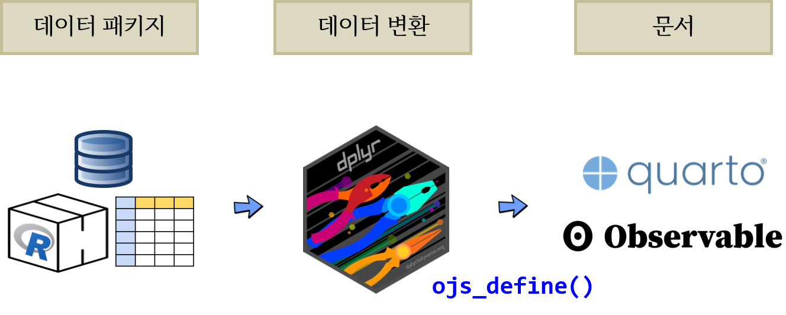
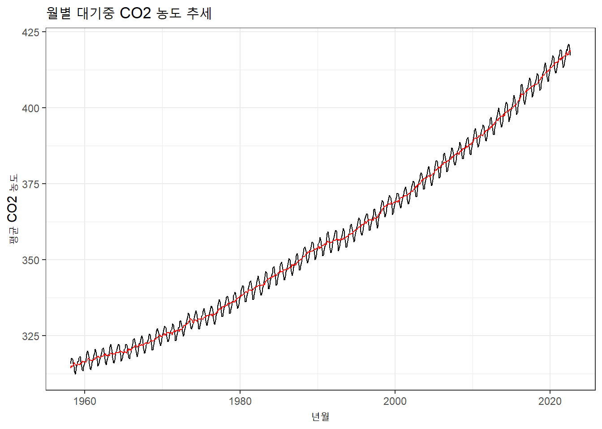

이산화탄소($CO_2$) 증가에 따라 기후위기가 이제 홍수와 가뭄으로 우리곁에 성큼 다가왔다. 미국 해양대기청(NOAA)에서 하와이 마우나로아(Mauna Loa)산에서 측정한 대기중 이산화탄소 농도 추세를 인터랙티브 시각화해보자.

# 데이터

[Trends in Atmospheric Carbon Dioxide](https://gml.noaa.gov/ccgg/trends/data.html)에서 월별 $CO_2$ 농도 데이터를 NOASS 웹사이트에서 바로 다운로드 받아 가져온다. 이를 ggplot으로 시각화해본다.


::: {.cell warning.hidden='true' message.hidden='true'}

```{.r .cell-code .hidden}
library(tidyverse)
```

::: {.cell-output .cell-output-stderr .hidden}
```
── Attaching packages ─────────────────────────────────────── tidyverse 1.3.1 ──
```
:::

::: {.cell-output .cell-output-stderr .hidden}
```
✔ ggplot2 3.3.6     ✔ purrr   0.3.4
✔ tibble  3.1.8     ✔ dplyr   1.0.9
✔ tidyr   1.2.0     ✔ stringr 1.4.1
✔ readr   2.1.2     ✔ forcats 0.5.2
```
:::

::: {.cell-output .cell-output-stderr .hidden}
```
Warning: package 'tibble' was built under R version 4.2.1
```
:::

::: {.cell-output .cell-output-stderr .hidden}
```
Warning: package 'dplyr' was built under R version 4.2.1
```
:::

::: {.cell-output .cell-output-stderr .hidden}
```
Warning: package 'stringr' was built under R version 4.2.1
```
:::

::: {.cell-output .cell-output-stderr .hidden}
```
Warning: package 'forcats' was built under R version 4.2.1
```
:::

::: {.cell-output .cell-output-stderr .hidden}
```
── Conflicts ────────────────────────────────────────── tidyverse_conflicts() ──
✖ dplyr::filter() masks stats::filter()
✖ dplyr::lag()    masks stats::lag()
```
:::

```{.r .cell-code .hidden}
# bitData::global_co2 %>% 
#   write_csv("data/co2_year.csv")

global_co2 <- read_csv("https://gml.noaa.gov/webdata/ccgg/trends/co2/co2_mm_mlo.csv", skip = 52)
```

::: {.cell-output .cell-output-stderr .hidden}
```
Rows: 774 Columns: 8
```
:::

::: {.cell-output .cell-output-stderr .hidden}
```
── Column specification ────────────────────────────────────────────────────────
Delimiter: ","
dbl (8): year, month, decimal date, average, deseasonalized, ndays, sdev, unc

ℹ Use `spec()` to retrieve the full column specification for this data.
ℹ Specify the column types or set `show_col_types = FALSE` to quiet this message.
```
:::

```{.r .cell-code .hidden}
global_co2 %>% 
  janitor::clean_names() %>% 
  mutate(yearmon = lubridate::make_date(year = year, month = month)) %>% 
  ggplot(aes(x=yearmon, y = average)) +
    geom_line() +
    geom_line(aes(y= deseasonalized), color = "red") +
    theme_bw() +
    labs(x = "년월",
         y = "평균 CO2 농도",
         title = "월별 대기중 CO2 농도 추세")
```

::: {.cell-output-display}
{width=672}
:::
:::


인터랙티브 시각화를 위해 데이터를 년도별로 평균을 내어 이를 시각화하는데 사용한다.


::: {.cell}

```{.r .cell-code .hidden}
global_co2 %>% 
  janitor::clean_names() %>% 
  group_by(year) %>% 
  summarize( mean = mean(average)) %>% 
  write_csv("data/co2_year.csv")
```
:::


로컬 저장소에 저장한 csv 파일을 이제 Observable JS 로 불러와서 년도를 달리하여 $CO_2$ 농도의 추세를 살펴본다.


```{ojs}
co2_data = FileAttachment("../data/co2_year.csv").csv({ typed: true })

co2_filtered = co2_data.filter(function(co2) {
  return study_year < co2.year ;
})
```


# UI

인터랙티브 데이터 시각화를 위해서 UI 입력부분을 정의한다. 먼저 연도를 슬라이더 입력값(`Input.range()`)에 넣어둔다.


```{ojs}
//| panel: input
viewof study_year = Inputs.range(
  [1959, 2021], 
  {value: 1980, step: 1, label: "연도:"}
)
```


# 인터랙티브 그래프

인터랙티브 데이터를 선택한 결과를 실시간 데이터와 그래프로 시각화하여 문서에 담아낸다.

::: {.panel-tabset}

## 시각화


```{ojs}
Plot.plot({
  marks: [
    Plot.line(co2_filtered, 
      { x: "year", y: "mean"}, 
      { stroke: "black" }
    )
  ]
})
```


## 표


```{ojs}
Inputs.table(co2_filtered)
```


:::


