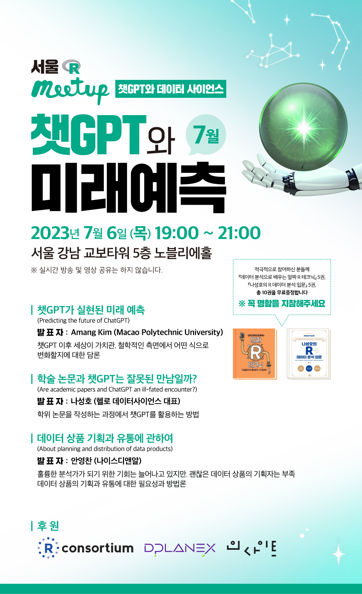

## 목차

1.  강사소개 및 미트업 안내

2.  커리큘럼

3.  챗GPT 데이터 사이언스 과정


## 강사소개 & 강의 개요 {.smaller}

::: panel-tabset
### 강사소개

::: {layout-ncol="2"}
### AI 아바타

{.absolute top="0" right="0" width="300"}

### 주요경력 및 학력

-   (현) 비영리법인 한국 R 사용자회: 기술 이사

-   (현) 국가교육위원회 전문위원: 과학/기술 분과

-   (현) 건국대학교 챗GPT 데이터 사이언스 과정: 외래교수

-   (전) TCS: GS 칼텍스 디지털 아카데미 강사

-   (전) 연세대학교 데이터 사이언스: 겸임교수

-   (전) 삼정 KPMG: Lighthouse AI 기술총괄

-   (전) 웹젠: 데이터 과학자 TD

-   (전) 현대모비스: 차량용 반도체 개발구매 <br>

-   (전) 현대자동차: VAATZ / FTA <br>

    <br> <hr> <br>

-   KAIST, CMU, 연세대 응용통계 및 컴퓨터 과학 전공

-   [RStudio Instructor](https://education.rstudio.com/trainers/people/lee+kwangchun/) - Tidyverse

-   [Seoul R Meetup Organizer](https://r2bit.com/seoul-r/)
:::


### 강의개요

::: {layout-ncol="2"}


### 강의상세

- 강의일시 : 2023. 7. 1. ~ 8.26 (매주 토) 10:00 ~ 17:00
- 장소 : 추후 공지
- 대상 : 전산 비전공자 대학생(석박사 포함)/직장인 대상 
- 모집정원: 25명
- 수강료: 1,650,000 원
- 과정 이수 시 [소프트웨어 카펜트리](https://carpentries.org/) 수료증
- 내용
  - 챗GPT 데이터 사이언스
  - 소프트웨어 카펜트리 글로벌 수료증
  - 디지털 전환
  - Text-to-X, AI 앱, 프롬프트 엔지니어링
  - 건국대 미래지식교육원 전문교육과정
  - 한국 R 사용자회
  - R/Python/SQL
:::
:::

#  {background-image="img/meetup_logo.jpg"}

::: r-fit-text
:::

## 서울 R 미트업 {.smaller}

::: columns
::: column
::: r-stack

{.fragment width="320"}

::: fragment
{.fragment width="320"}
:::

::: fragment
{.fragment width="320"}
:::

::: fragment
{.fragment width="320"}
:::

::: fragment
{.fragment width="320"}
:::


:::
:::

::: column
## 참여와 연대

-   **서울R미트업 meetup.com**: [link](https://www.meetup.com/seoul-r-meetup)
    -   **23년 4월 서울 R 미트업**: [link](https://www.meetup.com/seoul-r-meetup/events/292232899/)
    -   **23년 5월 서울 R 미트업**: [link](https://www.meetup.com/seoul-r-meetup/events/292966674/)
    -   **23년 6월 서울 R 미트업**: [link](https://www.meetup.com/seoul-r-meetup/events/293485362/)
    -   **23년 7월 서울 R 미트업**: [link](https://www.meetup.com/seoul-r-meetup/events/293929603/)
-   세계 R 미트업 현황 (Global R Meetup Dashboard): [link](https://r-community.org/usergroups/)
-   한국 R 사용자회 (Korea R User Group): [link](https://r2bit.com/)
-   한국 R 컨퍼런스 (Korea R Conference): [link](https://use-r.kr/)
-   유튜브 채널 (Youtube Channel): [link](https://www.youtube.com/channel/UCW-epmIvjBEhhVXw_F0Nqbw)
-   페이스북 그룹 (Facebook Group): [link](https://www.facebook.com/groups/tidyverse)
:::
:::


# 챗GPT 데이터 사이언스 <br> 과정 소개

## 커리큘럼 {.smaller}


::: {.cell}
::: {.cell-output-display}
```{=html}
<div>
<div style="display: inline-block;float:left;">
<div id="bndfjfawfi" style="padding-left:0px;padding-right:0px;padding-top:10px;padding-bottom:10px;overflow-x:auto;overflow-y:auto;width:auto;height:auto;">
<style>@import url("https://fonts.googleapis.com/css2?family=Roboto:ital,wght@0,100;0,200;0,300;0,400;0,500;0,600;0,700;0,800;0,900;1,100;1,200;1,300;1,400;1,500;1,600;1,700;1,800;1,900&display=swap");
@import url("https://fonts.googleapis.com/css2?family=Sunflower:ital,wght@0,100;0,200;0,300;0,400;0,500;0,600;0,700;0,800;0,900;1,100;1,200;1,300;1,400;1,500;1,600;1,700;1,800;1,900&display=swap");
#bndfjfawfi table {
  font-family: Roboto, Sunflower, NanumGothic, system-ui, 'Segoe UI', Helvetica, Arial, sans-serif, 'Apple Color Emoji', 'Segoe UI Emoji', 'Segoe UI Symbol', 'Noto Color Emoji';
  -webkit-font-smoothing: antialiased;
  -moz-osx-font-smoothing: grayscale;
}

#bndfjfawfi thead, #bndfjfawfi tbody, #bndfjfawfi tfoot, #bndfjfawfi tr, #bndfjfawfi td, #bndfjfawfi th {
  border-style: none;
}

#bndfjfawfi p {
  margin: 0;
  padding: 0;
}

#bndfjfawfi .gt_table {
  display: table;
  border-collapse: collapse;
  line-height: normal;
  margin-left: auto;
  margin-right: auto;
  color: #333333;
  font-size: 12px;
  font-weight: normal;
  font-style: normal;
  background-color: #FFFFFF;
  width: auto;
  border-top-style: solid;
  border-top-width: 3px;
  border-top-color: rgba(255, 255, 255, 0);
  border-right-style: none;
  border-right-width: 2px;
  border-right-color: #D3D3D3;
  border-bottom-style: solid;
  border-bottom-width: 1px;
  border-bottom-color: #D3D3D3;
  border-left-style: none;
  border-left-width: 2px;
  border-left-color: #D3D3D3;
}

#bndfjfawfi .gt_caption {
  padding-top: 4px;
  padding-bottom: 4px;
}

#bndfjfawfi .gt_title {
  color: #333333;
  font-size: 30px;
  font-weight: bold;
  padding-top: 4px;
  padding-bottom: 4px;
  padding-left: 5px;
  padding-right: 5px;
  border-bottom-color: #FFFFFF;
  border-bottom-width: 0;
}

#bndfjfawfi .gt_subtitle {
  color: #333333;
  font-size: 16px;
  font-weight: initial;
  padding-top: 3px;
  padding-bottom: 5px;
  padding-left: 5px;
  padding-right: 5px;
  border-top-color: #FFFFFF;
  border-top-width: 0;
}

#bndfjfawfi .gt_heading {
  background-color: #FFFFFF;
  text-align: left;
  border-bottom-color: #FFFFFF;
  border-left-style: none;
  border-left-width: 1px;
  border-left-color: #D3D3D3;
  border-right-style: none;
  border-right-width: 1px;
  border-right-color: #D3D3D3;
}

#bndfjfawfi .gt_bottom_border {
  border-bottom-style: solid;
  border-bottom-width: 2px;
  border-bottom-color: #D3D3D3;
}

#bndfjfawfi .gt_col_headings {
  border-top-style: solid;
  border-top-width: 3px;
  border-top-color: rgba(255, 255, 255, 0);
  border-bottom-style: solid;
  border-bottom-width: 3px;
  border-bottom-color: rgba(255, 255, 255, 0);
  border-left-style: none;
  border-left-width: 1px;
  border-left-color: #D3D3D3;
  border-right-style: none;
  border-right-width: 1px;
  border-right-color: #D3D3D3;
}

#bndfjfawfi .gt_col_heading {
  color: #333333;
  background-color: #FFFFFF;
  font-size: 80%;
  font-weight: bolder;
  text-transform: uppercase;
  border-left-style: none;
  border-left-width: 1px;
  border-left-color: #D3D3D3;
  border-right-style: none;
  border-right-width: 1px;
  border-right-color: #D3D3D3;
  vertical-align: bottom;
  padding-top: 6px;
  padding-bottom: 7px;
  padding-left: 5px;
  padding-right: 5px;
  overflow-x: hidden;
}

#bndfjfawfi .gt_column_spanner_outer {
  color: #333333;
  background-color: #FFFFFF;
  font-size: 80%;
  font-weight: bolder;
  text-transform: uppercase;
  padding-top: 0;
  padding-bottom: 0;
  padding-left: 4px;
  padding-right: 4px;
}

#bndfjfawfi .gt_column_spanner_outer:first-child {
  padding-left: 0;
}

#bndfjfawfi .gt_column_spanner_outer:last-child {
  padding-right: 0;
}

#bndfjfawfi .gt_column_spanner {
  border-bottom-style: solid;
  border-bottom-width: 3px;
  border-bottom-color: rgba(255, 255, 255, 0);
  vertical-align: bottom;
  padding-top: 6px;
  padding-bottom: 6px;
  overflow-x: hidden;
  display: inline-block;
  width: 100%;
}

#bndfjfawfi .gt_spanner_row {
  border-bottom-style: hidden;
}

#bndfjfawfi .gt_group_heading {
  padding-top: 8px;
  padding-bottom: 8px;
  padding-left: 5px;
  padding-right: 5px;
  color: #333333;
  background-color: #FFFFFF;
  font-size: 80%;
  font-weight: bolder;
  text-transform: uppercase;
  border-top-style: solid;
  border-top-width: 2px;
  border-top-color: #D3D3D3;
  border-bottom-style: solid;
  border-bottom-width: 2px;
  border-bottom-color: #D3D3D3;
  border-left-style: none;
  border-left-width: 1px;
  border-left-color: #D3D3D3;
  border-right-style: none;
  border-right-width: 1px;
  border-right-color: #D3D3D3;
  vertical-align: middle;
  text-align: left;
}

#bndfjfawfi .gt_empty_group_heading {
  padding: 0.5px;
  color: #333333;
  background-color: #FFFFFF;
  font-size: 80%;
  font-weight: bolder;
  border-top-style: solid;
  border-top-width: 2px;
  border-top-color: #D3D3D3;
  border-bottom-style: solid;
  border-bottom-width: 2px;
  border-bottom-color: #D3D3D3;
  vertical-align: middle;
}

#bndfjfawfi .gt_from_md > :first-child {
  margin-top: 0;
}

#bndfjfawfi .gt_from_md > :last-child {
  margin-bottom: 0;
}

#bndfjfawfi .gt_row {
  padding-top: 6px;
  padding-bottom: 6px;
  padding-left: 5px;
  padding-right: 5px;
  margin: 10px;
  border-top-style: solid;
  border-top-width: 1px;
  border-top-color: rgba(255, 255, 255, 0);
  border-left-style: none;
  border-left-width: 1px;
  border-left-color: #D3D3D3;
  border-right-style: none;
  border-right-width: 1px;
  border-right-color: #D3D3D3;
  vertical-align: middle;
  overflow-x: hidden;
}

#bndfjfawfi .gt_stub {
  color: #333333;
  background-color: #FFFFFF;
  font-size: 80%;
  font-weight: bolder;
  text-transform: uppercase;
  border-right-style: solid;
  border-right-width: 2px;
  border-right-color: #D3D3D3;
  padding-left: 5px;
  padding-right: 5px;
}

#bndfjfawfi .gt_stub_row_group {
  color: #333333;
  background-color: #FFFFFF;
  font-size: 100%;
  font-weight: initial;
  text-transform: inherit;
  border-right-style: solid;
  border-right-width: 2px;
  border-right-color: #D3D3D3;
  padding-left: 5px;
  padding-right: 5px;
  vertical-align: top;
}

#bndfjfawfi .gt_row_group_first td {
  border-top-width: 2px;
}

#bndfjfawfi .gt_row_group_first th {
  border-top-width: 2px;
}

#bndfjfawfi .gt_summary_row {
  color: #333333;
  background-color: #FFFFFF;
  text-transform: inherit;
  padding-top: 8px;
  padding-bottom: 8px;
  padding-left: 5px;
  padding-right: 5px;
}

#bndfjfawfi .gt_first_summary_row {
  border-top-style: solid;
  border-top-color: #D3D3D3;
}

#bndfjfawfi .gt_first_summary_row.thick {
  border-top-width: 2px;
}

#bndfjfawfi .gt_last_summary_row {
  padding-top: 8px;
  padding-bottom: 8px;
  padding-left: 5px;
  padding-right: 5px;
  border-bottom-style: solid;
  border-bottom-width: 2px;
  border-bottom-color: #D3D3D3;
}

#bndfjfawfi .gt_grand_summary_row {
  color: #333333;
  background-color: #FFFFFF;
  text-transform: inherit;
  padding-top: 8px;
  padding-bottom: 8px;
  padding-left: 5px;
  padding-right: 5px;
}

#bndfjfawfi .gt_first_grand_summary_row {
  padding-top: 8px;
  padding-bottom: 8px;
  padding-left: 5px;
  padding-right: 5px;
  border-top-style: double;
  border-top-width: 6px;
  border-top-color: #D3D3D3;
}

#bndfjfawfi .gt_last_grand_summary_row_top {
  padding-top: 8px;
  padding-bottom: 8px;
  padding-left: 5px;
  padding-right: 5px;
  border-bottom-style: double;
  border-bottom-width: 6px;
  border-bottom-color: #D3D3D3;
}

#bndfjfawfi .gt_striped {
  background-color: #F5F5F5;
}

#bndfjfawfi .gt_table_body {
  border-top-style: solid;
  border-top-width: 2px;
  border-top-color: #D3D3D3;
  border-bottom-style: solid;
  border-bottom-width: 2px;
  border-bottom-color: #D3D3D3;
}

#bndfjfawfi .gt_footnotes {
  color: #333333;
  background-color: #FFFFFF;
  border-bottom-style: none;
  border-bottom-width: 2px;
  border-bottom-color: #D3D3D3;
  border-left-style: none;
  border-left-width: 2px;
  border-left-color: #D3D3D3;
  border-right-style: none;
  border-right-width: 2px;
  border-right-color: #D3D3D3;
}

#bndfjfawfi .gt_footnote {
  margin: 0px;
  font-size: 90%;
  padding-top: 4px;
  padding-bottom: 4px;
  padding-left: 5px;
  padding-right: 5px;
}

#bndfjfawfi .gt_sourcenotes {
  color: #333333;
  background-color: #FFFFFF;
  border-bottom-style: none;
  border-bottom-width: 2px;
  border-bottom-color: #D3D3D3;
  border-left-style: none;
  border-left-width: 2px;
  border-left-color: #D3D3D3;
  border-right-style: none;
  border-right-width: 2px;
  border-right-color: #D3D3D3;
}

#bndfjfawfi .gt_sourcenote {
  font-size: 90%;
  padding-top: 4px;
  padding-bottom: 4px;
  padding-left: 5px;
  padding-right: 5px;
}

#bndfjfawfi .gt_left {
  text-align: left;
}

#bndfjfawfi .gt_center {
  text-align: center;
}

#bndfjfawfi .gt_right {
  text-align: right;
  font-variant-numeric: tabular-nums;
}

#bndfjfawfi .gt_font_normal {
  font-weight: normal;
}

#bndfjfawfi .gt_font_bold {
  font-weight: bold;
}

#bndfjfawfi .gt_font_italic {
  font-style: italic;
}

#bndfjfawfi .gt_super {
  font-size: 65%;
}

#bndfjfawfi .gt_footnote_marks {
  font-size: 75%;
  vertical-align: 0.4em;
  position: initial;
}

#bndfjfawfi .gt_asterisk {
  font-size: 100%;
  vertical-align: 0;
}

#bndfjfawfi .gt_indent_1 {
  text-indent: 5px;
}

#bndfjfawfi .gt_indent_2 {
  text-indent: 10px;
}

#bndfjfawfi .gt_indent_3 {
  text-indent: 15px;
}

#bndfjfawfi .gt_indent_4 {
  text-indent: 20px;
}

#bndfjfawfi .gt_indent_5 {
  text-indent: 25px;
}
</style>
<table class="gt_table" data-quarto-disable-processing="false" data-quarto-bootstrap="false">
  <thead>
    <tr class="gt_heading">
      <td colspan="3" class="gt_heading gt_title gt_font_normal gt_bottom_border" style><div style="text-align:center;"></div>
<div>
  <strong>챗GPT 데이터 사이언스</strong>
  전문교육과정
</div></td>
    </tr>
    
    <tr class="gt_col_headings">
      <th class="gt_col_heading gt_columns_bottom_border gt_center" rowspan="1" colspan="1" style="background-color: #585D63; color: #FFFFFF; font-size: 10px; font-weight: bold; border-bottom-width: 2.5px; border-bottom-style: solid; border-bottom-color: #585d63;" scope="col" id="강의주제">강의주제</th>
      <th class="gt_col_heading gt_columns_bottom_border gt_center" rowspan="1" colspan="1" style="background-color: #585D63; color: #FFFFFF; font-size: 10px; font-weight: bold; border-bottom-width: 2.5px; border-bottom-style: solid; border-bottom-color: #585d63;" scope="col" id="강의내용">강의내용</th>
      <th class="gt_col_heading gt_columns_bottom_border gt_center" rowspan="1" colspan="1" style="background-color: #585D63; color: #FFFFFF; font-size: 10px; font-weight: bold; border-bottom-width: 2.5px; border-bottom-style: solid; border-bottom-color: #585d63;" scope="col" id="수업방법">수업방법</th>
    </tr>
  </thead>
  <tbody class="gt_table_body">
    <tr class="gt_group_heading_row">
      <th colspan="3" class="gt_group_heading" scope="colgroup" id="1 주차 - 2023-07-01">1 주차 - 2023-07-01</th>
    </tr>
    <tr class="gt_row_group_first"><td headers="1 주차 - 2023-07-01  강의주제" class="gt_row gt_center" style="font-variant: small-caps;">데이터 사이언스 언어</td>
<td headers="1 주차 - 2023-07-01  강의내용" class="gt_row gt_center" style="font-variant: small-caps;">챗GPT와 데이터 사이언스</td>
<td headers="1 주차 - 2023-07-01  수업방법" class="gt_row gt_center" style="font-variant: small-caps;">핸즈온 실습</td></tr>
    <tr><td headers="1 주차 - 2023-07-01  강의주제" class="gt_row gt_center gt_striped" style="font-variant: small-caps;">데이터 사이언스 언어</td>
<td headers="1 주차 - 2023-07-01  강의내용" class="gt_row gt_center gt_striped" style="font-variant: small-caps;">Tidyverse와 챗GPT</td>
<td headers="1 주차 - 2023-07-01  수업방법" class="gt_row gt_center gt_striped" style="font-variant: small-caps;">핸즈온 실습</td></tr>
    <tr><td headers="1 주차 - 2023-07-01  강의주제" class="gt_row gt_center" style="font-variant: small-caps;">데이터 사이언스 언어</td>
<td headers="1 주차 - 2023-07-01  강의내용" class="gt_row gt_center" style="font-variant: small-caps;">파이썬/R/SQL 그리고 API</td>
<td headers="1 주차 - 2023-07-01  수업방법" class="gt_row gt_center" style="font-variant: small-caps;">핸즈온 실습</td></tr>
    <tr class="gt_group_heading_row">
      <th colspan="3" class="gt_group_heading" scope="colgroup" id="2 주차 - 2023-07-08">2 주차 - 2023-07-08</th>
    </tr>
    <tr class="gt_row_group_first"><td headers="2 주차 - 2023-07-08  강의주제" class="gt_row gt_center gt_striped" style="font-variant: small-caps;">소프트웨어 카펜트리 (기본기)</td>
<td headers="2 주차 - 2023-07-08  강의내용" class="gt_row gt_center gt_striped" style="font-variant: small-caps;">자동화: 유닉스 쉘</td>
<td headers="2 주차 - 2023-07-08  수업방법" class="gt_row gt_center gt_striped" style="font-variant: small-caps;">핸즈온 실습</td></tr>
    <tr><td headers="2 주차 - 2023-07-08  강의주제" class="gt_row gt_center" style="font-variant: small-caps;">소프트웨어 카펜트리 (기본기)</td>
<td headers="2 주차 - 2023-07-08  강의내용" class="gt_row gt_center" style="font-variant: small-caps;">버전제어: Git / GitHub</td>
<td headers="2 주차 - 2023-07-08  수업방법" class="gt_row gt_center" style="font-variant: small-caps;">핸즈온 실습</td></tr>
    <tr class="gt_group_heading_row">
      <th colspan="3" class="gt_group_heading" scope="colgroup" id="3 주차 - 2023-07-15">3 주차 - 2023-07-15</th>
    </tr>
    <tr class="gt_row_group_first"><td headers="3 주차 - 2023-07-15  강의주제" class="gt_row gt_center gt_striped" style="font-variant: small-caps;">소프트웨어 카펜트리 (기본기)</td>
<td headers="3 주차 - 2023-07-15  강의내용" class="gt_row gt_center gt_striped" style="font-variant: small-caps;">파이썬 / R</td>
<td headers="3 주차 - 2023-07-15  수업방법" class="gt_row gt_center gt_striped" style="font-variant: small-caps;">핸즈온 실습</td></tr>
    <tr><td headers="3 주차 - 2023-07-15  강의주제" class="gt_row gt_center" style="font-variant: small-caps;">소프트웨어 카펜트리 (기본기)</td>
<td headers="3 주차 - 2023-07-15  강의내용" class="gt_row gt_center" style="font-variant: small-caps;">데이터베이스</td>
<td headers="3 주차 - 2023-07-15  수업방법" class="gt_row gt_center" style="font-variant: small-caps;">핸즈온 실습</td></tr>
    <tr class="gt_group_heading_row">
      <th colspan="3" class="gt_group_heading" scope="colgroup" id="4 주차 - 2023-07-22">4 주차 - 2023-07-22</th>
    </tr>
    <tr class="gt_row_group_first"><td headers="4 주차 - 2023-07-22  강의주제" class="gt_row gt_center gt_striped" style="font-variant: small-caps;">데이터 과학 자료구조</td>
<td headers="4 주차 - 2023-07-22  강의내용" class="gt_row gt_center gt_striped" style="font-variant: small-caps;">숫자/범주 --&gt; 데이터프레임</td>
<td headers="4 주차 - 2023-07-22  수업방법" class="gt_row gt_center gt_striped" style="font-variant: small-caps;">핸즈온 실습</td></tr>
    <tr><td headers="4 주차 - 2023-07-22  강의주제" class="gt_row gt_center" style="font-variant: small-caps;">데이터 과학 자료구조</td>
<td headers="4 주차 - 2023-07-22  강의내용" class="gt_row gt_center" style="font-variant: small-caps;">날짜/공간정보/네트워크</td>
<td headers="4 주차 - 2023-07-22  수업방법" class="gt_row gt_center" style="font-variant: small-caps;">핸즈온 실습</td></tr>
    <tr><td headers="4 주차 - 2023-07-22  강의주제" class="gt_row gt_center gt_striped" style="font-variant: small-caps;">데이터 과학 자료구조</td>
<td headers="4 주차 - 2023-07-22  강의내용" class="gt_row gt_center gt_striped" style="font-variant: small-caps;">텍스트/이미지/오디오</td>
<td headers="4 주차 - 2023-07-22  수업방법" class="gt_row gt_center gt_striped" style="font-variant: small-caps;">핸즈온 실습</td></tr>
  </tbody>
  
  
</table>
</div>
</div>
<div style="display: inline-block;float:right;">
<div id="fjnvpbxwym" style="padding-left:0px;padding-right:0px;padding-top:10px;padding-bottom:10px;overflow-x:auto;overflow-y:auto;width:auto;height:auto;">
<style>@import url("https://fonts.googleapis.com/css2?family=Roboto:ital,wght@0,100;0,200;0,300;0,400;0,500;0,600;0,700;0,800;0,900;1,100;1,200;1,300;1,400;1,500;1,600;1,700;1,800;1,900&display=swap");
@import url("https://fonts.googleapis.com/css2?family=Sunflower:ital,wght@0,100;0,200;0,300;0,400;0,500;0,600;0,700;0,800;0,900;1,100;1,200;1,300;1,400;1,500;1,600;1,700;1,800;1,900&display=swap");
#fjnvpbxwym table {
  font-family: Roboto, Sunflower, NanumGothic, system-ui, 'Segoe UI', Helvetica, Arial, sans-serif, 'Apple Color Emoji', 'Segoe UI Emoji', 'Segoe UI Symbol', 'Noto Color Emoji';
  -webkit-font-smoothing: antialiased;
  -moz-osx-font-smoothing: grayscale;
}

#fjnvpbxwym thead, #fjnvpbxwym tbody, #fjnvpbxwym tfoot, #fjnvpbxwym tr, #fjnvpbxwym td, #fjnvpbxwym th {
  border-style: none;
}

#fjnvpbxwym p {
  margin: 0;
  padding: 0;
}

#fjnvpbxwym .gt_table {
  display: table;
  border-collapse: collapse;
  line-height: normal;
  margin-left: auto;
  margin-right: auto;
  color: #333333;
  font-size: 12px;
  font-weight: normal;
  font-style: normal;
  background-color: #FFFFFF;
  width: auto;
  border-top-style: solid;
  border-top-width: 3px;
  border-top-color: rgba(255, 255, 255, 0);
  border-right-style: none;
  border-right-width: 2px;
  border-right-color: #D3D3D3;
  border-bottom-style: solid;
  border-bottom-width: 1px;
  border-bottom-color: #D3D3D3;
  border-left-style: none;
  border-left-width: 2px;
  border-left-color: #D3D3D3;
}

#fjnvpbxwym .gt_caption {
  padding-top: 4px;
  padding-bottom: 4px;
}

#fjnvpbxwym .gt_title {
  color: #333333;
  font-size: 30px;
  font-weight: bold;
  padding-top: 4px;
  padding-bottom: 4px;
  padding-left: 5px;
  padding-right: 5px;
  border-bottom-color: #FFFFFF;
  border-bottom-width: 0;
}

#fjnvpbxwym .gt_subtitle {
  color: #333333;
  font-size: 16px;
  font-weight: initial;
  padding-top: 3px;
  padding-bottom: 5px;
  padding-left: 5px;
  padding-right: 5px;
  border-top-color: #FFFFFF;
  border-top-width: 0;
}

#fjnvpbxwym .gt_heading {
  background-color: #FFFFFF;
  text-align: left;
  border-bottom-color: #FFFFFF;
  border-left-style: none;
  border-left-width: 1px;
  border-left-color: #D3D3D3;
  border-right-style: none;
  border-right-width: 1px;
  border-right-color: #D3D3D3;
}

#fjnvpbxwym .gt_bottom_border {
  border-bottom-style: solid;
  border-bottom-width: 2px;
  border-bottom-color: #D3D3D3;
}

#fjnvpbxwym .gt_col_headings {
  border-top-style: solid;
  border-top-width: 3px;
  border-top-color: rgba(255, 255, 255, 0);
  border-bottom-style: solid;
  border-bottom-width: 3px;
  border-bottom-color: rgba(255, 255, 255, 0);
  border-left-style: none;
  border-left-width: 1px;
  border-left-color: #D3D3D3;
  border-right-style: none;
  border-right-width: 1px;
  border-right-color: #D3D3D3;
}

#fjnvpbxwym .gt_col_heading {
  color: #333333;
  background-color: #FFFFFF;
  font-size: 80%;
  font-weight: bolder;
  text-transform: uppercase;
  border-left-style: none;
  border-left-width: 1px;
  border-left-color: #D3D3D3;
  border-right-style: none;
  border-right-width: 1px;
  border-right-color: #D3D3D3;
  vertical-align: bottom;
  padding-top: 6px;
  padding-bottom: 7px;
  padding-left: 5px;
  padding-right: 5px;
  overflow-x: hidden;
}

#fjnvpbxwym .gt_column_spanner_outer {
  color: #333333;
  background-color: #FFFFFF;
  font-size: 80%;
  font-weight: bolder;
  text-transform: uppercase;
  padding-top: 0;
  padding-bottom: 0;
  padding-left: 4px;
  padding-right: 4px;
}

#fjnvpbxwym .gt_column_spanner_outer:first-child {
  padding-left: 0;
}

#fjnvpbxwym .gt_column_spanner_outer:last-child {
  padding-right: 0;
}

#fjnvpbxwym .gt_column_spanner {
  border-bottom-style: solid;
  border-bottom-width: 3px;
  border-bottom-color: rgba(255, 255, 255, 0);
  vertical-align: bottom;
  padding-top: 6px;
  padding-bottom: 6px;
  overflow-x: hidden;
  display: inline-block;
  width: 100%;
}

#fjnvpbxwym .gt_spanner_row {
  border-bottom-style: hidden;
}

#fjnvpbxwym .gt_group_heading {
  padding-top: 8px;
  padding-bottom: 8px;
  padding-left: 5px;
  padding-right: 5px;
  color: #333333;
  background-color: #FFFFFF;
  font-size: 80%;
  font-weight: bolder;
  text-transform: uppercase;
  border-top-style: solid;
  border-top-width: 2px;
  border-top-color: #D3D3D3;
  border-bottom-style: solid;
  border-bottom-width: 2px;
  border-bottom-color: #D3D3D3;
  border-left-style: none;
  border-left-width: 1px;
  border-left-color: #D3D3D3;
  border-right-style: none;
  border-right-width: 1px;
  border-right-color: #D3D3D3;
  vertical-align: middle;
  text-align: left;
}

#fjnvpbxwym .gt_empty_group_heading {
  padding: 0.5px;
  color: #333333;
  background-color: #FFFFFF;
  font-size: 80%;
  font-weight: bolder;
  border-top-style: solid;
  border-top-width: 2px;
  border-top-color: #D3D3D3;
  border-bottom-style: solid;
  border-bottom-width: 2px;
  border-bottom-color: #D3D3D3;
  vertical-align: middle;
}

#fjnvpbxwym .gt_from_md > :first-child {
  margin-top: 0;
}

#fjnvpbxwym .gt_from_md > :last-child {
  margin-bottom: 0;
}

#fjnvpbxwym .gt_row {
  padding-top: 6px;
  padding-bottom: 6px;
  padding-left: 5px;
  padding-right: 5px;
  margin: 10px;
  border-top-style: solid;
  border-top-width: 1px;
  border-top-color: rgba(255, 255, 255, 0);
  border-left-style: none;
  border-left-width: 1px;
  border-left-color: #D3D3D3;
  border-right-style: none;
  border-right-width: 1px;
  border-right-color: #D3D3D3;
  vertical-align: middle;
  overflow-x: hidden;
}

#fjnvpbxwym .gt_stub {
  color: #333333;
  background-color: #FFFFFF;
  font-size: 80%;
  font-weight: bolder;
  text-transform: uppercase;
  border-right-style: solid;
  border-right-width: 2px;
  border-right-color: #D3D3D3;
  padding-left: 5px;
  padding-right: 5px;
}

#fjnvpbxwym .gt_stub_row_group {
  color: #333333;
  background-color: #FFFFFF;
  font-size: 100%;
  font-weight: initial;
  text-transform: inherit;
  border-right-style: solid;
  border-right-width: 2px;
  border-right-color: #D3D3D3;
  padding-left: 5px;
  padding-right: 5px;
  vertical-align: top;
}

#fjnvpbxwym .gt_row_group_first td {
  border-top-width: 2px;
}

#fjnvpbxwym .gt_row_group_first th {
  border-top-width: 2px;
}

#fjnvpbxwym .gt_summary_row {
  color: #333333;
  background-color: #FFFFFF;
  text-transform: inherit;
  padding-top: 8px;
  padding-bottom: 8px;
  padding-left: 5px;
  padding-right: 5px;
}

#fjnvpbxwym .gt_first_summary_row {
  border-top-style: solid;
  border-top-color: #D3D3D3;
}

#fjnvpbxwym .gt_first_summary_row.thick {
  border-top-width: 2px;
}

#fjnvpbxwym .gt_last_summary_row {
  padding-top: 8px;
  padding-bottom: 8px;
  padding-left: 5px;
  padding-right: 5px;
  border-bottom-style: solid;
  border-bottom-width: 2px;
  border-bottom-color: #D3D3D3;
}

#fjnvpbxwym .gt_grand_summary_row {
  color: #333333;
  background-color: #FFFFFF;
  text-transform: inherit;
  padding-top: 8px;
  padding-bottom: 8px;
  padding-left: 5px;
  padding-right: 5px;
}

#fjnvpbxwym .gt_first_grand_summary_row {
  padding-top: 8px;
  padding-bottom: 8px;
  padding-left: 5px;
  padding-right: 5px;
  border-top-style: double;
  border-top-width: 6px;
  border-top-color: #D3D3D3;
}

#fjnvpbxwym .gt_last_grand_summary_row_top {
  padding-top: 8px;
  padding-bottom: 8px;
  padding-left: 5px;
  padding-right: 5px;
  border-bottom-style: double;
  border-bottom-width: 6px;
  border-bottom-color: #D3D3D3;
}

#fjnvpbxwym .gt_striped {
  background-color: #F5F5F5;
}

#fjnvpbxwym .gt_table_body {
  border-top-style: solid;
  border-top-width: 2px;
  border-top-color: #D3D3D3;
  border-bottom-style: solid;
  border-bottom-width: 2px;
  border-bottom-color: #D3D3D3;
}

#fjnvpbxwym .gt_footnotes {
  color: #333333;
  background-color: #FFFFFF;
  border-bottom-style: none;
  border-bottom-width: 2px;
  border-bottom-color: #D3D3D3;
  border-left-style: none;
  border-left-width: 2px;
  border-left-color: #D3D3D3;
  border-right-style: none;
  border-right-width: 2px;
  border-right-color: #D3D3D3;
}

#fjnvpbxwym .gt_footnote {
  margin: 0px;
  font-size: 90%;
  padding-top: 4px;
  padding-bottom: 4px;
  padding-left: 5px;
  padding-right: 5px;
}

#fjnvpbxwym .gt_sourcenotes {
  color: #333333;
  background-color: #FFFFFF;
  border-bottom-style: none;
  border-bottom-width: 2px;
  border-bottom-color: #D3D3D3;
  border-left-style: none;
  border-left-width: 2px;
  border-left-color: #D3D3D3;
  border-right-style: none;
  border-right-width: 2px;
  border-right-color: #D3D3D3;
}

#fjnvpbxwym .gt_sourcenote {
  font-size: 90%;
  padding-top: 4px;
  padding-bottom: 4px;
  padding-left: 5px;
  padding-right: 5px;
}

#fjnvpbxwym .gt_left {
  text-align: left;
}

#fjnvpbxwym .gt_center {
  text-align: center;
}

#fjnvpbxwym .gt_right {
  text-align: right;
  font-variant-numeric: tabular-nums;
}

#fjnvpbxwym .gt_font_normal {
  font-weight: normal;
}

#fjnvpbxwym .gt_font_bold {
  font-weight: bold;
}

#fjnvpbxwym .gt_font_italic {
  font-style: italic;
}

#fjnvpbxwym .gt_super {
  font-size: 65%;
}

#fjnvpbxwym .gt_footnote_marks {
  font-size: 75%;
  vertical-align: 0.4em;
  position: initial;
}

#fjnvpbxwym .gt_asterisk {
  font-size: 100%;
  vertical-align: 0;
}

#fjnvpbxwym .gt_indent_1 {
  text-indent: 5px;
}

#fjnvpbxwym .gt_indent_2 {
  text-indent: 10px;
}

#fjnvpbxwym .gt_indent_3 {
  text-indent: 15px;
}

#fjnvpbxwym .gt_indent_4 {
  text-indent: 20px;
}

#fjnvpbxwym .gt_indent_5 {
  text-indent: 25px;
}
</style>
<table class="gt_table" data-quarto-disable-processing="false" data-quarto-bootstrap="false">
  <thead>
    
    <tr class="gt_col_headings">
      <th class="gt_col_heading gt_columns_bottom_border gt_center" rowspan="1" colspan="1" style="background-color: #585D63; color: #FFFFFF; font-size: 10px; font-weight: bold; border-bottom-width: 2.5px; border-bottom-style: solid; border-bottom-color: #585d63;" scope="col" id="강의주제">강의주제</th>
      <th class="gt_col_heading gt_columns_bottom_border gt_center" rowspan="1" colspan="1" style="background-color: #585D63; color: #FFFFFF; font-size: 10px; font-weight: bold; border-bottom-width: 2.5px; border-bottom-style: solid; border-bottom-color: #585d63;" scope="col" id="강의내용">강의내용</th>
      <th class="gt_col_heading gt_columns_bottom_border gt_center" rowspan="1" colspan="1" style="background-color: #585D63; color: #FFFFFF; font-size: 10px; font-weight: bold; border-bottom-width: 2.5px; border-bottom-style: solid; border-bottom-color: #585d63;" scope="col" id="수업방법">수업방법</th>
    </tr>
  </thead>
  <tbody class="gt_table_body">
    <tr class="gt_group_heading_row">
      <th colspan="3" class="gt_group_heading" scope="colgroup" id="5 주차 - 2023-07-29">5 주차 - 2023-07-29</th>
    </tr>
    <tr class="gt_row_group_first"><td headers="5 주차 - 2023-07-29  강의주제" class="gt_row gt_center" style="font-variant: small-caps;">디지털 글쓰기, 대쉬보드, API 개발</td>
<td headers="5 주차 - 2023-07-29  강의내용" class="gt_row gt_center" style="font-variant: small-caps;">디지털 보고서(PDF, HTML, PPT)</td>
<td headers="5 주차 - 2023-07-29  수업방법" class="gt_row gt_center" style="font-variant: small-caps;">핸즈온 실습</td></tr>
    <tr><td headers="5 주차 - 2023-07-29  강의주제" class="gt_row gt_center gt_striped" style="font-variant: small-caps;">디지털 글쓰기, 대쉬보드, API 개발</td>
<td headers="5 주차 - 2023-07-29  강의내용" class="gt_row gt_center gt_striped" style="font-variant: small-caps;">Serverless 대쉬보드, R/Python 대쉬보드</td>
<td headers="5 주차 - 2023-07-29  수업방법" class="gt_row gt_center gt_striped" style="font-variant: small-caps;">핸즈온 실습</td></tr>
    <tr><td headers="5 주차 - 2023-07-29  강의주제" class="gt_row gt_center" style="font-variant: small-caps;">디지털 글쓰기, 대쉬보드, API 개발</td>
<td headers="5 주차 - 2023-07-29  강의내용" class="gt_row gt_center" style="font-variant: small-caps;">기계학습 모형 API 배포</td>
<td headers="5 주차 - 2023-07-29  수업방법" class="gt_row gt_center" style="font-variant: small-caps;">핸즈온 실습</td></tr>
    <tr class="gt_group_heading_row">
      <th colspan="3" class="gt_group_heading" scope="colgroup" id="- 주차 - 2023-08-05">- 주차 - 2023-08-05</th>
    </tr>
    <tr class="gt_row_group_first"><td headers="- 주차 - 2023-08-05  강의주제" class="gt_row gt_center gt_striped" style="font-variant: small-caps;">휴가</td>
<td headers="- 주차 - 2023-08-05  강의내용" class="gt_row gt_center gt_striped" style="font-variant: small-caps;">휴가</td>
<td headers="- 주차 - 2023-08-05  수업방법" class="gt_row gt_center gt_striped" style="font-variant: small-caps;">-</td></tr>
    <tr class="gt_group_heading_row">
      <th colspan="3" class="gt_group_heading" scope="colgroup" id="6 주차 - 2023-08-12">6 주차 - 2023-08-12</th>
    </tr>
    <tr class="gt_row_group_first"><td headers="6 주차 - 2023-08-12  강의주제" class="gt_row gt_center" style="font-variant: small-caps;">챗GPT와 오픈소스</td>
<td headers="6 주차 - 2023-08-12  강의내용" class="gt_row gt_center" style="font-variant: small-caps;">(오픈소스) 거대언어모형(LLM)</td>
<td headers="6 주차 - 2023-08-12  수업방법" class="gt_row gt_center" style="font-variant: small-caps;">핸즈온 실습</td></tr>
    <tr><td headers="6 주차 - 2023-08-12  강의주제" class="gt_row gt_center gt_striped" style="font-variant: small-caps;">챗GPT와 오픈소스</td>
<td headers="6 주차 - 2023-08-12  강의내용" class="gt_row gt_center gt_striped" style="font-variant: small-caps;">Write/Draw/Coding/Reasoning</td>
<td headers="6 주차 - 2023-08-12  수업방법" class="gt_row gt_center gt_striped" style="font-variant: small-caps;">핸즈온 실습</td></tr>
    <tr><td headers="6 주차 - 2023-08-12  강의주제" class="gt_row gt_center" style="font-variant: small-caps;">챗GPT와 오픈소스</td>
<td headers="6 주차 - 2023-08-12  강의내용" class="gt_row gt_center" style="font-variant: small-caps;">AI 시대 데이터 사이언스 제품개발 방법</td>
<td headers="6 주차 - 2023-08-12  수업방법" class="gt_row gt_center" style="font-variant: small-caps;">핸즈온 실습</td></tr>
    <tr class="gt_group_heading_row">
      <th colspan="3" class="gt_group_heading" scope="colgroup" id="7 주차 - 2023-08-19">7 주차 - 2023-08-19</th>
    </tr>
    <tr class="gt_row_group_first"><td headers="7 주차 - 2023-08-19  강의주제" class="gt_row gt_center gt_striped" style="font-variant: small-caps;">Prompt Engineering</td>
<td headers="7 주차 - 2023-08-19  강의내용" class="gt_row gt_center gt_striped" style="font-variant: small-caps;">사용자 및 개발자를 위한 프롬프트 공학</td>
<td headers="7 주차 - 2023-08-19  수업방법" class="gt_row gt_center gt_striped" style="font-variant: small-caps;">핸즈온 실습</td></tr>
    <tr><td headers="7 주차 - 2023-08-19  강의주제" class="gt_row gt_center" style="font-variant: small-caps;">Prompt Engineering</td>
<td headers="7 주차 - 2023-08-19  강의내용" class="gt_row gt_center" style="font-variant: small-caps;">OpenAI API 기반 NLP 개발</td>
<td headers="7 주차 - 2023-08-19  수업방법" class="gt_row gt_center" style="font-variant: small-caps;">핸즈온 실습</td></tr>
    <tr><td headers="7 주차 - 2023-08-19  강의주제" class="gt_row gt_center gt_striped" style="font-variant: small-caps;">Prompt Engineering</td>
<td headers="7 주차 - 2023-08-19  강의내용" class="gt_row gt_center gt_striped" style="font-variant: small-caps;">OPL(OpenAI, Pinecone, Langchain) 프레임워크</td>
<td headers="7 주차 - 2023-08-19  수업방법" class="gt_row gt_center gt_striped" style="font-variant: small-caps;">핸즈온 실습</td></tr>
    <tr class="gt_group_heading_row">
      <th colspan="3" class="gt_group_heading" scope="colgroup" id="8 주차 - 2023-08-26">8 주차 - 2023-08-26</th>
    </tr>
    <tr class="gt_row_group_first"><td headers="8 주차 - 2023-08-26  강의주제" class="gt_row gt_center" style="font-variant: small-caps;">챗GPT AI 앱 프로젝트</td>
<td headers="8 주차 - 2023-08-26  강의내용" class="gt_row gt_center" style="font-variant: small-caps;">오픈소스 LLM 기반 AI 데이터 분석 제품</td>
<td headers="8 주차 - 2023-08-26  수업방법" class="gt_row gt_center" style="font-variant: small-caps;">핸즈온 실습</td></tr>
    <tr><td headers="8 주차 - 2023-08-26  강의주제" class="gt_row gt_center gt_striped" style="font-variant: small-caps;">챗GPT AI 앱 프로젝트</td>
<td headers="8 주차 - 2023-08-26  강의내용" class="gt_row gt_center gt_striped" style="font-variant: small-caps;">데이터 사이언스 AutoGPT</td>
<td headers="8 주차 - 2023-08-26  수업방법" class="gt_row gt_center gt_striped" style="font-variant: small-caps;">핸즈온 실습</td></tr>
    <tr><td headers="8 주차 - 2023-08-26  강의주제" class="gt_row gt_center" style="font-variant: small-caps;">챗GPT AI 앱 프로젝트</td>
<td headers="8 주차 - 2023-08-26  강의내용" class="gt_row gt_center" style="font-variant: small-caps;">챗GPT AI 프로젝트 발표</td>
<td headers="8 주차 - 2023-08-26  수업방법" class="gt_row gt_center" style="font-variant: small-caps;">핸즈온 실습</td></tr>
  </tbody>
  
  
</table>
</div>
</div>
</div>
```
:::
:::

