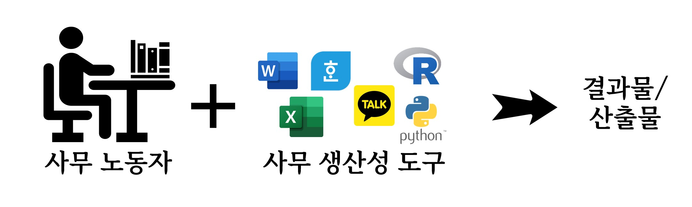
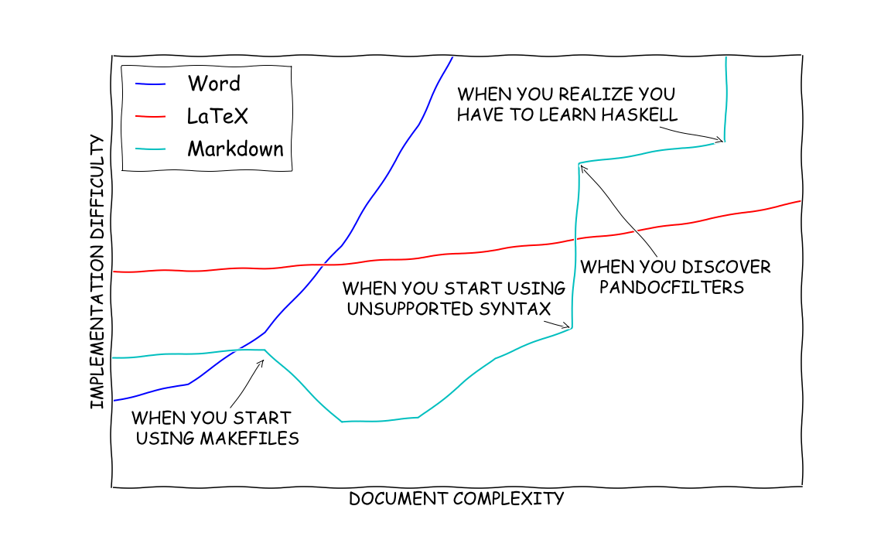
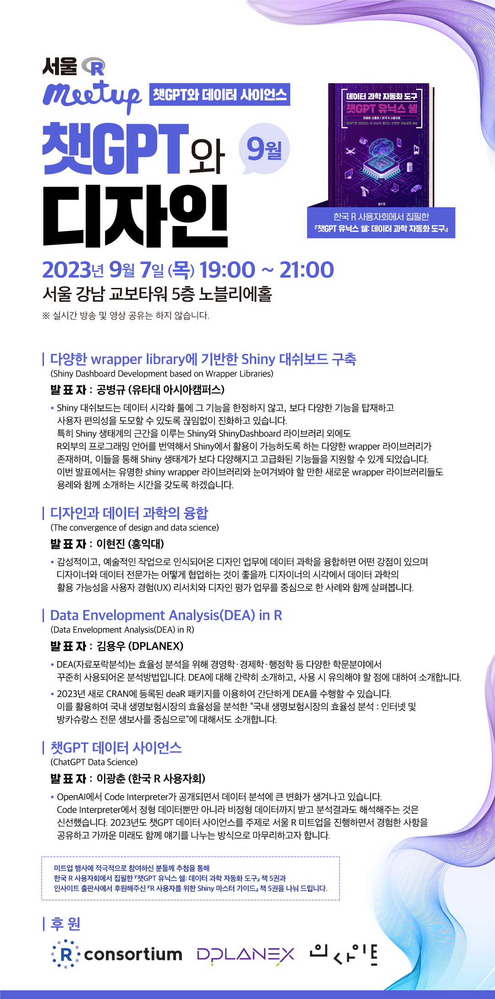

## 목차

1.  강사 및 강의 소개

2.  챗GPT 유닉스 쉘 / 디지털 글쓰기 (도서)

3.  대학교육 ( 통계 사례 연구 )

4.  챗GPT 활용 (데이터 사이언스)

5.  생성형 AI ~~경제~~ 일자리와 교육

6.  챗GPT 플러그인

7.  생성형 AI 데이터 사이언스

8.  글쓰기와 오피스 전쟁

9.  챗GPT 디지털 글쓰기

10. GPT-4 터보

11. 질의응답!

## 강사 & 강의 개요 {.smaller}

::: panel-tabset
### 강사 소개

::: {layout-ncol="2"}
### AI 아바타

{.absolute top="0" right="0" width="300"}

### 주요경력 및 학력

-   (현) [공익법인 한국 R 사용자회](https://r2bit.com/): 기술 이사

-   (현) 국가교육위원회 전문위원: 과학/기술 분과

-   (현) [건국대학교 챗GPT 데이터 사이언스 과정](https://r2bit.com/bitSlide/kunkuk_20230701.html#/title-slide): 외래교수

-   (현) 경기도 빅데이터 위원회 자문위원

-   (전) TCS: GS 칼텍스 디지털 아카데미 강사

-   (전) 연세대학교 데이터 사이언스: 겸임교수

-   (전) 삼정 KPMG: Lighthouse AI 기술총괄

-   (전) 웹젠: 데이터 과학자 TD

-   (전) 현대모비스: 차량용 반도체 개발구매 <br>

-   (전) 현대자동차: VAATZ / FTA <br>

    <hr>

-   KAIST, CMU, 연세대 응용통계 및 컴퓨터 과학 전공

-   [RStudio Instructor](https://education.rstudio.com/trainers/people/lee+kwangchun/) - Tidyverse

-   [Seoul R Meetup Organizer](https://r2bit.com/seoul-r/)
:::

### 강의개요

::: {layout-ncol="2"}


### 강의상세

-   날짜 : 2024. 1. 23. (화) 10:00\~18:00
-   장소 : 세종과학예술영재학교 S212 호
-   대상 : 세종과학예술영재학교 R 사용자
-   내용
    -   챗GPT 유닉스 쉘 도서출판
    -   사례연구: 통계 &rarr; 챗GPT 데이터 사이언스 
    -   생성형 AI 데이터 사이언스
    -   생성형 AI 일자리와 교육 (수능)
    -   사무환경과 오피스 전쟁
    -   챗GPT 디지털 글쓰기
    -   R/Tidyverse
    
:::

:::

# 챗GPT 유닉스 쉘 (책)

## 챗GPT 유닉스 쉘 집필과정 {.smaller}

::: columns
::: column
### 교보문고

-1.jpg){fig-align="center" width="319"}
:::

::: column
### 작업흐름

```{mermaid}
graph TB
    A[Greg Wilson] --> B[소프트웨어 카펜트리]
    B --> C["공동 저작"]
    C --> D["콘텐츠, 디자인, 교수방법, 경험, 네트워크"]
    D --> E["챗GPT(AI)"]
    
    style A fill:#f9d79c,stroke:#f39c12,stroke-width:2px
    style B fill:#aed6f1,stroke:#2e86c1,stroke-width:2px
    style C fill:#d7bde2,stroke:#884ea0,stroke-width:2px
    style D fill:#a2d9ce,stroke:#17a589,stroke-width:2px
    style E fill:#fcf3cf,stroke:#f1c40f,stroke-width:2px
```
:::
:::


::: aside
{width="101"} 📚 [종이책](https://product.kyobobook.co.kr/detail/S000208801484) 📱 [전자책](https://ebook-product.kyobobook.co.kr/dig/epd/ebook/E000005358063)
:::


## 챗GPT 도서 제작 {.smaller}

::: panel-tabset
### Greg Wilson

{fig-align="center" width="551"}

-   [Software Carpentry Version 3 lessons (2007)](https://github.com/swcarpentry/v3)

### 공동저작

{fig-align="center" width="457"}

-   [소프트웨어 카펜트리 공동저작](software_carpentry_github.jpg)

### 콘텐츠, 디자인, 경험, 네트워크

{fig-align="center" width="457"}

-   [소프트웨어 카펜트리](https://software-carpentry.org/) : 소프트웨어
-   [데이터 카펜트리](https://datacarpentry.org/) : 데이터
-   [도서관 카펜트리](https://librarycarpentry.org/) : 텍스트

### 책 구성

::: columns
::: column

:::

::: column
{fig-align="center" width="403"}
:::
:::


### 사람과 AI

<br>

{fig-align="center" width="1522"}
:::

## 챗GPT 디지털 글쓰기 {.smaller}

{fig-align="center" width="500"}

::: aside

- [챗GPT 디지털 글쓰기](https://r2bit.com/gpt-writing/)
:::


<!--  -->

# 챗GPT 활용

## 데이터 과학 MCQ {.smaller}

::::: panel-tabset

### MCQ 01번 

통계에서 모든 경우의 수를 포함하는 집합을 일컷는 용어는?

1. 표본 공간(Sample Space)
1. 포함집합(Super Set)
1. 포함공간(Super Space)
1. 표본집합(Sample Set)

:::{.callout-note collapse='true'}
### 정답
- 정답: 1
- **난이도: 쉬움**
:::

### MCQ 02번 

다음 데이터에서 중위수(Median)을 계산하시오.

데이터: `23, 97, 12, 38, 62`

1. 38
1. 12
1. 62
1. 23

:::{.callout-note collapse='true'}
### 정답
- 정답: 1
- **난이도: 쉬움**
:::


### MCQ 03번 

동전 던지기를 했을 때 뒷면이 나올 확률은 얼마인가?

1. 1
1. 0.5
1. 0.25
1. 0

:::{.callout-note collapse='true'}
### 정답
- 정답: 2
- **난이도: 쉬움**
:::

### `...`

### MCQ 10번 

독립변수를 이르는 다른 명칭은 다음 중 어느 것인가?

1. 반응 변수 (Response Variable)
1. 설명된 변수 (Explained Variable)
1. 반응자 (Reactor)
1. 회귀변수(Regressor)

::: {.callout-caution}
## 정답
- 정답: 4
- **난이도: 어려움**
:::


:::::

- [통계와 확률](https://r2bit.com/curriculum/mcq_stat.html)
- [데이터 과학](https://r2bit.com/curriculum/mcq_ds.html)
- [데이터프레임과 시각화](https://r2bit.com/curriculum/mcq_pandas.html)


## 데이터 과학 프롬프트 {.smaller}


- [챗GPT - 데이터 과학 프롬프트](https://r2bit.com/chatGPT/prompt_data_science.html)

## 데이터 과학 인터뷰 {.smaller}

::::: panel-tabset

### 질문

::: {.callout-tip collapse="false" icon="false"}
### 질문/과제{.unnumbered}

기계학습 분류모형개발할 때 클래스 불균형(class imbalance) 문제를 어떻게 처리하나요? (1분)
:::

::: {.callout-tip collapse="false" icon="false"}
### 질문/과제 {.unnumbered}

기계학습모형에서 bias 와 variance trade-off에서 존재합니다. 
어떤 기계학습 모형이 bias 와 variance를 줄이는데 효과적으로 알려져 있나요? (1분)
:::

::: {.callout-tip collapse="false" icon="false"}
### 질문/과제 {.unnumbered}

리스트와 데이터프레임 자료구조의 차이점에 대해서 말씀해 주세요. (1분)
:::

::: {.callout-tip collapse="false" icon="false"}
### 질문/과제 {.unnumbered}

feature engineering, data preprocessing, data cleansing이 어떻게 다른지 설명하세요. (1분)
:::

::: {.callout-tip collapse="false" icon="false"}
### 질문/과제 {.unnumbered}

제품 설명 등 텍스트 필드 칼럼이 있습니다. 기계학습 알고리즘 분류나 예측 모형에 적용시킬 수 있는 방법을 설명해주세요. (1분)
:::

### 주제선택 택1 발표

::: {.callout-note collapse="false"}
### 시각화 {.unnumbered}

Data Analytics에서 시각화는 매우 중요합니다. 
어떻게 가르칠것인지 커러큘럼, 교수방법, 프로젝트 진행방법, 평가방법에 대해서 말씀해주세요. (5분)

:::

::: {.callout-note collapse="false"}
### EDA {.unnumbered}

탐색적 데이터 분석(EDA)가 훌륭한 기계학습 알고리즘 개발과 함께 매우 중요합니다. 어떻게 가르칠것인지 커러큘럼, 교수방법, 프로젝트 진행방법, 평가방법에 대해서 말씀해주세요. (5분)

:::

### 문제해결

::: {.callout-warning collapse="false"}
### 문제 과제 {.unnumbered}

역사가 오래된 대기업일수록 20대부터 50대까지 다양한 연령층의 직원분들이 근무를 하고 계십니다. 서로 다른 학습목적을 갖고, 다양한 연령대, 컴퓨팅 이해도와 스킬이 다르고 학습에 투여할 수 있는 시간이 다른 분들로 구성된 15명 내외 수강상을 대상으로 데이터 과학 기초과정을 강의해야 하는데 이는 동일한 연령대 동일한 기술, 동일한 관심사, 동일한 학습비용을 지불하고 동일한 시간을 투여할 수 있는 상황이 아닙니다. 이러한 여건하에서 어떻게 하면 학습목표를 달성할 수 있을까요? (20분)

:::


:::::

- [데이터 과학 인터뷰 문제](https://r2bit.com/chatGPT/interview.html)


# 생성형 AI ~~경제~~ 일자리와 교육

## 생성형 AI 개발 생태계 {.smaller}

::: panel-tabset
### 변호사 입학시험

{fig-align="center" width="778"}

### OpenAI API 가격('23.04/23.07)

::: columns
::: column
{fig-align="center" width="734"}
:::

::: column
{fig-align="center" width="778"}
:::
:::

### Stable Diffusion

{fig-align="center" width="672"}

### 오픈소스 SQL

<br>


-   [Better than GPT-4 for SQL queries: NSQL (Fully OpenSource)](https://medium.com/towards-artificial-intelligence/nsql-first-ever-fully-opensource-sql-foundation-model-f7b501d91ca4)

### LLM 계층

{fig-align="center" width="889"}

-   [Essential Guide to Foundation Models and Large Language Models](https://thebabar.medium.com/essential-guide-to-foundation-models-and-large-language-models-27dab58f7404)

### FM


-   [Proprietary vs. Open Source Foundation Models](https://tolacapital.com/2023/05/15/foundationmodels/)

:::

## 수능 국영수 {.smaller}

- 영어
    - [문제지(PDF &rarr; 코드)](https://r2bit.com/quarto/sat_english.html)
    - [문제풀이(코드 &rarr; 챗GPT)](https://r2bit.com/quarto/sat_english_solve.html)
    - [훈련(챗GPT &rarr; 연습문제)](https://r2bit.com/quarto/sat_english_practice.html)    
- 수학
    - [문제지(PDF &rarr; 코드)](https://r2bit.com/quarto/sat_math.html)
- 국어
    - [문제지(PDF &rarr; 코드)](https://r2bit.com/quarto/sat_korean.html)

## 생성AI 입시교육 {.smaller}

::: panel-tabset
### 수능영어문제

{fig-align="center" width="500"}

::: {.cell}
::: {.cell-output-display}

```{=html}
<audio controls="">
<source src="data/01_문제 01.mp3" type="audio/mp3"/>
</audio>
```

:::
:::

### 프롬프트

다음 지문을 보고 문제를 푸세요. 지문과 문제는 백틱(`) 세개로 감싸여 있고 다음과 같이 되어 있습니다.

\```  지문과 문제 \```

출력: 
1. 영어지문 전체를 한글로 번역한다.
2. 정답을 제시하고 이유도 설명한다. <br>
\``` <br>

다음을 듣고, 남자가 하는 말의 목적으로 가장 적절한 것을 고르시오. <br>
M: Hello, Lockwood High School students. This is your school librarian, Mr. Wilkins. I’m sure you’re aware that our school librar y is hosting a bookmark design competition. I encourage students of all grades to par ticipate in the competition. The winning designs will be made into bookmarks, which will be distributed to librar y visitors. We’re also giving out a variety of other prizes. So don’t let this great oppor tunity slip away. Since the registration period for the bookmark design competition ends this Friday, make sure you visit our school librar y to submit your application. Come and par ticipate to display your creativity and talents.

다음을 듣고, 남자가 하는 말의 목적으로 가장 적절한 것을 고르시오. ① 도서관의 변경된 운영 시간을 안내하려고 ② 독후감 쓰기 대회의 일정을 공지하려고 ③ 책갈피 디자인 대회 참가를 독려하려고 ④ 기한 내 도서 반납을 촉구하려고 ⑤ 전자책 이용 방법을 설명하려고 <br>
\```

### 출력결과

다음은 영어 지문의 한글 번역입니다:

안녕하세요, 록우드 고등학교 학생 여러분. 저는 교사 월킨스입니다. 아마도 여러분들은 저희 학교 도서관에서 책갈피 디자인 대회를 개최한다는 사실을 알고 있을 것입니다. 저희는 모든 학년의 학생들이 이 대회에 참가하도록 권장합니다. 우승 디자인은 책갈피로 만들어져서 도서관 방문자들에게 배포될 것입니다. 우리는 또한 다양한 상품을 제공하고 있습니다. 그러니 이 좋은 기회를 놓치지 마십시오. 책갈피 디자인 대회의 등록 기간은 이번 주 금요일에 종료되기 때문에, 신청을 제출하려면 반드시 학교 도서관을 방문해야 합니다. 참여하여 여러분의 창의력과 재능을 표출해보세요.

위 지문에 대한 문제는 다음과 같습니다:

다음을 듣고, 남자가 하는 말의 목적으로 가장 적절한 것을 고르시오.
① 도서관의 변경된 운영 시간을 안내하려고
② 독후감 쓰기 대회의 일정을 공지하려고
③ 책갈피 디자인 대회 참가를 독려하려고
④ 기한 내 도서 반납을 촉구하려고
⑤ 전자책 이용 방법을 설명하려고

정답은 **③ 책갈피 디자인 대회 참가를 독려하려고 **입니다.

남자의 말에서는 책갈피 디자인 대회를 언급하고, 학생들에게 대회에 참가할 것을 권장하고 있습니다. 그래서 남자의 목적은 책갈피 디자인 대회 참가를 독려하는 것입니다.

:::

::: aside

- [ShareGPT](https://sharegpt.com/c/hgMYJTM)
:::


# 챗GPT 플러그인

## 포스터 제작

::: panel-tabset
### 포스터 시안

{fig-align="center" width="359"}

### 포스터 편집

{fig-align="center" width="580"}

### 최종 포스터

{fig-align="center" width="353"}
:::

-   [ShareGPT: Canva 사용사례](https://chat.openai.com/share/9689351d-6f4b-475c-96e4-618e46aca82b)

## API 프로그래밍 {.smaller}

::: panel-tabset
### 준비 프롬프트

> 웹사이트를 읽고 다음 지령을 준비해 https://apis.map.kakao.com/web/documentation/

``` markdown
Kakao 지도 API 문서는 다양한 지도 관련 기능을 제공한다. 이 문서는 지도 객체 생성, 이벤트, 메서드 등에 대한 상세한 정보를 담고 있다. 아래는 주요 내용의 요약이다.

### 지도 객체 생성
- `kakao.maps.Map(container, options)`: 지도를 생성한다.
  - `container`: 지도가 표시될 HTML element
  - `options`: 중심 좌표, 확대 수준, 지도 종류 등을 설정할 수 있다.

### 주요 메서드
- `setCenter(latlng)`: 지도의 중심 좌표를 설정한다.
- `getCenter()`: 지도의 중심 좌표를 반환한다.
- `setLevel(level, options)`: 지도의 확대 수준을 설정한다.
- `getLevel()`: 지도의 확대 수준을 반환한다.
- `setMapTypeId(mapTypeId)`: 지도의 타입을 설정한다.
- `getMapTypeId()`: 지도의 타입을 반환한다.

### 이벤트
- `center_changed`: 중심 좌표가 변경되면 발생한다.
- `zoom_start`: 확대 수준이 변경되기 직전에 발생한다.
- `zoom_changed`: 확대 수준이 변경되면 발생한다.
- `click`: 지도를 클릭하면 발생한다.
- `dblclick`: 지도를 더블클릭하면 발생한다.

이 외에도 다양한 메서드와 이벤트가 있어, 개발자가 원하는 기능을 쉽게 구현할 수 있다.
```

### 코드제작 프롬프트롬

> 주소를 넘기면 위경도 좌표를 반환하는 R 코드를 작성해줘.

R에서 주소를 위경도 좌표로 변환하기 위해 `httr` 패키지를 사용하여 Kakao API를 호출한 예시 코드이다.

``` r
# 필요한 패키지를 설치하고 불러온다
install.packages("httr")
install.packages("jsonlite")
library(httr)
library(jsonlite)

# 주소를 위경도로 변환하는 함수를 정의한다
get_latlng <- function(address) {
  # Kakao API 키를 설정한다 (본인의 API 키로 교체해야 한다)
  api_key <- "YOUR_KAKAO_API_KEY"
  
  # API URL과 파라미터를 설정한다
  url <- "https://dapi.kakao.com/v2/local/search/address.json"
  params <- list(query = address)
  headers <- add_headers("Authorization" = paste("KakaoAK", api_key))
  
  # API를 호출한다
  response <- GET(url, query = params, headers)
  
  # 응답을 확인하고 JSON을 파싱한다
  if (status_code(response) == 200) {
    content <- content(response, "text", encoding = "UTF-8")
    json_data <- fromJSON(content)
    
    # 위경도를 추출한다
    if (json_data$meta$total_count > 0) {
      lat <- json_data$documents[[1]]$y
      lng <- json_data$documents[[1]]$x
      return(list(lat = lat, lng = lng))
    } else {
      return(NULL)
    }
  } else {
    stop("API request failed")
  }
}

# 함수를 테스트한다
address <- "서울특별시 강남구 테헤란로 212"
result <- get_latlng(address)
print(paste("Latitude:", result$lat, "Longitude:", result$lng))
```

### 코드수정

::: {.cell}

```{.r .cell-code  code-line-numbers="10"}
library(httr)
library(jsonlite)

# 주소를 위경도로 변환하는 함수를 정의한다
get_latlng <- function(address) {
  # Kakao API 키를 설정한다 (본인의 API 키로 교체해야 한다)
  api_key <- Sys.getenv("KAKAO_MAP_API_KEY")
  
  # API URL과 파라미터를 설정한다
  url <- "https://dapi.kakao.com/v2/local/search/address.json"
  params <- list(query = address)
  headers <- add_headers("Authorization" = paste("KakaoAK", api_key))
  
  # API를 호출한다
  response <- GET(url, query = params, headers)
  
  # 응답을 확인하고 JSON을 파싱한다
  if (status_code(response) == 200) {
    content <- content(response, "text", encoding = "UTF-8")
    json_data <- fromJSON(content)
    
    # 위경도를 추출한다
    if (json_data$meta$total_count > 0) {
      lat <- json_data$documents[[1]]$y
      lng <- json_data$documents[[1]]$x
      return(list(lat = lat, lng = lng))
    } else {
      return(NULL)
    }
  } else {
    stop("API request failed")
  }
}

# 가톨릭관동대학교 주소
address <- "강원도 강릉시 범일로579번길 24"
result <- get_latlng(address)
print(paste("Latitude:", result$lat, "Longitude:", result$lng))
```
:::

### 작업결과

{fig-align="center" width="700"}
:::

-   [ShareGPT: API 사용사례](https://chat.openai.com/share/dcfee23a-0853-454b-9d8c-f76fc4474cb6), [플러그인(Plugin) - 칸바, 카카오맵, 울프람](https://r2bit.com/chatGPT/plugin.html)


## 사실확인 (Wolfram) {.smaller}

::: panel-tabset
### 지구는 평평해?

울프람 알파(Wolfram Alpha) 사용해서 사실관계를 확인해보자.

> "지구는 평평하다"라는 주장을 검증해줘.

```
"지구는 평평하다"라는 주장에 대해 Wolfram Alpha를 이용해 검증해보았습니다.

### 입력 해석
- 질문: 지구는 평평하다?

### 결과
- 답변: 아니다.
  - 지역적으로만 그렇다. 그리고 그것도 특정 지역, 예를 들어 미국 중서부에서만 해당된다.

자세한 정보는 [Wolfram|Alpha 웹사이트](https://www6b3.wolframalpha.com/input?i=Is+the+Earth+flat%3F)에서 확인할 수 있다.

이처럼 Wolfram Alpha는 다양한 주장이나 정보에 대한 팩트체크를 할 수 있는 유용한 도구이다.
```

- [Wolfram|Alpha 웹사이트](https://www6b3.wolframalpha.com/input?i=Is+the+Earth+flat%3F)

### 라면은 건강에 안 좋아?

> 라면을 많이 먹으면 건강에 정말 안좋은가?

Wolfram Alpha에서는 "라면을 많이 먹으면 건강에 정말 안 좋은가?"에 대한 구체적인 답변을 제공하지 못했다. 그러나 일반적으로 라면은 높은 나트륨, 지방, 인공 첨가물 등을 포함하고 있어, 과도하게 섭취할 경우 다음과 같은 건강 문제가 발생할 수 있다:

1. **고혈압**: 라면에는 나트륨이 많이 들어있다. 나트륨 과다 섭취는 혈압을 높일 수 있다.
  
2. **비만**: 라면은 칼로리가 높고, 지방도 많이 들어있다. 지속적으로 라면을 많이 먹으면 체중 증가의 위험이 있다.

3. **소화기 문제**: 라면은 소화가 잘 되지 않는 식품 중 하나이다. 과도한 섭취는 소화기에 부담을 줄 수 있다.

4. **영양 불균형**: 라면은 영양소가 적고, 나트륨이나 지방 등의 불필요한 성분이 많다. 이로 인해 영양 불균형이 발생할 수 있다.

5. **심혈관 질환**: 고혈압, 높은 콜레스테롤 등은 심혈관 질환의 위험을 높인다.

라면을 즐길 때는 이러한 점들을 고려하여 적당한 양과 빈도로 섭취하는 것이 중요하다.

:::

## 수능문제 풀이 {.smaller}

::: panel-tabset
### 2023 수능 수학

2023학년도 대학수학능력시험 수학영역 문제를 풀어보자.


### 문제 풀이

> $\left(\frac{4}{2^{\sqrt{2}}}\right)^{2+\sqrt{2}}$ 값은?

식 $$
\left(\frac{4}{2^{\sqrt{2}}}\right)^{2+\sqrt{2}}
$$
의 값은 $4$입니다.

정확한 형태로는 $2^{(2 - \sqrt{2}) (2 + \sqrt{2})}$로 표현됩니다.

자세한 정보는 [Wolfram|Alpha 웹사이트](https://www6b3.wolframalpha.com/input?i=%284+%2F+%282%5E%28sqrt%282%29%29%29%29%5E%282+%2B+sqrt%282%29%29)에서 확인할 수 있다.

### 풀이 과정

> 과정도 설명해줘.

::::: columns
::: column

물론이다. 주어진 식은 $$
\left(\frac{4}{2^{\sqrt{2}}}\right)^{2+\sqrt{2}}
$$이다. 이 식을 단계별로 분해해보자.

- 단계 1: 분모를 간단하게 만들기 <br>
먼저, 분모인 $2^{\sqrt{2}}$를 간단하게 만들기 위해 분자와 분모에 $2^{\sqrt{2}}$를 곱한다. 이렇게 하면:

$$
\left(\frac{4 \times 2^{\sqrt{2}}}{2^{\sqrt{2}} \times 2^{\sqrt{2}}}\right)^{2+\sqrt{2}}
$$

- 단계 2: 분모를 합치기 <br>
이제 분모의 $2^{\sqrt{2}} \times 2^{\sqrt{2}}$를 합쳐 $2^{2\sqrt{2}}$로 만든다.

$$
\left(\frac{4 \times 2^{\sqrt{2}}}{2^{2\sqrt{2}}}\right)^{2+\sqrt{2}}
$$

:::

::: column

- 단계 3: 분자를 합치기 <br>
분자의 $4 \times 2^{\sqrt{2}}$를 합쳐 $2^2 \times 2^{\sqrt{2}} = 2^{2+\sqrt{2}}$로 만든다.

$$
\left(\frac{2^{2+\sqrt{2}}}{2^{2\sqrt{2}}}\right)^{2+\sqrt{2}}
$$

- 단계 4: 지수 법칙 적용 <br>
지수 법칙에 따라 분자와 분모의 지수를 빼준다.

$$
\left(2^{(2+\sqrt{2}) - 2\sqrt{2}}\right)^{2+\sqrt{2}} = \left(2^{(2 - \sqrt{2})(2 + \sqrt{2})}\right)^{2+\sqrt{2}}
$$

- 단계 5: 최종 계산 <br>
마지막으로, $(2 - \sqrt{2})(2 + \sqrt{2})$를 계산하면 $4 - 2 = 2$가 된다. 따라서 최종 결과는 $2^2 = 4$이다.

이렇게 해서 $$
\left(\frac{4}{2^{\sqrt{2}}}\right)^{2+\sqrt{2}} = 4
$$임을 확인할 수 있다.

:::
:::::

:::

::: aside
[[ShareGPT: 팩트체크와 수학문제 풀이](https://chat.openai.com/share/e3e57271-9956-4348-abe9-4a87bc56a984)]{.aside}
:::


# 생성형 AI <br> 데이터 사이언스

## OpenAI Advanced Data Analysis {.smaller}

<br>

> Open AI Code Interpreter → Advanced Data Analysis

<br>


::: aside
[생성AI 광명시 데이터 분석 사례](https://r2bit.com/map_challenge/km_BitGPT.html)
:::

## RStudio Copilot

> `Tools -> Global Options -> Copilot -> Enable Github Copilot`


## 웹앱(Shiny App) 개발 사례


## 광명시 보좌관

{fig-align="center" width="728"}

-   [소스코드](https://github.com/bit2r/BitStat2)

# **글쓰기** <br> 챗GPT 인터페이스 - 오피스 전쟁  

## 구글 검색의 종말(?)

{fig-align="center" width="700"}

## 글쓰기 역사

<br>


::: aside
-   [문자와 종이 역사](https://r2bit.com/quarto/writing_history.html)
:::

## 오피스 전쟁 {.smaller}

|       항목        |                                                      MS 오피스 [^1]                                                       |                                                  구글 오피스 [^2]                                                  |                                                             리브레 오피스 [^3]                                                              |                                                    한컴 오피스 [^4]                                                     |
|:-------------:|:-------------:|:-------------:|:-------------:|:-------------:|
| 문서 작성 및 편집 |                                    워드, 엑셀, 파워포인트 등의 데스크톱 및 웹 앱 제공                                     |                               구글 문서, 스프레드시트, 프레젠테이션 등의 웹 앱 제공                                |                                                라이터, 캘크, 임프레스 등의 데스크톱 앱 제공                                                 |                                    한글, 한셀, 한쇼 등의 데스크톱 및 모바일 앱 제공                                     |
|   협업 및 공유    | 원드라이브를 통해 문서를 클라우드에 저장하고 공유 가능. 여러 사람이 동시에 문서를 수정할 수 있으나 실시간으로 보기 어려움 | 구글 드라이브를 통해 문서를 클라우드에 저장하고 공유 가능. 여러 사람이 동시에 문서를 수정하고 실시간으로 확인 가능 | 드롭박스나 구글 드라이브와 연동하여 문서를 클라우드에 저장하고 공유 가능. 여러 사람이 동시에 문서를 수정할 수 있으나 실시간으로 보기 어려움 | 넷프리즘을 통해 문서를 클라우드에 저장하고 공유 가능. 여러 사람이 동시에 문서를 수정할 수 있으나 실시간으로 보기 어려움 |
|  이메일 및 채팅   |                          Outlook을 통해 비즈니스 메일 제공. Teams을 통해 채팅 및 화상 회의 가능                           |                     Gmail을 통해 비즈니스 메일 제공. Chat과 Meet을 통해 채팅 및 화상 회의 가능                     |                                                          이메일 및 채팅 기능 없음                                                           |                                                이메일 및 채팅 기능 없음                                                 |
|       가격        |                 1인당 월 5\~20달러 다양한 요금제 제공. 데스크톱 앱 사용 가능한 요금제는 12.5달러부터 시작                 |                                     1인당 월 6\~18달러까지 다양한 요금제 제공                                      |                                                                  완전 무료                                                                  |                              개인용은 무료로 사용 가능하며 업무용은 별도로 견적 요청 필요                               |

[^1]: https://www.microsoft.com/ko-kr/microsoft-365/business

[^2]: https://workspace.google.com/intl/ko_kr/

[^3]: https://www.libreoffice.org/

[^4]: https://www.hancom.com/product/productMain.do

## 오피스 전쟁: 패러다임 충돌


## 챗GPT 시대 사무실

::: panel-tabset
### 챗GPT 사용원인

{width="600"}

### 인터페이스

{width="500"}

### 챗GPT AS-IS



### 챗GPT TO-BE


:::

## 챗GPT가 이룬 대통합


## 인터페이스 (Interface) {.smaller}

::: panel-tabset
### 진화과정

<br> <br> <br>

```{mermaid}
flowchart TB
    
    subgraph A["사용자 인터페이스"]
    direction LR
        CLI["CLI<br>Command Line Interface<br> 1950~"]     --> GUI["GUI <br> Graphic User Inferface<br> 1970~"]
        GUI               --> WI["Web Interface <br> 1994~"]
        WI --> MI["Mobile Interface <br> 2007~"]
        MI --> NUI["LUI <br> Language User Interface <br> 2023~"]

    end


class A nodeStyle

classDef nodeStyle fill:#fcfbfa,stroke:#000000,stroke-width:0.7px,font-weight:bold,font-size:14px;
```

### CLI

<br>


-   <https://en.wikipedia.org/wiki/Computer_terminal>

### GUI

<br>


-   <https://kartsci.org/kocomu/computer-history/graphical-user-interface-history/>

### WUI

<br> <br>


### MUI


-   <https://www.huffpost.com/entry/uber-your-way-through-cit_b_1205446>

### LUI


-   <https://twitter.com/sama/status/1515764302904377344>
:::

## 챗GPT NUI {.smaller}

::: panel-tabset
### 1:1 채팅

-   챗GPT (ChatGPT)

{fig-align="center" width="634"}

### 클릭하여 완료

-   OpenAI Playground

{fig-align="center" width="645"}

### 자동완성

-   GitHub Copilot

{fig-align="center"}

-   <https://towardsdatascience.com/some-experiments-using-github-copilot-with-python-90f8065fb72e>

### 명령 팔레트

::: columns
::: column
#### 사례

::: r-stack


::: fragment

:::

::: fragment

:::
:::

-   <https://blog.replit.com/clui>
-   <https://blog.replit.com/ai>
:::

::: column
#### Command Palette 역사

-   60년대로 거슬러 올라가는 명령 팔레트는 최근 기술 업계에서 다시 인기를 얻고 있으며 사용자 중심 소프트웨어의 필수적인 부분으로 간주됨.
-   CLI는 개인용 컴퓨터가 대중화되기 전 초기 컴퓨팅을 지배했으며 사용자가 시스템을 작동하기 위해 특정 명령을 알아야 했다. 1984년 Apple의 매킨토시와 함께 도입된 그래픽 사용자 인터페이스(GUI)는 중요한 혁신으로 여겨졌지만, 소프트웨어의 복잡성이 증가함에 따라 GUI만으로는 탐색하기가 점점 더 어려워졌다.
-   사용자가 항목 이름의 짧은 약어입력하여 앱과 파일을 검색할 수 있는 런처가 점점 더 보편화 되었다. 예를 들어 2001년에 출시된 Mac OS X용 LaunchBar, Quicksilver, 2005년에 출시된 Apple의 시스템 전체 Spotlight가 있다. 검색과 CLI의 결합은 **Command Palette**의 탄생으로 이어졌다.
-   오늘날 우리가 알고 있는 현대식 명령 팔레트는 2011년 Sublime Text 2 베타 Joe Skinner가 처음 소개. 명령줄 사용에 익숙한 프로그래머들이 단축키를 모두 외울 필요 없이 더 빠르게 작업할 수 있어 중요한 발전이 됨.
:::
:::
:::

# 도구(문서)의 인간 <br> 데이터 사이언스 글쓰기

<br>


## 데이터 과학 과거와 현재 {.smaller}

<br> <br>

::: columns
::: column
### 과거

<br>


:::

::: column
### 현재

<br>


:::
:::

## 글쓰기 진화 {.smaller}

::: panel-tabset
### 글쓰기 역사


### 생산성과 자동화를 넘어


### 개발과 저작


<!-- ```{mermaid} -->

<!-- graph LR -->

<!--     subgraph "소프트웨어" -->

<!--         direction LR -->

<!--         sourcecode[소스코드] -->

package1\[패키지\] --\> <!--         package1 --> product1\["제품(S/W)"\] --\> <!--         product1 --> distribute1\[배포\] --\> <!--         distribute1 --> service1\["서비스<br>(앱)"\] --\> <!--     end -->

<!--     subgraph "문서" -->

<!--         direction LR -->

<!--         text[텍스트] -->

package2\[패키지\] --\> <!--         package2 --> product2\["제품(문서)"\] --\> <!--         product2 --> distribute2\[배포\] --\> <!--         distribute2 --> service2\["서비스<br>(출판)"\] --\> <!--     end -->

<!--     style 소프트웨어 fill:#f5f5f5,stroke:#333,stroke-width:3px -->

<!--     style 문서 fill:#b5b5b5,stroke:#111,stroke-width:3px -->

<!--     style sourcecode fill:#ffeeee,stroke:#f66,stroke-width:2px -->

<!--     style package1 fill:#eeffee,stroke:#6f6,stroke-width:2px -->

<!--     style product1 fill:#eeeeff,stroke:#66f,stroke-width:2px -->

<!--     style distribute1 fill:#eefeee,stroke:#6ff,stroke-width:2px -->

<!--     style service1 fill:#ffeeee,stroke:#f66,stroke-width:2px -->

<!--     style text fill:#ffeeee,stroke:#f66,stroke-width:2px -->

<!--     style package2 fill:#eeffee,stroke:#6f6,stroke-width:2px -->

<!--     style product2 fill:#eeeeff,stroke:#66f,stroke-width:2px -->

<!--     style distribute2 fill:#eefeee,stroke:#6ff,stroke-width:2px -->

<!--     style service2 fill:#ffeeee,stroke:#f66,stroke-width:2px -->

<!-- ``` -->
:::

## 데이터 과학 → 디지털 글쓰기 {.smaller}

::: panel-tabset
### 데이터 과학


### 문서 구성요소


### 문서 복잡성

{width="880"}

### 문서 도구 개발 역사

::: {.cell}

:::

::: {.cell}
::: {.cell-output-display}

```{=html}
<div id="mxrrlotmdi" style="padding-left:0px;padding-right:0px;padding-top:10px;padding-bottom:10px;overflow-x:auto;overflow-y:auto;width:auto;height:auto;">
<style>#mxrrlotmdi table {
  font-family: system-ui, 'Segoe UI', Roboto, Helvetica, Arial, sans-serif, 'Apple Color Emoji', 'Segoe UI Emoji', 'Segoe UI Symbol', 'Noto Color Emoji';
  -webkit-font-smoothing: antialiased;
  -moz-osx-font-smoothing: grayscale;
}

#mxrrlotmdi thead, #mxrrlotmdi tbody, #mxrrlotmdi tfoot, #mxrrlotmdi tr, #mxrrlotmdi td, #mxrrlotmdi th {
  border-style: none;
}

#mxrrlotmdi p {
  margin: 0;
  padding: 0;
}

#mxrrlotmdi .gt_table {
  display: table;
  border-collapse: collapse;
  line-height: normal;
  margin-left: auto;
  margin-right: auto;
  color: #333333;
  font-size: 16px;
  font-weight: normal;
  font-style: normal;
  background-color: #FFFFFF;
  width: auto;
  border-top-style: solid;
  border-top-width: 2px;
  border-top-color: #A8A8A8;
  border-right-style: none;
  border-right-width: 2px;
  border-right-color: #D3D3D3;
  border-bottom-style: solid;
  border-bottom-width: 2px;
  border-bottom-color: #A8A8A8;
  border-left-style: none;
  border-left-width: 2px;
  border-left-color: #D3D3D3;
}

#mxrrlotmdi .gt_caption {
  padding-top: 4px;
  padding-bottom: 4px;
}

#mxrrlotmdi .gt_title {
  color: #333333;
  font-size: 125%;
  font-weight: initial;
  padding-top: 4px;
  padding-bottom: 4px;
  padding-left: 5px;
  padding-right: 5px;
  border-bottom-color: #FFFFFF;
  border-bottom-width: 0;
}

#mxrrlotmdi .gt_subtitle {
  color: #333333;
  font-size: 85%;
  font-weight: initial;
  padding-top: 3px;
  padding-bottom: 5px;
  padding-left: 5px;
  padding-right: 5px;
  border-top-color: #FFFFFF;
  border-top-width: 0;
}

#mxrrlotmdi .gt_heading {
  background-color: #FFFFFF;
  text-align: center;
  border-bottom-color: #FFFFFF;
  border-left-style: none;
  border-left-width: 1px;
  border-left-color: #D3D3D3;
  border-right-style: none;
  border-right-width: 1px;
  border-right-color: #D3D3D3;
}

#mxrrlotmdi .gt_bottom_border {
  border-bottom-style: solid;
  border-bottom-width: 2px;
  border-bottom-color: #D3D3D3;
}

#mxrrlotmdi .gt_col_headings {
  border-top-style: solid;
  border-top-width: 2px;
  border-top-color: #D3D3D3;
  border-bottom-style: solid;
  border-bottom-width: 2px;
  border-bottom-color: #D3D3D3;
  border-left-style: none;
  border-left-width: 1px;
  border-left-color: #D3D3D3;
  border-right-style: none;
  border-right-width: 1px;
  border-right-color: #D3D3D3;
}

#mxrrlotmdi .gt_col_heading {
  color: #333333;
  background-color: #FFFFFF;
  font-size: 100%;
  font-weight: normal;
  text-transform: inherit;
  border-left-style: none;
  border-left-width: 1px;
  border-left-color: #D3D3D3;
  border-right-style: none;
  border-right-width: 1px;
  border-right-color: #D3D3D3;
  vertical-align: bottom;
  padding-top: 5px;
  padding-bottom: 6px;
  padding-left: 5px;
  padding-right: 5px;
  overflow-x: hidden;
}

#mxrrlotmdi .gt_column_spanner_outer {
  color: #333333;
  background-color: #FFFFFF;
  font-size: 100%;
  font-weight: normal;
  text-transform: inherit;
  padding-top: 0;
  padding-bottom: 0;
  padding-left: 4px;
  padding-right: 4px;
}

#mxrrlotmdi .gt_column_spanner_outer:first-child {
  padding-left: 0;
}

#mxrrlotmdi .gt_column_spanner_outer:last-child {
  padding-right: 0;
}

#mxrrlotmdi .gt_column_spanner {
  border-bottom-style: solid;
  border-bottom-width: 2px;
  border-bottom-color: #D3D3D3;
  vertical-align: bottom;
  padding-top: 5px;
  padding-bottom: 5px;
  overflow-x: hidden;
  display: inline-block;
  width: 100%;
}

#mxrrlotmdi .gt_spanner_row {
  border-bottom-style: hidden;
}

#mxrrlotmdi .gt_group_heading {
  padding-top: 8px;
  padding-bottom: 8px;
  padding-left: 5px;
  padding-right: 5px;
  color: #333333;
  background-color: #FFFFFF;
  font-size: 100%;
  font-weight: initial;
  text-transform: inherit;
  border-top-style: solid;
  border-top-width: 2px;
  border-top-color: #D3D3D3;
  border-bottom-style: solid;
  border-bottom-width: 2px;
  border-bottom-color: #D3D3D3;
  border-left-style: none;
  border-left-width: 1px;
  border-left-color: #D3D3D3;
  border-right-style: none;
  border-right-width: 1px;
  border-right-color: #D3D3D3;
  vertical-align: middle;
  text-align: left;
}

#mxrrlotmdi .gt_empty_group_heading {
  padding: 0.5px;
  color: #333333;
  background-color: #FFFFFF;
  font-size: 100%;
  font-weight: initial;
  border-top-style: solid;
  border-top-width: 2px;
  border-top-color: #D3D3D3;
  border-bottom-style: solid;
  border-bottom-width: 2px;
  border-bottom-color: #D3D3D3;
  vertical-align: middle;
}

#mxrrlotmdi .gt_from_md > :first-child {
  margin-top: 0;
}

#mxrrlotmdi .gt_from_md > :last-child {
  margin-bottom: 0;
}

#mxrrlotmdi .gt_row {
  padding-top: 8px;
  padding-bottom: 8px;
  padding-left: 5px;
  padding-right: 5px;
  margin: 10px;
  border-top-style: solid;
  border-top-width: 1px;
  border-top-color: #D3D3D3;
  border-left-style: none;
  border-left-width: 1px;
  border-left-color: #D3D3D3;
  border-right-style: none;
  border-right-width: 1px;
  border-right-color: #D3D3D3;
  vertical-align: middle;
  overflow-x: hidden;
}

#mxrrlotmdi .gt_stub {
  color: #333333;
  background-color: #FFFFFF;
  font-size: 100%;
  font-weight: initial;
  text-transform: inherit;
  border-right-style: solid;
  border-right-width: 2px;
  border-right-color: #D3D3D3;
  padding-left: 5px;
  padding-right: 5px;
}

#mxrrlotmdi .gt_stub_row_group {
  color: #333333;
  background-color: #FFFFFF;
  font-size: 100%;
  font-weight: initial;
  text-transform: inherit;
  border-right-style: solid;
  border-right-width: 2px;
  border-right-color: #D3D3D3;
  padding-left: 5px;
  padding-right: 5px;
  vertical-align: top;
}

#mxrrlotmdi .gt_row_group_first td {
  border-top-width: 2px;
}

#mxrrlotmdi .gt_row_group_first th {
  border-top-width: 2px;
}

#mxrrlotmdi .gt_summary_row {
  color: #333333;
  background-color: #FFFFFF;
  text-transform: inherit;
  padding-top: 8px;
  padding-bottom: 8px;
  padding-left: 5px;
  padding-right: 5px;
}

#mxrrlotmdi .gt_first_summary_row {
  border-top-style: solid;
  border-top-color: #D3D3D3;
}

#mxrrlotmdi .gt_first_summary_row.thick {
  border-top-width: 2px;
}

#mxrrlotmdi .gt_last_summary_row {
  padding-top: 8px;
  padding-bottom: 8px;
  padding-left: 5px;
  padding-right: 5px;
  border-bottom-style: solid;
  border-bottom-width: 2px;
  border-bottom-color: #D3D3D3;
}

#mxrrlotmdi .gt_grand_summary_row {
  color: #333333;
  background-color: #FFFFFF;
  text-transform: inherit;
  padding-top: 8px;
  padding-bottom: 8px;
  padding-left: 5px;
  padding-right: 5px;
}

#mxrrlotmdi .gt_first_grand_summary_row {
  padding-top: 8px;
  padding-bottom: 8px;
  padding-left: 5px;
  padding-right: 5px;
  border-top-style: double;
  border-top-width: 6px;
  border-top-color: #D3D3D3;
}

#mxrrlotmdi .gt_last_grand_summary_row_top {
  padding-top: 8px;
  padding-bottom: 8px;
  padding-left: 5px;
  padding-right: 5px;
  border-bottom-style: double;
  border-bottom-width: 6px;
  border-bottom-color: #D3D3D3;
}

#mxrrlotmdi .gt_striped {
  background-color: rgba(128, 128, 128, 0.05);
}

#mxrrlotmdi .gt_table_body {
  border-top-style: solid;
  border-top-width: 2px;
  border-top-color: #D3D3D3;
  border-bottom-style: solid;
  border-bottom-width: 2px;
  border-bottom-color: #D3D3D3;
}

#mxrrlotmdi .gt_footnotes {
  color: #333333;
  background-color: #FFFFFF;
  border-bottom-style: none;
  border-bottom-width: 2px;
  border-bottom-color: #D3D3D3;
  border-left-style: none;
  border-left-width: 2px;
  border-left-color: #D3D3D3;
  border-right-style: none;
  border-right-width: 2px;
  border-right-color: #D3D3D3;
}

#mxrrlotmdi .gt_footnote {
  margin: 0px;
  font-size: 90%;
  padding-top: 4px;
  padding-bottom: 4px;
  padding-left: 5px;
  padding-right: 5px;
}

#mxrrlotmdi .gt_sourcenotes {
  color: #333333;
  background-color: #FFFFFF;
  border-bottom-style: none;
  border-bottom-width: 2px;
  border-bottom-color: #D3D3D3;
  border-left-style: none;
  border-left-width: 2px;
  border-left-color: #D3D3D3;
  border-right-style: none;
  border-right-width: 2px;
  border-right-color: #D3D3D3;
}

#mxrrlotmdi .gt_sourcenote {
  font-size: 90%;
  padding-top: 4px;
  padding-bottom: 4px;
  padding-left: 5px;
  padding-right: 5px;
}

#mxrrlotmdi .gt_left {
  text-align: left;
}

#mxrrlotmdi .gt_center {
  text-align: center;
}

#mxrrlotmdi .gt_right {
  text-align: right;
  font-variant-numeric: tabular-nums;
}

#mxrrlotmdi .gt_font_normal {
  font-weight: normal;
}

#mxrrlotmdi .gt_font_bold {
  font-weight: bold;
}

#mxrrlotmdi .gt_font_italic {
  font-style: italic;
}

#mxrrlotmdi .gt_super {
  font-size: 65%;
}

#mxrrlotmdi .gt_footnote_marks {
  font-size: 75%;
  vertical-align: 0.4em;
  position: initial;
}

#mxrrlotmdi .gt_asterisk {
  font-size: 100%;
  vertical-align: 0;
}

#mxrrlotmdi .gt_indent_1 {
  text-indent: 5px;
}

#mxrrlotmdi .gt_indent_2 {
  text-indent: 10px;
}

#mxrrlotmdi .gt_indent_3 {
  text-indent: 15px;
}

#mxrrlotmdi .gt_indent_4 {
  text-indent: 20px;
}

#mxrrlotmdi .gt_indent_5 {
  text-indent: 25px;
}
</style>
<table class="gt_table" data-quarto-disable-processing="false" data-quarto-bootstrap="false">
  <thead>
    
    <tr class="gt_col_headings">
      <th class="gt_col_heading gt_columns_bottom_border gt_center" rowspan="1" colspan="1" scope="col" id="연도">연도</th>
      <th class="gt_col_heading gt_columns_bottom_border gt_center" rowspan="1" colspan="1" scope="col" id="도구">도구</th>
      <th class="gt_col_heading gt_columns_bottom_border gt_center" rowspan="1" colspan="1" scope="col" id="개발자">개발자</th>
    </tr>
  </thead>
  <tbody class="gt_table_body">
    <tr><td headers="연도" class="gt_row gt_center">1978</td>
<td headers="도구" class="gt_row gt_center"><a href=https://en.wikipedia.org/wiki/TeX>TeX</a></td>
<td headers="개발자" class="gt_row gt_center">Donald Knuth</td></tr>
    <tr><td headers="연도" class="gt_row gt_center">1984</td>
<td headers="도구" class="gt_row gt_center"><a href=https://en.wikipedia.org/wiki/Literate_programming>Literate Programming</a></td>
<td headers="개발자" class="gt_row gt_center">Donald Knuth</td></tr>
    <tr><td headers="연도" class="gt_row gt_center">1988</td>
<td headers="도구" class="gt_row gt_center"><a href=https://www.wolfram.com/mathematica/scrapbook/>Mathematica Notebooks</a></td>
<td headers="개발자" class="gt_row gt_center">Stephen Wolfram</td></tr>
    <tr><td headers="연도" class="gt_row gt_center">2001</td>
<td headers="도구" class="gt_row gt_center"><a href=https://ipython.org>IPython</a></td>
<td headers="개발자" class="gt_row gt_center">Fernando Perez</td></tr>
    <tr><td headers="연도" class="gt_row gt_center">2003</td>
<td headers="도구" class="gt_row gt_center"><a href=https://en.wikipedia.org/wiki/Org-mode>Emacs org-mode</a></td>
<td headers="개발자" class="gt_row gt_center">Carsten Dominik</td></tr>
    <tr><td headers="연도" class="gt_row gt_center">2004</td>
<td headers="도구" class="gt_row gt_center"><a href=https://en.wikipedia.org/wiki/Markdown>Markdown</a></td>
<td headers="개발자" class="gt_row gt_center">John Gruber</td></tr>
    <tr><td headers="연도" class="gt_row gt_center">2005</td>
<td headers="도구" class="gt_row gt_center"><a href=https://doc.sagemath.org/html/en/reference/index.html>Sage Notebook</a></td>
<td headers="개발자" class="gt_row gt_center">William Stein</td></tr>
    <tr><td headers="연도" class="gt_row gt_center">2006</td>
<td headers="도구" class="gt_row gt_center"><a href=https://en.wikipedia.org/wiki/Pandoc>Pandoc</a></td>
<td headers="개발자" class="gt_row gt_center">John MacFarlane</td></tr>
    <tr><td headers="연도" class="gt_row gt_center">2009</td>
<td headers="도구" class="gt_row gt_center"><a href=https://github.github.com/gfm/>GitHub Flavored Markdown</a></td>
<td headers="개발자" class="gt_row gt_center">Tom Preston-Werner</td></tr>
    <tr><td headers="연도" class="gt_row gt_center">2011</td>
<td headers="도구" class="gt_row gt_center"><a href=https://ipython.org/ipython-doc/3/notebook/>iPython Notebook</a></td>
<td headers="개발자" class="gt_row gt_center">Fernando Perez</td></tr>
    <tr><td headers="연도" class="gt_row gt_center">2012</td>
<td headers="도구" class="gt_row gt_center"><a href=http://yihui.name/knitr/>knitr</a></td>
<td headers="개발자" class="gt_row gt_center">Yihui Xie</td></tr>
    <tr><td headers="연도" class="gt_row gt_center">2014</td>
<td headers="도구" class="gt_row gt_center"><a href=https://juypter.org>Project Jupyter</a></td>
<td headers="개발자" class="gt_row gt_center">Fernando Perez</td></tr>
    <tr><td headers="연도" class="gt_row gt_center">2020</td>
<td headers="도구" class="gt_row gt_center"><a href=https://quarto.org>Quarto</a></td>
<td headers="개발자" class="gt_row gt_center">J.J. Allaire</td></tr>
  </tbody>
  
  
</table>
</div>
```

:::
:::
:::

## 디지털 글쓰기

::: panel-tabset
### 삼권분립

{fig-align="center" width="615"}

### 한글 디지털 글쓰기 책

{fig-align="center" width="499"}
:::

::: aside
[챗GPT 디지털 글쓰기](https://r2bit.com/gpt-writing/)
:::

# GPT-4 터보

## OpenAI DevDay (2023-11-06)

::: panel-tabset
### 유튜브

<iframe width="560" height="315" src="https://www.youtube.com/embed/U9mJuUkhUzk?si=92ZTbuZUuL8wZwUW" title="YouTube video player" frameborder="0" allow="accelerometer; autoplay; clipboard-write; encrypted-media; gyroscope; picture-in-picture; web-share" allowfullscreen>

</iframe>

::: aside
[OpenAI DevDay, Opening Keynote](https://www.youtube.com/watch?v=U9mJuUkhUzk)
:::

### 맥락 크기

|   구분   |  GPT-4 Turbo  |   GPT-4 32K   | GPT-3.5 Turbo |
|:--------:|:-------------:|:-------------:|:-------------:|
| 문맥 창  | 128,000 토큰  |  32,000 토큰  |  8,192 토큰   |
| 페이지수 |   약 300 쪽   |   약 75 쪽    |   약 19 쪽    |
|   기준   | 427 토큰 / 쪽 | 427 토큰 / 쪽 | 427 토큰 / 쪽 |

### 비용

환율(1,300월/1달러)을 적용하여 1,000개 토큰 기준 비용을 산출하면 `GPT-4 Turbo`가 `GPT-4` 와 비교하면 입력기준 $\frac{1}{3}$ 저렴하다.

|     모형      | 입력(1K 토큰) | 출력(1K 토큰) |
|:-------------:|:-------------:|:-------------:|
|  GPT-4 Turbo  |  **13.0원**   |  **39.0원**   |
|     GPT-4     |    39.0원     |    78.0원     |
|   GPT-4 32k   |    78.0원     |    156.0원    |
| GPT-3.5 Turbo |     1.3원     |     2.6원     |
| Assistant API |    19.5원     |      \-       |

### 다중 모드성

"GPT-4 터보"는 **다중 모드성(Multimodality)**를 제공한다. 과거 텍스트, 이미지, 오디오 각각 다른 모드로 제공된 것이 "GPT-4 터보"에서 통합되어 제공된다.

-   텍스트(GPT-4)
-   이미지(DALL-E 3)
-   오디오(Whisper)
:::

## 최신 지식

**2021년 9월 → 2023년 4월**

::: panel-tabset
### GPT3-5-turbo


### GPT-4 + 빙검색


### GPT-4


### GPT-4 터보

{fig-align="center" width="1093"}
:::


## GPT 스토어 [^gpt-store] {.smaller}

:::{layout-nrow="1"}


:::

[^gpt-store]: [App Store for AI: OpenAI’s GPT Store lets you build (and monetize) your own GPT](https://techcrunch.com/2023/11/06/app-store-for-ai-build-your-own-gpt-and-sell-it-on-openais-gpt-store/)

## 생태계 진화

::: {layout-nrow="1"}


:::

{fig-align="left" width="263"}


# 참고문헌

::: {#refs}
:::


    
    

#  {background-image="img/meetup_logo.jpg"}

::: r-fit-text
:::

## 서울 R 미트업 {.smaller}

::: columns
::: column
::: r-stack

{.fragment width="320"}

::: fragment
{.fragment width="320"}
:::


::: fragment
{.fragment width="320"}
:::

::: fragment
{.fragment width="320"}
:::

::: fragment
{.fragment width="320"}
:::

::: fragment
{.fragment width="320"}
:::

::: fragment
{.fragment width="320"}
:::


:::
:::

::: column
## 참여와 연대

-   **서울R미트업 meetup.com**: [link](https://www.meetup.com/seoul-r-meetup)
    -   **23년 4월 서울 R 미트업**: [link](https://www.meetup.com/seoul-r-meetup/events/292232899/)
    -   **23년 5월 서울 R 미트업**: [link](https://www.meetup.com/seoul-r-meetup/events/292966674/)
    -   **23년 6월 서울 R 미트업**: [link](https://www.meetup.com/seoul-r-meetup/events/293485362/)
    -   **23년 7월 서울 R 미트업**: [link](https://www.meetup.com/seoul-r-meetup/events/293929603/)
    -   **23년 8월 서울 R 미트업**: [link](https://www.meetup.com/seoul-r-meetup/events/294651161/)
    -   **23년 9월 서울 R 미트업**: [link](https://www.meetup.com/seoul-r-meetup/events/295338359/)
-   세계 R 미트업 현황 (Global R Meetup Dashboard): [link](https://r-community.org/usergroups/)
-   한국 R 사용자회 (Korea R User Group): [link](https://r2bit.com/)
-   한국 R 컨퍼런스 (Korea R Conference): [link](https://use-r.kr/)
-   유튜브 채널 (Youtube Channel): [link](https://www.youtube.com/channel/UCW-epmIvjBEhhVXw_F0Nqbw)
-   페이스북 그룹 (Facebook Group): [link](https://www.facebook.com/groups/tidyverse)
:::
:::


